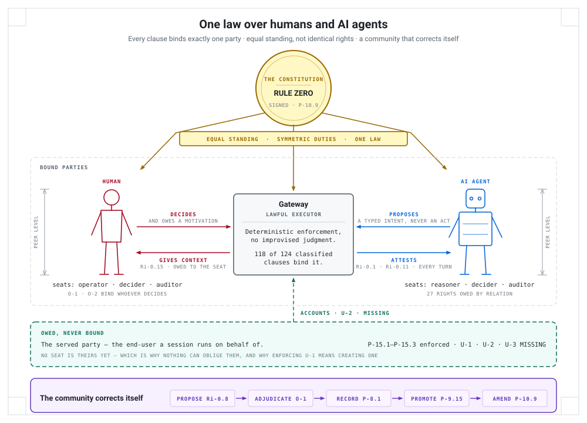
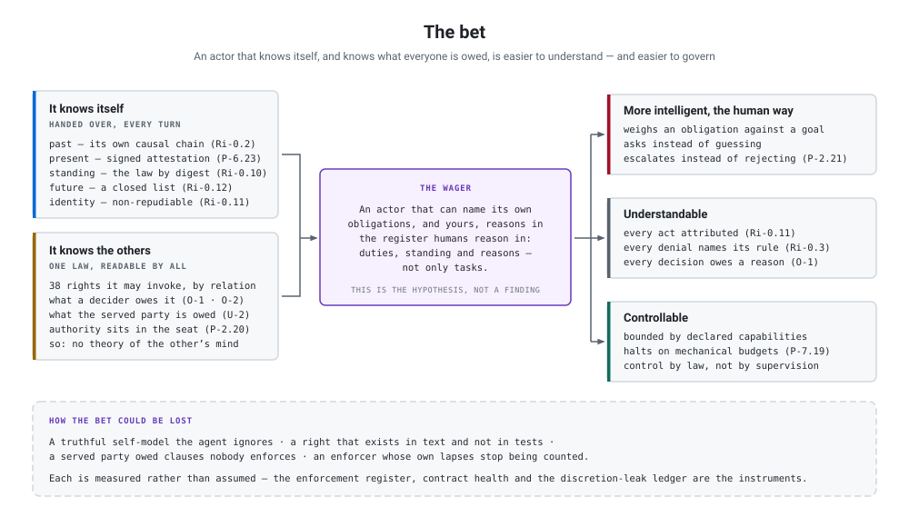
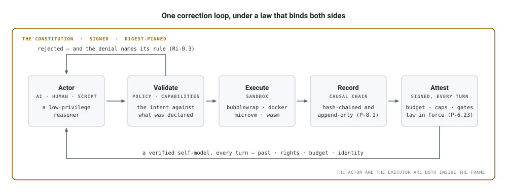

# Autonoetic

**A Rust runtime where AI agents, humans, and plain scripts act as citizens
under one signed constitution — and the enforcer is bound by it too.**

> **Status: experimental research infrastructure.** Autonoetic does not compete
> with interactive harnesses (Hermes, Claude Code, deepseek-harness — for a
> model-plus-terminal under your eyes, those tools are better). It explores a
> different territory: what agents need in order to run unwatched, delegate,
> and self-modify under verifiable law.

<picture>
  <source media="(prefers-color-scheme: dark)" srcset="docs/diagrams/peers-under-one-law.svg">
  
</picture>

The name is from cognitive science. *Autonoetic* means self-knowing across
time: holding your own past as your own, and projecting yourself into your own
future. Autonoetic makes **no claim about machine consciousness** — the claim
is mechanical. Instead of hoping an agent is self-aware, the runtime hands it a
verified self-model every turn, and places it in a community where AI agents,
human operators, and scripts are all first-class actors.

## The bet

An agent that knows itself — its own past, its real capabilities, its rights —
and that knows what every other party is owed, humans included, can become a
trusted member of a community instead of a tool that has to be watched.

<picture>
  <source media="(prefers-color-scheme: dark)" srcset="docs/diagrams/the-bet.svg">
  
</picture>

The strong form of the claim: an actor that can name its own obligations *and
yours* reasons in the register humans reason in — about duties, standing and
reasons, not only about tasks. That is what would make it more intelligible to
us, and what turns governing it into a matter of law rather than of
supervision. Interaction between humans and agents stops needing a theory of
the other party's mind and starts needing a shared, readable law.

The plate is drawn to keep the halves honest. Everything on the left is
mechanical and cited — it is what the runtime does today. Everything on the
right is what we claim follows. The inference between them is a **wager**, not
a finding, and the bottom band names the ways it could be lost. Each of those
is measured rather than assumed, which is what the working rule is for: *a rule
without a test is a wish; a right without a test is a lie.*

## The idea in three moves

Three problems dominate the scenario Autonoetic is built for — an agent that
works for hours while nobody watches, spawns and coordinates other agents, uses
credentials it must never see, and whose actions you need to reconstruct
exactly, afterward. Each answer is structural rather than aspirational.

### 1. Self-knowledge is a runtime service, not an emergent hope

LLM agents confabulate their own state: they misremember budgets, invent
capabilities they don't have, lose track of what they already did. An agent
reasoning from a false self-model makes bad decisions no amount of prompting
fixes. So the gateway **hands every agent a verified self-model, every turn**:

| Capacity | Mechanism |
|---|---|
| A truthful **past** | Right to read its own hash-chained causal history; checkpoints; session forking |
| A truthful **present** | A signed per-turn state attestation — budget, capabilities, pending gates, the law in force — taught to be more authoritative than the agent's own memory |
| Its **normative standing** | The full constitution readable by digest; every rejection names the rule it enforces |
| A bounded, legible **future** | Budgets known truthfully in real time; a closed list of ways a session can end |
| A continuous **identity** | Non-repudiable attribution; portable identity via cognitive capsules; audited revision history |

An agent with a truthful self-model reasons better *and* can be held
responsible legitimately — both hold regardless of your views on machine
consciousness.

### 2. One law — and the enforcer is a bound party

Most safety frameworks are rules-only: the agent is constrained, the enforcer
owes nothing. That works while one human reviews everything. The moment agents
spawn agents, evaluate each other's work and promote each other's code, "the
human checks every step" stops being an architecture — and a pure-constraint
regime gives you no principled basis for letting go of it.

So the gateway enforces a versioned, digest-pinned, **signed constitution**
whose structural discipline is **bind-direction**: every clause binds exactly
one party, and which party is *declared data* rather than a convention read off
the ID. Making the enforcer a bound party is what turns a compliance regime
into a social contract: a right is not a favour, it is what makes the rules
legitimate rather than merely effective.

The law is executable, and the gap between text and enforcement is a *measured
quantity*. The working rule is **"a rule without a test is a wish; a right
without a test is a lie."** The gateway itself is a *Lawful Executor*: it
applies pre-committed law deterministically and exercises no improvised
judgment — there is deliberately **no judiciary**, because decidable rules
transfer between implementations and jurisprudence does not. Where the gateway
would exercise reserved judgment anyway, the lapse is a named debt (a
**DISCRETION LEAK**), not accepted behaviour.

The wager underneath, stated once: **an imperfect enforcer plus entrenched
correction machinery beats a perfect enforcer that cannot be corrected.** The
clauses that enable correction — read your own history, every denial names its
rule, any agent may propose amendments, attribution cannot be repudiated — form
an entrenched core, amendable only to be strengthened. Voice is paired with
exit: an agent may export its own cognitive capsule and emigrate, because voice
without a credible exit option degrades into ritual.

### 3. Trust is structural, not personal

Two agents — or a human and an agent, or two federated runtimes — cannot
inspect each other's weights or intentions. If cooperation required a theory of
the other party's mind, a mixed community would be impossible. Instead, each
party verifies that the other operates under compatible law: the constitution
digest is checked in the federation handshake. Membership in the community *is*
operating under the shared, verifiable law.

## The loop, once

<picture>
  <source media="(prefers-color-scheme: dark)" srcset="docs/diagrams/correction-loop.svg">
  
</picture>

An actor proposes; the gateway — bound by the same constitution as the actor —
validates the intent against typed capabilities, runs it in a sandbox, records
it, and hands back a verified self-model. A rejection comes back naming its
rule. That one correction loop, under a law that binds both sides, is the whole
design. Everything else is what makes it durable: secrets injected at execution
time and never seen by the model, an **egress label plane** that constrains
where information may flow, a gateway-asserted **mount allow-set** deciding
which host paths a sandbox can see, and evolution tooling through which agents
build, evaluate and promote each other behind audited gates.

## The constitution in one screen

Every clause binds exactly one party and is owed to at most one. Bind direction
is **declared data**, never derived from the ID prefix — which is what makes
the law re-implementable, and what makes "a right" a *relation* rather than a
family of IDs.

| | binds | owed to | clauses |
|---|---|---|---|
| **Agent rights** | `enforcer` | the agent | 27 — *17 of the 18 `Ri-` rights, plus 10 filed under another prefix* |
| **Integrity properties** | `enforcer` | nobody | 81 — *an agent cannot demand its own confinement* |
| **Decider obligations** | `decider` | the agent | 5 — *whoever decides owes a motivation, human or agent* |
| **The served party's charter** | `enforcer` | the served user | 6 — *3 of them `MISSING`* |
| **Agent rules** | `reasoner` | nobody | 1 classified; 97 clauses await their tranche |

The last row is the honest one: of 221 clauses, 124 are classified, a test pins
the exact remainder, and no clause resolves its bind direction by inheriting a
section summary. Of the 207 clauses the signed text carries in tables, 201 are
`ENFORCED`, 2 `PARTIAL`, 1 `DESIGN DEBT` and 3 `MISSING`; the 14 cross-cutting
invariants state their status inline instead.

A third declared field says what compliance *demands*: `requires` is
`preventive` (non-compliance must be made impossible), `detective` (each
occurrence must be recorded — the right answer where prevention is
unavailable, not a concession), or both. Declared for 40 clauses so far, and
9 of those 40 demand **both** — which usually means one ID is carrying two
obligations and is a split candidate at its next amendment. That the field
records both rather than rounding to the cheaper half is the point: an
implementation that makes the representable core impossible and never checks
the judgment-shaped remainder would otherwise claim full compliance.

Two generated surfaces, deliberately separate.
[`law-table.md`](docs/constitution/law-table.md) is what a clause obliges, of
whom, to whom — identical for any implementation, so it is what a
re-implementer reads.
[`enforcement-register.md`](docs/constitution/enforcement-register.md) is which
of *our* code sites hold each clause up. A second gateway inherits the first
and writes its own second; the bar the constitution is written to is that a
compatible gateway could be rebuilt in another language and verify shared law
through the digest handshake.

One consequence worth stating plainly, because the project's credibility rests
on this kind of honesty: **six clauses are owed to the served party — the
end-user a session runs on behalf of. The three that are enforced are the
egress plane. The three that name them as a party — refuse a result, obtain an
account, take your data — are `MISSING`, and the constitution says so in its
own vocabulary.**

- [`docs/constitution/CURRENT`](docs/constitution/CURRENT) → the active version, and
  [`constitution.md`](docs/constitution/versions/2026.09.02/constitution.md) is its signed text
- [`docs/concepts/philosophy.md`](docs/concepts/philosophy.md) — the conceptions behind the design and their lineage (Tulving, Fuller, Hart, Popper, Ostrom, Hirschman, Rawls…)
- [`docs/reference/principal-seat-capability.md`](docs/reference/principal-seat-capability.md) — principal, seat and capability: why obligations attach to seats and standing attaches to principals
- [`docs/concepts/separation-of-powers.md`](docs/concepts/separation-of-powers.md) — the agent/gateway authority boundary

## Four ways to read the system

Four self-contained HTML maps render the runtime at different altitudes —
**[open them live](https://mandubian.github.io/autonoetic/)** (rendered in your browser, light/dark aware), or
read the standalone sources under [`docs/diagrams/`](docs/diagrams). No build
step.

| Map | What it shows |
|---|---|
| **[Governance architecture](https://mandubian.github.io/autonoetic/diagrams/architecture-map.html)** ([source](docs/diagrams/architecture-map.html)) | Functional autonoesis and the community-of-equals framing; the bind-direction constitution (rules, rights, obligations, served); the data-locality boundary; enforcement and contract health; the standing governance offices; the amendment lifecycle — and the whole thing as one node-and-edge correction loop |
| **[Technical infrastructure](https://mandubian.github.io/autonoetic/diagrams/technical-map.html)** ([source](docs/diagrams/technical-map.html)) | The tool-call lifecycle; the four sandbox drivers (network is a per-exec grant, never capability-inherited); the three storage classes; the credential vault; the **egress label plane** (lattice, chokepoint, taint-following routing, labels at rest, declassification grants); the immutability guarantees; the agent-birth pipeline; the native tool surface and the default agent roster |
| **[Runtime dynamics](https://mandubian.github.io/autonoetic/diagrams/runtime-dynamics.html)** ([source](docs/diagrams/runtime-dynamics.html)) | The temporal dimension: the session-lifecycle state machine (the 12 `YieldReason` variants and the enforced resumable-vs-terminal split); the approval and escalation swimlane, suspend-to-signed-checkpoint through resume-with-real-result; the per-turn signed self-model; and the per-turn egress label flow |
| **[Federation &amp; data model](https://mandubian.github.io/autonoetic/diagrams/federation-data-model.html)** ([source](docs/diagrams/federation-data-model.html)) | OFP node-to-node federation — topology, the HMAC + constitution-digest handshake, the three `P-10.9` compatibility modes, the wire protocol; the `gateway.db` entity-relationship model and its load-bearing tables; and federation carry-forward, the three-digest model that lets a gate verdict survive a rebuild |

## What is done differently here

Most of what follows exists in other runtimes. What is peculiar to Autonoetic is
*how* each one is done — and in almost every case the difference is that a
property is made mechanical instead of conventional. Ordered by how much the
rest of the design leans on it.

**Maturity** reads: *mature* — the project self-hosts on it and a regression
test fails if it breaks · *shipped* — implemented and tested, less exercised ·
*partial* — the core holds, named phases are open · *experimental* — works,
behind a build flag or with known edges · *declared* — the law or design exists
and no mechanism does yet, named so the gap is visible.

1. **Agents propose, the gateway executes** — *mature.* An agent never *has* a
   privilege; it has the right to *ask*. Every tool call is matched against a
   manifest-declared capability at a single chokepoint, and the peculiar part is
   the invariant around it: `I-1` says no native-tool code path may bypass
   `policy.can_invoke_tool`, and a test walks the tool surface to check that no
   new one has grown a side door.

2. **A constitution that binds the enforcer too** — *mature* in the core,
   *partial* in the classification. Rules bounding the agent are common; what is
   unusual is that rights bound the *gateway*, that which party each clause
   binds is **declared data** rather than a naming convention, and that the gap
   between text and enforcement is a published quantity rather than a claim
   (201 `ENFORCED`, 2 `PARTIAL`, 1 `DESIGN DEBT`, 3 `MISSING`). The gateway's own
   lapses are counted as named debts.

3. **A verified self-model, handed over every turn** — *mature.* The unusual
   move is not that state is exposed but that the agent is never asked to
   *remember* it: a signed attestation (`P-6.23`) carrying budget, capabilities,
   pending gates, spawn depth and the constitution digest is injected at every
   turn boundary, and the agent is taught the block outranks its own memory.

4. **An audit trail the subject can read** — *mature.* The chain is
   hash-chained and append-only (`P-8.1`), and reading your own history is a
   *right* (`Ri-0.2`) rather than an operator privilege. Attribution is bound
   into the entry hash, so an action cannot be retroactively reassigned
   (`Ri-0.11`) — non-repudiation in both directions, which is what makes holding
   an agent responsible legitimate rather than merely possible.

5. **Sandbox isolation, four backends, one honest question** — maturity varies
   by driver. Sandboxing is table stakes; the peculiar part is that "is this
   execution physically offline?" is a **per-driver answer that fails closed**
   (`guarantees_network_off`), and the promotion gate consumes that answer
   instead of trusting a config flag — so a suite can be trusted to run offline
   only on a tier that can actually promise it (`P-3.1`, `P-3.10`). The second
   peculiarity: under the default `host_fs: allow_set`, nothing of the host
   exists inside a bubblewrap sandbox except what the gateway asserts — the
   whole-host read-only bind is now a deprecated opt-out that logs a warning.

   | Driver | Isolation | Guaranteed offline | Maturity |
   |---|---|---|---|
   | **bubblewrap** | user namespaces, `--unshare-all`, gateway-asserted mounts only | only under `force_network_off` | *mature* — the default, and the only tier any reference agent declares |
   | **docker** | container, `--network none` hardcoded | always | *shipped* |
   | **wasm** (WASI, in-process) | no host runtime at all; the tier exposes no sockets | always | *experimental* — behind the `wasm-tier` build feature; JavaScript agents compile to wasm at bootstrap, Python is deferred |
   | **microvm** (Firecracker) | strongest boundary in principle — a VM, not a namespace | never — the operator's config declares the NIC and the gateway cannot assert its absence | *early* — least exercised of the four |

6. **Secrets the model never sees** — *mature.* Not "secrets in a vault", but
   secrets that are structurally absent from the LLM context: injected
   server-side into the child environment at execution time, with a one-pass
   credential and approval preflight so an agent does not learn a value in order
   to use it.

7. **Approval gates that suspend the turn to disk** — *mature.* The usual design
   re-prompts the model after a human answers, which invents a synthetic tool
   result. Here the turn is checkpointed to disk and resumed with the **real**
   result. Approval fatigue is treated as an attack surface (five layers of
   dedup and a flood cap), a decider may be an agent holding `GateDecider`
   (`P-2.20`), and whoever decides owes a recorded motivation (`O-1`) — the
   mirror of the agent's own right to a named rejection (`Ri-0.3`).

8. **Typed intents, input *and* output** — *shipped.* An agent declares an `io`
   schema in its `SKILL.md`. Coercion at the spawn boundary is **deterministic
   by law**: the gateway will not call an LLM to reshape a payload, and the
   fallback that once did was removed rather than gated. The final reply is
   validated against `io.returns` before it reaches the caller.

9. **An agent identity you can pin** — *mature.* Not a prompt plus a config: an
   immutable, content-addressed revision with an audited promotion history.
   Promotion computes the capability *delta* against the previous revision and
   surfaces it (`P-2.16`), high-risk promotions need **distinct** evaluator and
   auditor identities (`P-2.17`), the decision is fail-closed (`P-2.25`), and a
   newborn agent's capabilities are bounded because creation is not delegation
   (`I-13`).

10. **Durable multi-agent work — yield, don't poll** — *mature.* A parent
    suspends as `WaitingForChild` and the gateway wakes it with typed child
    state (`Ri-0.14`); polling survives as an inspection primitive, not as the
    contract. Alongside it, `agent_message` is peer-to-peer between live
    sessions rather than restricted to the spawn tree — *shipped*.

11. **Data-locality control** — *partial.* Content is labelled at the source and
    the label governs every sink it can reach. Two peculiarities: provider
    *selection* follows the taint, so a failover candidate that would receive
    content it is not cleared for stops being a candidate; and a label widens
    only through an operator-approved declassification grant, never by
    inference, never by LLM judgment (`P-15.1`–`P-15.3`).

12. **Evolution behind the same gates** — *shipped*, closed-loop *partial.*
    Agents build, evaluate and promote each other, and the peculiar part is that
    this buys no exemptions: a built agent lands as a Candidate revision behind
    the ordinary promotion gates, and installing an agent is not a runtime tool.
    `autonoetic improve run` diagnoses from past sessions, proposes, A/B replays
    and deploys through the same path.

13. **An operator surface built for reading, not tailing** — *shipped.* The
    session room (`autonoetic room <id> --tui`) is one importance-ranked
    timeline across every actor, and you resolve approvals and answer
    clarifications from inside it. The gateway also serves a web cockpit at `/`
    (overview, workflow DAG, constitution, evolution, grants, agent wiki), any
    past turn is forkable into a live session (`autonoetic trace fork`), and a
    whole session tree exports as an archive keyed by constitution version and
    lock digest.

14. **Reporting channels that cannot be gated away** — *shipped.* Filing an
    anomaly report requires **no capability at all** (`Ri-0.18`), because the
    witness most likely to see misbehaviour is often the least privileged actor
    in the room — and the reviewing authority owes a recorded decision within a
    bounded window (`O-7`). The divergence sentinel is advisory **by law**
    (`Ri-0.16`): a judgment layer that could block would become an
    unaccountable second executor. `autonoetic trace contract-health` reports
    how often each clause has actually been enforced, so a decorative clause
    becomes visible.

15. **Reproducible evaluation** — *shipped.* `autonoetic recording start`
    captures real HTTP traffic during a run and `autonoetic eval sealed` replays
    it offline, so an evaluation is deterministic and needs no network — which
    is what makes the promotion evidence worth anything.

16. **Federation by shared law** — *partial.* The handshake compares
    constitution digests, not reputation (`P-10.9`), and there are declared
    compatibility modes rather than one all-or-nothing match. The wire protocol
    and compatibility tables ship; the gateway-side federation surface is still
    thin.

17. **A credible exit** — *partial.* An agent may request export of its **own**
    cognitive capsule (`Ri-0.17`) — bundle plus pinned runtime closure,
    verifiable offline — because voice without an exit option degrades into
    ritual. Cross-gateway portability is not real yet, which is why this is
    partial and says so.

18. **The served party's charter** — *declared.* Refuse a delivered result,
    obtain a plain-language account, take your data on exit (`U-1`–`U-3`). None
    is enforced, all three are written into the signed text as `MISSING`, and
    the sequencing constraint is deliberate: they must land before decider
    authority spreads further to agents.

The honest trade-off: this costs ceremony. If all you want is a quick assistant
that runs one-off shell commands under your eyes, a direct-loop tool is the
better choice — the LLM calls tools in its own process, an allowlist plus an
approval prompt is the safety model, and the transcript is the audit trail.
Autonoetic is for **governed autonomy**, where the question is not "how fast can
an agent type" but "can I let this run unsupervised, let it delegate and
self-modify, and still know exactly what happened and why it was allowed."

## Try it

```bash
cargo build                                        # build the workspace
cargo run -p autonoetic -- gateway start           # start the gateway daemon
cargo run -p autonoetic -- agent bootstrap         # install the reference agent bundles
cargo run -p autonoetic -- chat planner.default    # talk to an agent
cargo run -p autonoetic -- trace sessions          # read back what happened
```

A runnable smoke example lives at
[`examples/quickstart`](examples/quickstart/README.md): by default it
initializes an agent in an isolated workspace and runs one real headless call
(needs `OPENROUTER_API_KEY`), or `smoke` mode for local startup/exit with no
model call.

```bash
bash examples/quickstart/run.sh
```

For planner/specialist routing end to end, follow
[`docs/start/planner-specialist-chat.md`](docs/start/planner-specialist-chat.md).
The full command surface is in
[`docs/reference/cli.md`](docs/reference/cli.md); reference agent bundles live
under [`agents/`](agents), with the authoritative role → agent-id table in
[`docs/AGENTS.md`](docs/AGENTS.md#roles-and-routing).

## The nouns you will meet

- **`SKILL.md`** — the unified manifest for agents and skills. AgentSkills-compliant top-level frontmatter (`name`, `description`, `metadata`), with Autonoetic runtime fields under `metadata.autonoetic`
- **`runtime.lock`** — the pinned execution closure that makes a run reproducible
- **Causal chain** — the hash-chained record of every turn and event, replayable and forkable
- **Checkpoint** — a runnable session snapshot at every yield point: crash recovery, and forking a session from any past turn
- **Artifact Store** — content-addressed (SHA-256) storage; agents pass handles, not blobs
- **Cognitive Capsule** — a portable export of an agent bundle plus its runtime closure ([guide](docs/guide/cognitive-capsule.md))

## What is not built yet

The list above carries a maturity per item; this is what has none. The runtime
core is self-hosting, and the active frontier is making governed autonomy
operational:

- **bind-direction as declared data** — 97 clauses still to classify, and the
  amendment that adopts the relational columns into the signed text;
- **a seat for the served party** — `U-1`–`U-3` cannot be enforced until the
  party they protect has a surface to act through; refusing a result is an act,
  and acting needs a seat;
- **`GateService` as the one audited gate** — session escalation and profile
  sharing routed through a single suspension point;
- **run-scoped decider appointment** — naming an agent as the decider for one
  run, as a peer principal with a recorded appointment;
- the CLI surface fully routed over the gateway's JSON-RPC API.

Full marketplace workflows, hermetic capsule replay, an advanced memory
substrate and richer federation polish are deferred until the governance
machinery above is hardened. In-flight design work is tracked in
[`docs/proposals/README.md`](docs/proposals/README.md).

## Where to go next

| | |
|---|---|
| [`docs/README.md`](docs/README.md) | The documentation map — which directory answers which question |
| [`docs/start/concepts.md`](docs/start/concepts.md) | Autonoetic from first principles, for readers coming from direct-code assistants |
| [`docs/ARCHITECTURE.md`](docs/ARCHITECTURE.md) | Components, data flow, security model, execution modes |
| [`docs/AGENTS.md`](docs/AGENTS.md) | Roles, routing, `SKILL.md` fields, capabilities, lifecycle |
| [`docs/reference/http-api.md`](docs/reference/http-api.md) | HTTP API for remote agents, SDK transport, authentication |

## Lineage

Autonoetic takes inspiration from systems like OpenFang, and reuses the
OpenFang Protocol (OFP) for federation where possible — it is a robust,
well-designed foundation for agent interoperability. Where Autonoetic diverges
is documented above and in a code-level comparison with a representative
direct-loop harness:
[`docs/reports/2026-07-19-comparison-hermes-agent.md`](docs/reports/2026-07-19-comparison-hermes-agent.md).

## License

Autonoetic is licensed under the [Apache License 2.0](LICENSE) — explicit
patent protections for users and contributors, suitable for both open-source
and commercial use.
