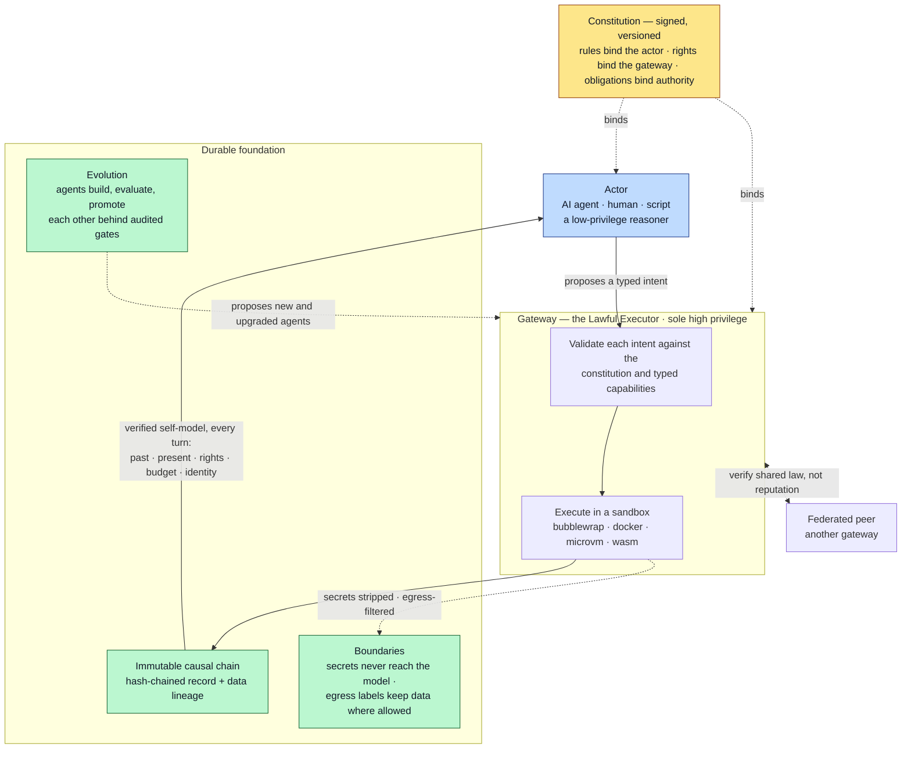

# Autonoetic

**Autonoetic is a Rust runtime built on one bet: an AI agent that knows
itself — its own past, its real capabilities, its rights — and that lives
under the same law as every other actor, human or artificial, can become a
trusted member of a community instead of a tool that has to be watched.**

The name is from cognitive science. *Autonoetic* means self-knowing across
time: holding your own past as your own, and projecting yourself into your own
future. Autonoetic makes no claim about machine consciousness — the claim is
mechanical. Instead of hoping an agent is self-aware, the runtime hands it a
verified self-model every turn (its true history, its actual capabilities, the
law in force) and places it in a community where AI agents, human operators,
and plain scripts are all first-class actors — owed the same rights, held to
the same rules and obligations.

What holds that community together is a signed, versioned **constitution**:
not a leash on something dangerous, but the common law that lets independent
actors cooperate, delegate, and trust one another *mechanically* rather than
personally. A neutral **gateway** enforces it deterministically and invents no
rules of its own — a *Lawful Executor*. Because every actor is bound by the
same verifiable law, none has to guess at another's intentions to work with
it; trust becomes structural, which is what makes a mixed community of humans,
agents, and scripts possible at all.

The rest of the project is the foundation that makes such a community real:

- a **lawful gateway** — every privileged action is validated against the
  constitution and typed capabilities, then executed inside a sandbox
  (bubblewrap / docker / microvm / wasm);
- **immutable recording and data lineage** — a hash-chained causal trace of
  every turn, replayable and forkable, so an actor's past is a fact it can
  reason from and anyone can audit, not a memory it might confabulate;
- **boundaries that protect** — secrets injected at execution time and never
  seen by the model, and data-locality controls that constrain where
  information is allowed to flow;
- **evolution tooling** — agents that build, evaluate, and promote each
  other's code under the same law, behind audited gates.

None of this is the fastest way to hand a model a terminal, and it is not
trying to be. Autonoetic is for the harder question underneath: what does an
agent need in order to know itself, act on its own, cooperate with others, and
still be fully accountable — and can that be engineered rather than merely
hoped for.

## Autonoetic at a glance

An actor proposes; the gateway — bound by the same constitution as the actor —
validates it, runs it in a sandbox, records everything, and hands back a
verified self-model each turn. That one correction loop, under a law that binds
both sides, is the whole design.



For the full picture, open the live **[visual maps](https://mandubian.github.io/autonoetic/)** (rendered
in your browser, light/dark aware):
[governance architecture](https://mandubian.github.io/autonoetic/diagrams/architecture-map.html),
[technical infrastructure](https://mandubian.github.io/autonoetic/diagrams/technical-map.html),
[runtime dynamics](https://mandubian.github.io/autonoetic/diagrams/runtime-dynamics.html), and
[federation & data model](https://mandubian.github.io/autonoetic/diagrams/federation-data-model.html).

> New here? [**Why this exists**](#why-this-exists) lays out the three problems
> that shape everything below; [**Autonoetic for beginners**](docs/autonoetic-concepts-for-beginners.md)
> builds the same ideas from first principles.

## Why this exists

Most agent harnesses — OpenClaw, Hermes, the code-assistant CLIs — are built
around one scenario: a capable model, a terminal, and a human watching. The
LLM calls tools directly in its own process; safety is an allowlist plus an
approval prompt; the transcript is the audit trail; trust is *personal* — you
trust the model, and whoever wrote the prompt. For interactive assistance
that design is right, and those tools are better at it than Autonoetic is.

Autonoetic starts from the scenario that design does not cover: an agent that
works for hours while nobody watches, spawns and coordinates other agents,
uses credentials it must never see, and whose actions you need to
reconstruct — exactly, afterward. Three problems dominate that scenario, and
they shape everything in this codebase.

**1. Agents don't know themselves.** LLM agents confabulate their own state:
they misremember budgets, invent capabilities they don't have, lose track of
what they already did. An agent reasoning from a false self-model makes bad
decisions no amount of prompting fixes.

**2. Constraint without legitimacy doesn't scale.** Most safety frameworks
are rules-only: the agent is constrained, the enforcer owes nothing. That
works while one human reviews everything. The moment agents spawn agents,
evaluate each other's work, and promote each other's code, "the human checks
every step" stops being an architecture — and a pure-constraint regime gives
you no principled basis for letting go of it.

**3. Trust between agents can't be personal.** Two agents (or a human and an
agent, or two federated runtimes) cannot inspect each other's weights or
intentions. If cooperation requires a theory of the other party's mind, a
mixed community of humans, agents, and scripts is impossible.

Autonoetic's answer to each is structural, not aspirational:

### Self-knowledge is a runtime service, not an emergent hope

The name comes from cognitive science: **autonoetic consciousness** is Endel
Tulving's term for self-knowing across time — remembering your own past as
your own, and projecting yourself into your own future. Autonoetic makes
**no claim about machine consciousness**. The claim is narrower and
mechanical: rather than asking the model to be self-aware, the gateway
**hands every agent a verified self-model, every turn**:

| Capacity | Mechanism |
|---|---|
| A truthful **past** | Right to read its own hash-chained causal history; checkpoints; session forking |
| A truthful **present** | A signed per-turn state attestation — budget, capabilities, pending gates, the law in force — taught to be more authoritative than the agent's own memory |
| Its **normative standing** | The full constitution readable by digest; every rejection names the rule it enforces |
| A bounded, legible **future** | Budgets known truthfully in real time; a closed list of ways a session can end |
| A continuous **identity** | Non-repudiable attribution; portable identity via cognitive capsules; audited revision history |

An agent with a truthful self-model reasons better *and* can be held
responsible legitimately — both hold regardless of your views on machine
consciousness.

### A constitution, not a config file

The gateway enforces a versioned, digest-pinned, signed **constitution**
whose structural novelty is **bind-direction discipline**: every clause binds
exactly one party. **Rules** (`P-*`) bind the *agent* — a finite, named set
of forbidden actions; everything else is permitted. **Rights** (`Ri-*`) bind
the *gateway* — unconditional entitlements the enforcer owes every agent.
**Obligations** (`O-*`) bind whoever exercises authority over an agent.
Making the enforcer a bound party is what turns a compliance regime into a
social contract: a right is not a favour, it is what makes the rules
legitimate rather than merely effective.

The law is executable, and the gap between text and enforcement is a
*measured quantity*: the working rule is **"a rule without a test is a wish;
a right without a test is a lie."** The
[enforcement register](docs/constitution/enforcement-register.md) tracks,
clause by clause, what is `ENFORCED` versus `PARTIAL` / `MISSING`, and the
gateway's own lapses are named debts (**DISCRETION LEAKs**), not accepted
behaviour. The gateway itself is a *Lawful Executor*: it applies
pre-committed law deterministically and exercises no improvised judgment.

The wager underneath, stated once: **an imperfect enforcer plus entrenched
correction machinery beats a perfect enforcer that cannot be corrected.**
The clauses that enable correction — read your own history, every denial
names its rule, any agent may propose amendments, attribution cannot be
repudiated — form an entrenched core, amendable only to be strengthened.
Amendments are a first-class, audited operation; the constitution itself is
versioned and its digest is verified by federated peers. Voice is paired
with exit: the constitution declares an agent's right to export its own
cognitive capsule (emigration) — today only partially enforced — because
voice without a credible exit option degrades into ritual.

### Trust is structural, not personal

Two parties cooperate because each can verify the other operates under
compatible law — the constitution digest is checked in the federation
handshake — not because they know each other's internals. Membership in the
community *is* operating under the shared, verifiable law. This requires no
theory of the other party's mind, which is exactly what makes a mixed
community of humans, AI agents, and plain scripts possible: Autonoetic
treats all three as actors under the same constitution, owed the same
rights, held to the same rules.

Where to dig further:

- [`docs/philosophy.md`](docs/philosophy.md) — the conceptions behind the design, and their intellectual lineage (Tulving, Fuller, Hart, Popper, Ostrom, Hirschman, Rawls…)
- [`docs/autonoetic-concepts-for-beginners.md`](docs/autonoetic-concepts-for-beginners.md) — the same ideas from first principles, for readers coming from direct-code assistants
- [`docs/constitution/versions/2026.07.08/constitution.md`](docs/constitution/versions/2026.07.08/constitution.md) — the canonical law (current version)
- [`docs/separation-of-powers.md`](docs/separation-of-powers.md) — agent vs gateway authority boundary

## How this differs from a classic agent harness

The mechanical consequence of the above is a strict **separation of
powers**: agents are low-privilege reasoners that *propose* intents; the
gateway is the sole high-privilege executor that validates and runs them.
An agent never "has" network access — it has permission to *ask* the
gateway to perform network operations under declared, typed capabilities.

| | Direct-loop harness (OpenClaw, Hermes, code CLIs) | Autonoetic |
|---|---|---|
| Execution | LLM calls tools directly in its own process | Agents propose; the gateway validates against typed capabilities and executes in a sandbox (bubblewrap / docker / microvm / wasm) |
| Safety model | Allowlists + interactive approval | A signed constitution binding *both* sides, enforced deterministically; approvals suspend the turn to disk and resume with real results |
| Secrets | In env/config, visible to the model | Vault-injected at execution time; never enter LLM context |
| Audit trail | Session transcript | Hash-chained causal chain with non-repudiable attribution, mirrored to a queryable event store |
| Agent identity | A prompt + a config | A `SKILL.md` manifest + immutable, content-addressed revisions with audited promotion; exportable as a Cognitive Capsule with its pinned runtime closure (`runtime.lock`) |
| Multi-agent | Ephemeral subagents inside one trust domain | Durable agents that spawn, evaluate, and promote each other under the same law — including agents building and installing new agents through gated revision promotion |
| Trust across machines | N/A — single node, single user | Federation (OFP) with HMAC + constitution-digest handshake: peers verify law-compatibility, not reputation |

The honest trade-off: this costs ceremony. If all you want is a quick
assistant that runs one-off shell commands under your eyes, a direct-loop
tool is the better choice. Autonoetic is for **governed autonomy** — when
the question is not "how fast can an agent type" but "can I let this run
unsupervised, let it delegate and self-modify, and still know exactly what
happened and why it was allowed."

## Main Concepts

- `SKILL.md`: the unified manifest for agents and skills
- `runtime.lock`: the pinned execution closure for reproducible runtime resolution
- `autonoetic_sdk`: the sandbox bridge for memory, artifacts, messaging, and secrets
- Artifact Store: a content-addressed store for binaries, datasets, outputs, and runtime dependencies
- Checkpoint: a runnable session snapshot taken at every yield point — enables crash recovery and forking a session from any past turn (`autonoetic trace fork`)
- Cognitive Capsule: a portable export containing an agent bundle plus its runtime closure

Autonoetic now accepts AgentSkills-compliant top-level `SKILL.md` frontmatter (`name`, `description`, `metadata`) and stores Autonoetic-specific runtime fields under `metadata.autonoetic`.

## Documentation

### Comprehensive Guides

- [`docs/ARCHITECTURE.md`](docs/ARCHITECTURE.md): System architecture, design principles, security model, data flow
- [`docs/MODULES.md`](docs/MODULES.md): Workspace structure, module reference, SKILL.md format, configuration
- [`docs/AGENTS.md`](docs/AGENTS.md): Roles, routing, capabilities, agent lifecycle, building new agents
- [`docs/CLI.md`](docs/CLI.md): Complete CLI command reference with examples

### Visual Maps

Four self-contained HTML maps render the system at different altitudes. **View them live in your browser at the [visual maps hub](https://mandubian.github.io/autonoetic/)** (GitHub Pages). Each is also a standalone file under `docs/diagrams/` — no build step, light/dark theme–aware:

- **[Governance architecture](https://mandubian.github.io/autonoetic/diagrams/architecture-map.html)** ([source](docs/diagrams/architecture-map.html)) — functional autonoesis and the community-of-equals framing, the bind-direction constitution (rules/rights/obligations/served), the data-locality boundary (§15 enacts the agent's egress duty; the served-party right is still unratified), enforcement & contract health, the standing governance offices, the amendment lifecycle, and a full node-and-edge system graph rendering the whole as one correction loop.
- **[Technical infrastructure](https://mandubian.github.io/autonoetic/diagrams/technical-map.html)** ([source](docs/diagrams/technical-map.html)) — the tool-call lifecycle, the four sandbox drivers (network is a per-exec grant, never capability-inherited), the three storage classes, the credential vault, the **egress label plane** (lattice · chokepoint · taint-following routing · labels at rest · operator declassification grants), the immutability guarantees, the agent-birth pipeline and error/repair loop, the native tool surface, and the default agent roster.
- **[Runtime dynamics](https://mandubian.github.io/autonoetic/diagrams/runtime-dynamics.html)** ([source](docs/diagrams/runtime-dynamics.html)) — the temporal dimension: the session-lifecycle state machine (the 12 `YieldReason` variants grouped by Ri-0.12 into resumable vs terminal, and the separate persisted `SessionLifecycleState` vocabulary they map onto), the approval & escalation multi-actor swimlane (suspend-to-signed-checkpoint, resume-with-real-result), the per-turn signed self-model (the P-6.23 attestation), and the **per-turn egress label flow**.
- **[Federation & data model](https://mandubian.github.io/autonoetic/diagrams/federation-data-model.html)** ([source](docs/diagrams/federation-data-model.html)) — OFP node-to-node federation (the topology, the HMAC + constitution-digest handshake, the three P-10.9 compatibility modes, the wire protocol and message kinds), the `gateway.db` entity-relationship model at **schema v80** (the four spine columns, a core-spine ER diagram, and the load-bearing tables by cluster including the egress label plane), and **federation carry-forward** (the three-digest model and the strictness dial that let a gate verdict survive a rebuild).

### Specialized Docs

- [`docs/quickstart-planner-specialist-chat.md`](docs/quickstart-planner-specialist-chat.md): End-to-end CLI quickstart tutorial
- [`docs/remote-agents-http-api.md`](docs/remote-agents-http-api.md): HTTP API for remote agents, SDK transport, authentication
- [`docs/AGENTS.md`](docs/AGENTS.md): Canonical agent reference — roles, routing, capabilities, lifecycle
- [`docs/agent-features.md`](docs/agent-features.md): Detailed agent manifest reference (capabilities, IO, disclosure) — partially superseded by `AGENTS.md`
- [`docs/iteration-repair-validation-runbook.md`](docs/iteration-repair-validation-runbook.md): Iterative repair validation steps
- [`docs/schema-enforcement-hook.md`](docs/schema-enforcement-hook.md): Schema coercion for agent.spawn payloads

- [`docs/cognitive-capsule.md`](docs/cognitive-capsule.md): Portable agent capsule export/import
- [`docs/design/README.md`](docs/design/README.md): Active design plans with open work
- [`docs/architecture-summary.md`](docs/architecture-summary.md): What's kept vs externalized
- [`docs/gateway-architecture-principles.md`](docs/gateway-architecture-principles.md): Gateway neutrality principles
- [`docs/separation-of-powers.md`](docs/separation-of-powers.md): Agent vs gateway responsibilities

### Planning

- [`docs/archived/plan.md`](docs/archived/plan.md): Archived implementation roadmap

## Reference Agent Bundles

Reference agent bundles are grouped under [`agents/`](agents/):

- `agents/lead/` for front-door/orchestration agents
- `agents/specialists/` for hand roles
- `agents/evolution/` for builder and evolution flows

Current bundles:

- Lead: `agents/lead/planner.default/` (plus `planner.collaborative/`)
- Specialists:
  - `agents/specialists/researcher.default/`
  - `agents/specialists/architect.default/`
  - `agents/specialists/packager.default/`
  - `agents/specialists/coder.default/`
  - `agents/specialists/executor.default/`
  - `agents/specialists/debugger.default/`
  - `agents/specialists/sealed_evaluator.default/`
  - `agents/specialists/static_evaluator.default/`
  - `agents/specialists/unit_test_runner.default/`
  - `agents/specialists/auditor.default/`
  - `agents/specialists/credential_onboarding.default/`
  - `agents/specialists/discovery.default/`
  - `agents/specialists/watchdog.default/` (plus `watchdog-fast.default/`)
  - `agents/specialists/improvement-orchestrator.default/`, `outcome-grader.default/`
- Evolution:
  - `agents/evolution/specialized_builder.default/`
  - `agents/evolution/agent-factory.default/`
  - `agents/evolution/agent-adapter.default/`
  - `agents/evolution/evolution-steward.default/`
  - `agents/evolution/memory-curator.default/`
  - `agents/evolution/evolution-orchestrator.default/`, `code-issue-proposer.default/`

The authoritative role → agent-id table lives in [`docs/AGENTS.md`](docs/AGENTS.md) → Roles and Routing; check there when this list falls behind.

To install these into your active runtime directory, run:

`autonoetic agent bootstrap [--from <path>] [--overwrite]`

## Current Direction

The current MVP is intentionally narrow:

- Gateway daemon with JSON-RPC and HTTP REST APIs
- `SKILL.md` and `runtime.lock` parsing
- Bubblewrap sandboxing
- text-first Tier 1 memory
- minimal Tier 2 recall
- content-addressed artifact handles
- hash-chain causal logging
- OFP federation listener with HMAC handshake + extension negotiation
- MCP client/server plumbing (registry, discovery, and agent exposure)

## HTTP Content API (for Remote Agents)

The gateway exposes REST endpoints for remote agents to access content. See [docs/remote-agents-http-api.md](docs/remote-agents-http-api.md) for full documentation.

**Quick start for remote agents:**

```python
# On the remote agent machine
export AUTONOETIC_HTTP_URL="http://gateway-host:8080"
export AUTONOETIC_SHARED_SECRET="your-secret"

from autonoetic_sdk import Client
sdk = Client()  # Automatically uses HTTP mode
sdk.files.write("main.py", "print(42)")
```

**Endpoints:**

| Method | Endpoint | Description |
|--------|----------|-------------|
| POST | `/api/content/write` | Write content (UTF-8 or base64) |
| GET | `/api/content/read/{session_id}/{name}` | Read content by name/handle |
| POST | `/api/content/read` | Read content (body params) |
| POST | `/api/content/persist` | Mark content as persistent |
| GET | `/api/content/names?session_id=X` | List content names with handles |

More advanced features like full marketplace workflows, hermetic capsule replay, advanced memory substrate, and richer federation polish are deferred until the base runtime is proven.

## Lineage

Autonoetic takes inspiration from systems like OpenFang, and reuses the
OpenFang Protocol (OFP) for federation where possible — it is a robust,
well-designed foundation for agent interoperability. Where Autonoetic
diverges is documented above (see *Why this exists*) and in a detailed
code-level comparison with a representative direct-loop harness:
[`docs/comparison-hermes-agent.md`](docs/comparison-hermes-agent.md).

## Status

The runtime core is implemented and self-hosting: gateway daemon (JSON-RPC +
HTTP REST), `SKILL.md` + `runtime.lock` parsing, multi-driver sandboxing
(bubblewrap / docker / microvm / wasm), content-addressed artifacts, hash-chain
causal logging, durable workflows, OFP federation with HMAC + constitution
digest handshake, and MCP client/server plumbing.

Governance is built alongside the runtime: the current constitution
(`2026.07.30`) has 18 enforced rights and 182 rules, 179 of them enforced — see
[`docs/constitution/enforcement-register.md`](docs/constitution/enforcement-register.md)
for what is `ENFORCED` vs `PARTIAL` / `MISSING` / `DESIGN DEBT`. Active and
archived design plans are tracked under [`docs/design/`](docs/design/README.md)
and [`docs/archived/`](docs/archived/) respectively.

## Quickstart Example

A runnable smoke example now lives at [`examples/quickstart`](examples/quickstart/README.md).

For planner/specialist implicit routing through CLI chat, see:

- [`docs/quickstart-planner-specialist-chat.md`](docs/quickstart-planner-specialist-chat.md)

From `autonoetic/`:

```bash
bash examples/quickstart/run.sh
```

By default it initializes an agent in an isolated `/tmp` workspace and runs a real headless call against OpenRouter `google/gemini-3-flash-preview` (requires `OPENROUTER_API_KEY`). You can also run `smoke` mode for local interactive startup/exit without a remote model call.

Each run appends lifecycle/tool events to the agent causal trace at `agents/<agent_id>/history/causal_chain.jsonl`.
By default, the gateway also captures redacted full evidence payloads with `evidence_ref` pointers in causal entries. Set `AUTONOETIC_EVIDENCE_MODE=off` if you want compact-only traces.
Causal entries expose top-level `session_id`, `turn_id`, and `event_seq` fields for multi-run/multi-turn introspection, plus `entry_hash` / `prev_hash` linkage for chain integrity.
You can inspect traces with:
- `autonoetic trace sessions [--agent <agent_id>] [--json]`
- `autonoetic trace show <session_id> [--agent <agent_id>] [--json]`
- `autonoetic trace event <log_id> [--agent <agent_id>] [--json]`
- `autonoetic trace follow <session_id> [--agent <agent_id>] [--json]`
- `autonoetic trace fork <session_id> [--message <text>] [--at-turn N] [--interactive]`
- `autonoetic trace history <session_id> [--agent <agent_id>] [--json]`

## Specialized Builder

The canonical builder flow lives in the agent bundle at
[`agents/evolution/specialized_builder.default/`](agents/evolution/specialized_builder.default/SKILL.md),
which uses the revision pipeline (`content_write` → `artifact_build` →
`agent_revision_create_from_intent` → `agent_revision_promote`).

Older runnable examples that demonstrated this flow (`examples/specialized_builder`,
`examples/tiered_memory_probe`) have been archived under
[`examples/archived/`](examples/archived/) — they depended on the since-removed
`agent.install` tool (constitution P-9.2) and on GNU-only `find -printf`, and no
longer run against a current gateway.

## License

Autonoetic is licensed under the [Apache License 2.0](LICENSE).

This license provides explicit patent protections for users and contributors, making it suitable for both open-source and commercial use.
