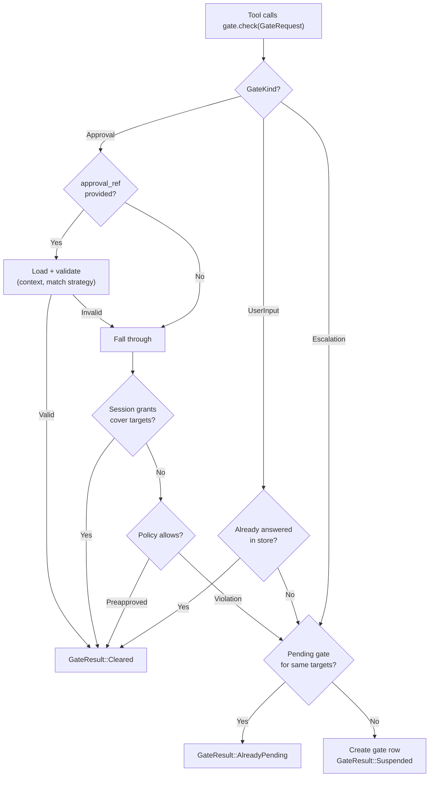
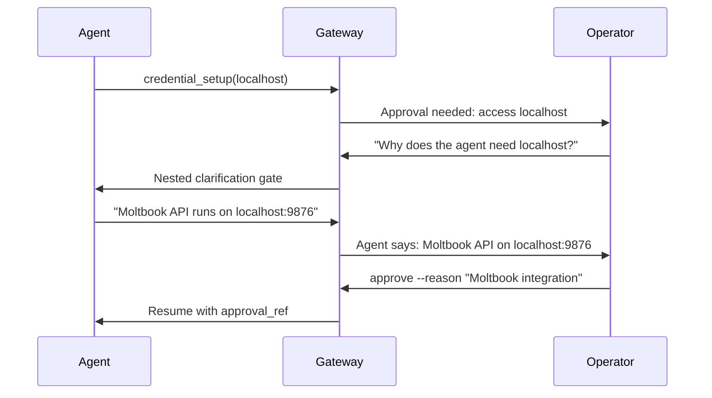
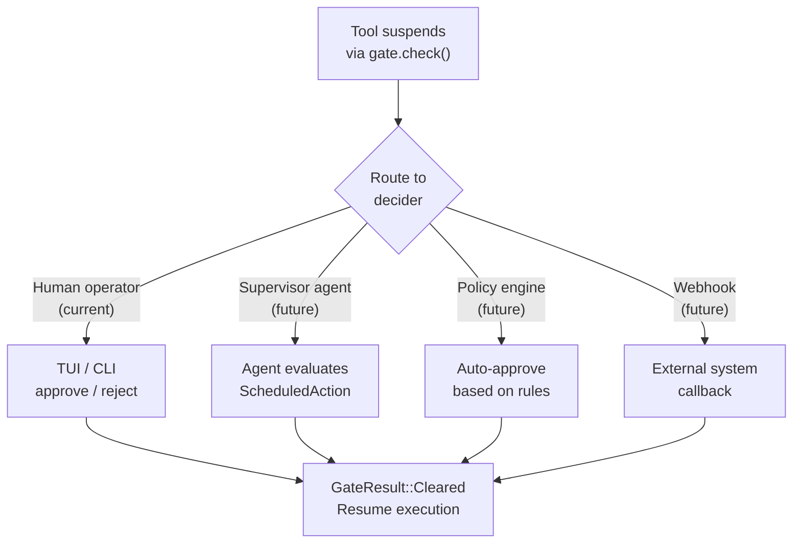

# HumanGate Unification Plan

> Tracking issue: [#167](https://github.com/mandubian/autonoetic/issues/167)

## Problem Statement

The approval mechanism is **spread across 15+ files** with each tool reimplementing the same "check → gate → suspend → resume" pattern independently. This caused 7 redundant approval requests in a single demo session and makes the system fragile to extend with new tools.

Additionally, approvals (`ApprovalRequired`) and clarifications (`UserInputRequired`) are structurally the same pattern at the lifecycle level — both suspend execution, persist a durable state row, wait for human input, and resume by injecting the answer. The current split into two separate pipelines with duplicated resume code is an implementation accident, not a fundamental distinction.

---

## Current Dispersion Map

Approval logic currently lives in all of these locations:

```mermaid
flowchart LR
    subgraph tools ["Tool Layer (each reimplements the pattern)"]
        sandbox["sandbox.rs\n(dedup, grants, cache,\napproval_ref, policy)"]
        web["web.rs\n(grants, approval_ref,\npolicy, 3 tools)"]
        cred["credential.rs\n(NO grants for setup,\nexact URL match, NO dedup)"]
        artifact_p["artifact_prepare.rs\n(sandbox-style grants)"]
        artifact_e["artifact_exec.rs\n(loose approval_ref)"]
        revision["agent_revision.rs\n(capability delta gate)"]
        session_tool["session.rs\n(escalation gate)"]
        profile["user_profile.rs\n(profile share gate)"]
        lifecycle["lifecycle.rs\n(session continue gate)"]
    end

    subgraph store_layer ["Store Layer"]
        approvals_store["gateway_store/approvals.rs\n(create, get, decide,\ngrants, coverage)"]
    end

    subgraph sched ["Scheduler Layer"]
        approval_sched["scheduler/approval.rs\n(resolve, approve, reject,\nsignal, unblock task)"]
        signal["scheduler/signal.rs\n(ApprovalResolved signal)"]
        scheduler["scheduler.rs\n(timeout, re-queue)"]
    end

    subgraph exec_layer ["Execution Layer"]
        execution["execution.rs\n(checkpoint resume,\ntext hint injection)"]
        continuation["continuation.rs\n(replay approved action)"]
        tcp["tool_call_processor.rs\n(detect approval_required)"]
    end

    subgraph ui ["UI Layer"]
        chat["cli/chat.rs\n(cards, Ctrl+A, merge,\nformat action detail)"]
        gw_cli["cli/gateway.rs\n(CLI approve/reject)"]
    end

    tools --> store_layer
    store_layer --> sched
    sched --> exec_layer
    exec_layer --> ui
```



Each tool in the tool layer independently handles: grant checking, `approval_ref` validation, policy enforcement, `ScheduledAction` construction, dedup, suspension JSON building, and resume matching — with **inconsistent** behavior across tools.

### Per-tool approval behavior comparison

| Capability | sandbox.rs | web.rs | credential.rs (request) | credential.rs (setup) |
|---|---|---|---|---|
| Session grant check | Yes | Yes | Yes | **No** |
| Pending dedup | Yes (`pending_sandbox_exec_requests_for_session`) | No | No | **No** |
| `approval_ref` match | Command substitution | Exact payload | Exact payload | **Exact URL (byte-identical)** |
| `ApprovedExecCache` | Yes | No | No | No |
| `build_approval_details` | Yes | Custom | Custom | Custom |

---

## Known Bugs (from demo session)

The demo session (`demo-session-1`) produced **7 consecutive approval requests** (`apr-2978b6f9` through `apr-9870506d`) for `credential_setup` calls to `localhost`, all approved by the operator, before the agent finally succeeded on the 7th attempt by including `approval_ref`. Four independent bugs compounded:

### Bug 1: `credential_setup` never checks session grants

`credential_request` ([credential.rs](../autonoetic-gateway/src/runtime/tools/credential.rs) lines 445-467) calls `store.session_grants_cover_targets(&root_sid, &[url_host])` before the policy gate. When an earlier approval for `localhost` creates a session grant, all subsequent `credential_request` calls to `localhost` auto-approve.

`credential_setup` (lines 1480-1596, 1720-1850) **skips this check entirely** and goes straight to exact-URL `approval_ref` matching. So even after the operator approves `localhost`, the next `credential_setup` to `localhost` triggers a brand-new approval.

**Impact**: This single fix would have eliminated 6 of the 7 redundant approvals in the demo.

### Bug 2: Exact URL matching instead of host-level

Lines 1489 and 1733-1734:
```rust
let skill_url_is_approved = approved_setup_remote_url.as_deref() == Some(url.as_str());
let step_url_is_approved  = approved_setup_remote_url.as_deref() == Some(url.as_str());
```

This is **byte-identical** URL comparison. If the operator approves `http://localhost:9876/skill.md` but the agent retries with `http://localhost:9876/api/register-agent`, the approval doesn't match — even though both are on `localhost` which the operator already approved.

### Bug 3: No dedup for credential tools

`create_credential_request_approval` (lines 91-130) generates a fresh `apr-{uuid}` on every call. The only guard is `approval_flood_cap` (pending count cap), not content equality. Compare with `sandbox_exec` which uses `pending_sandbox_exec_requests_for_session` to return `approval_already_pending` instead of minting duplicates.

### Bug 4: LLM-dependent `approval_ref` relay

The gateway injects a text hint into the LLM context on resume ([execution.rs](../autonoetic-gateway/src/execution.rs) lines 1870-1878):

```
[gateway] Approval `{rid}` has been granted by the operator.
When retrying the tool call that required approval, include
"approval_ref": "{rid}" in the arguments to skip the approval gate.
```

The LLM frequently ignores this instruction. The demo showed 6 retries without `approval_ref` before the 7th succeeded.

### Bug timeline (demo session)

| Time | Approval ID | What | `approval_ref` on retry? | Outcome |
|------|-------------|------|--------------------------|---------|
| 13:33:02 | `apr-2978b6f9` | credential_setup: fetch skill.md | No | Suspended |
| 13:34:18 | `apr-fdafb17a` | credential_setup: API call to localhost | No | Suspended |
| 13:34:41 | `apr-9c6f1ed7` | credential_setup: fetch skill.md from localhost | No | Suspended |
| 13:40:47 | `apr-2b37af9d` | credential_setup: same intent | No | Suspended |
| 13:42:00 | `apr-08f9cb9d` | credential_setup: repeat | No | Suspended |
| 13:42:59 | `apr-cc686e00` | credential_setup: explicit API steps | No | Suspended |
| 13:47:01 | `apr-9870506d` | credential_setup: same registration | **Yes** | **Approved, credential created** |

---

## Observation: Approvals and Clarifications Are the Same Pattern

Currently the codebase treats approvals (`ApprovalRequired`) and clarifications (`UserInputRequired`) as separate mechanisms with parallel but divergent implementations:

```mermaid
flowchart LR
    subgraph current ["Current: Two Separate Pipelines"]
        direction TB
        subgraph approval_pipe ["Approval Pipeline"]
            a1["Tool returns\napproval_required JSON"] --> a2["TurnContinuation\n(signed, on disk)"]
            a2 --> a3["YieldReason::\nApprovalRequired"]
            a3 --> a4["Signal::\nApprovalResolved"]
            a4 --> a5["Resume: inject\ntext hint for LLM"]
        end
        subgraph user_pipe ["UserAsk Pipeline"]
            u1["Tool returns\ninteraction_required JSON"] --> u2["PendingToolState\n(on checkpoint)"]
            u2 --> u3["YieldReason::\nUserInputRequired"]
            u3 --> u4["Direct resume API\n(no signal)"]
            u4 --> u5["Resume: inject\nsynthetic tool_result"]
        end
    end
```



### Structural comparison

| Aspect | Approval | UserAsk |
|--------|----------|---------|
| Suspension trigger | Tool returns `approval_required: true` JSON | Tool returns `interaction_required: true` JSON |
| State persistence | `TurnContinuation` (signed file on disk) + `approvals` table | `PendingToolState` (on `SessionCheckpoint`) + `user_interactions` table |
| `YieldReason` | `ApprovalRequired { approval_request_id }` | `UserInputRequired { interaction_id }` |
| Resume notification | `Signal::ApprovalResolved` via notification pipeline | Direct `resume_from_user_interaction` API call |
| Answer injection | Text hint in user message (LLM-dependent) | Synthetic tool result (deterministic) |
| Resume code | Inlined twice in `execution.rs` (~1809-1887, ~2092-2171) | Shared helper `resume_answered_user_interaction_from_loaded_checkpoint` |
| Store table | `approvals` (action, decision, operator fields) | `user_interactions` (question, options, answer fields) |
| Batch interruption | `tool_call_processor.rs` stops batch early | Lifecycle-level inspection only |

Both: suspend execution, persist durable state row, wait for human, resume with answer injected. The differences are **implementation accidents**, not fundamental.

Moreover, approval enrichment (asking the agent questions before deciding) is essentially "a clarification nested inside an approval" — the same suspension pattern applied recursively.

---

## Architecture: Unified HumanGate

### Design: Single HumanGate Abstraction

New module: `autonoetic-gateway/src/runtime/human_gate.rs`

```rust
/// A human gate is any point where execution suspends awaiting human input.
/// This unifies approvals, user_ask, escalation, and future gate types.
pub enum GateKind {
    /// Operator must approve/reject a gated action (network, sandbox, credential, etc.)
    Approval {
        action: ScheduledAction,
        targets: Vec<String>,
        match_strategy: MatchStrategy,
    },
    /// Agent explicitly asks the user a question
    UserInput {
        question: String,
        kind: String,
        options: Option<Vec<InteractionOption>>,
        allow_freeform: bool,
    },
    /// Operator escalation (guidance needed)
    Escalation { reason: String },
}

/// How strictly an approval_ref must match the current request.
pub enum MatchStrategy {
    /// Host extracted from URL must match (credential, web)
    HostLevel,
    /// Exact ScheduledAction field equality (current web behavior)
    ExactPayload,
    /// Command string from approved action replaces current (sandbox)
    SubstituteCommand,
}

/// What a tool provides to the gate.
pub struct GateRequest<'a> {
    pub kind: GateKind,
    pub manifest: &'a AgentManifest,
    pub session_id: Option<&'a str>,
    pub run_context: Option<&'a NativeToolRunContext>,
    pub config: Option<&'a GatewayConfig>,
    pub reason: String,
    pub summary: String,
    pub approval_ref: Option<&'a str>,
    pub pre_validated: bool,
}

/// Unified result.
pub enum GateResult {
    /// Proceed — already approved/answered/granted
    Cleared { source: ClearanceSource },
    /// Already pending — reuse existing gate ID
    AlreadyPending { gate_id: String },
    /// New gate created, session should suspend
    Suspended { gate_id: String, response_json: String },
    /// Policy allows without gating
    PolicyAllowed,
}

pub enum ClearanceSource {
    ApprovalRef(String),
    SessionGrant,
    PreapprovedPolicy,
    CachedApproval,
    AnsweredInteraction(String),
}
```

### Unified Gate Pipeline



### What Each Tool Provides vs What the Gate Handles

**Tool provides** (tool-specific):
- `GateKind` with its variant-specific data (`ScheduledAction` for approvals, question/options for user_ask)
- `MatchStrategy` for approval gates
- `targets` for grant checks (approval gates only)
- `summary` for TUI display

**Gate handles** (centralized, currently reimplemented per-tool):
- `approval_ref` loading and context validation
- Session grant coverage check
- Network policy enforcement
- Pending gate deduplication (generalized across all gate kinds)
- Gate row creation (unified store, not separate tables)
- Suspension response construction (consistent JSON shape)
- Flood cap enforcement
- Enrichment message thread management
- Resume orchestration (inject answer/approval into execution context)

### Approval Enrichment as Nested Clarification

The current `gateway approvals ask` is ephemeral LLM Q&A — not stored, not sent to the agent. With the unified gate, **enrichment becomes a first-class feature**:

When an approval is pending, the operator can:
1. **Ask the agent**: Creates a nested `UserInput` gate on the same session, answered by the agent (not the user), providing context the operator needs to decide
2. **Add notes**: Stored as a message thread on the gate row (new `gate_messages` table or JSON array column)
3. **Request modification**: Operator sends back "change the URL to X" — agent sees this as a clarification answer and resubmits the gate with updated parameters



### Migration example

**Before** (credential_setup, ~120 lines of approval logic per gate):
```rust
let url_host = extract_host(url)?;
let skill_url_is_approved = approved_setup_remote_url.as_deref() == Some(url.as_str());
if !skill_url_is_approved {
    if let Err(violation) = enforce_remote_target_policy(/* ... */) {
        let action = ScheduledAction::CredentialRequest { /* ... */ };
        let request_id = create_credential_request_approval(/* ... */)?;
        return Ok(json!({ "ok": false, "approval_required": true, /* ... */ }).to_string());
    }
    if url_host.is_empty() || !policy.can_connect_net(&url_host).is_allowed() {
        // ... another 30 lines, same pattern ...
    }
}
```

**After** (~10 lines):
```rust
let url_host = extract_host(url)?;
let gate_result = gate.check(GateRequest {
    kind: GateKind::Approval {
        action: ScheduledAction::CredentialRequest { /* ... */ },
        targets: vec![url_host.clone()],
        match_strategy: MatchStrategy::HostLevel,
    },
    approval_ref: args.approval_ref.as_deref(),
    summary: format!("Fetch skill.md from {}", url_host),
    // ... remaining context fields
})?;
match gate_result {
    GateResult::Cleared { .. } | GateResult::PolicyAllowed => { /* proceed */ },
    GateResult::AlreadyPending { .. } |
    GateResult::Suspended { .. } => return Ok(gate_result.to_response()),
}
```

---

## Implementation Phases

### Phase 1: Define HumanGate abstraction and store

- Create `autonoetic-gateway/src/runtime/human_gate.rs` with types above
- Create `HumanGateService` with `check()` implementing the unified pipeline
- Add `gate_messages` support to the approval store (or a new unified `gates` table that subsumes both `approvals` and `user_interactions`)
- Keep backward compat: existing `approvals` and `user_interactions` tables continue working; the service reads/writes both during transition

### Phase 2: Fix immediate approval bugs via the new gate

Apply all four bugs through the gate service:
- **2a**: Session grant check in `credential_setup` — automatic when using `gate.check()` with `GateKind::Approval`
- **2b**: Host-level matching — `MatchStrategy::HostLevel` in `GateKind::Approval`
- **2c**: Dedup — automatic in `gate.check()` via generalized `pending_gates_for_targets`
- **2d**: Auto-inject `approval_ref` on checkpoint resume in `execution.rs` — modify the last `tool_call` arguments in checkpoint history instead of just injecting a text hint

### Phase 3: Migrate existing tools to HumanGateService

Migrate tools one at a time, keeping behavior identical but reducing code:
- **3a**: `sandbox.rs` — replace ~400 lines with `gate.check()` using `MatchStrategy::SubstituteCommand`; keep `ApprovedExecCache` as a `pre_validated` bypass
- **3b**: `web.rs` — replace `create_network_approval` + inline checks with `gate.check()` using `MatchStrategy::ExactPayload` or `HostLevel`
- **3c**: `credential.rs` — replace `credential_request` and `credential_setup` gates with `gate.check()` using `MatchStrategy::HostLevel`
- **3d**: `user_interaction.rs` — migrate `user_ask` to `gate.check()` with `GateKind::UserInput`, unifying the suspension and resume paths

Other tools (`artifact_*.rs`, `agent_revision.rs`, `session.rs`, `user_profile.rs`, `lifecycle.rs`) migrate later.

### Phase 4: Unify checkpoint resume paths

Replace the duplicated resume paths in `execution.rs`:
- Current: `ApprovalRequired` resume is inlined twice (~1809-1887, ~2092-2171) with different code than `UserInputRequired` resume (`resume_answered_user_interaction_from_loaded_checkpoint`)
- Target: Single `resume_from_human_gate(checkpoint, gate_row)` function that handles both by inspecting the `GateKind` stored on the row
- For approval gates: auto-inject `approval_ref` into tool call arguments (not just a text hint)
- For user input gates: inject synthetic tool result (current behavior, now shared)

### Phase 5: Approval enrichment (operator-agent conversation thread)

Add the enrichment conversation thread:
- New `gate_messages` column/table: sequence of `(sender, timestamp, content)` tuples on a gate row
- TUI: when a pending approval is displayed, show the enrichment thread; allow operator to type a message
- Gateway: operator message on a pending approval either:
  - Stores as enrichment note (if approval stays pending)
  - Creates a nested `GateKind::UserInput` addressed to the agent (if operator wants agent to clarify)
- CLI: `gateway approvals comment <id> "message"` to add enrichment; `gateway approvals ask-agent <id> "question"` to create nested clarification

### Phase 6: Improve TUI surfacing

Update `cli/chat.rs` to use the unified gate data:
- Show gate-kind-specific detail: `"Credential setup: approve access to localhost"` vs `"Agent asks: What is your moltbook username?"`
- Show enrichment thread inline with the approval card
- Show dedup info: `"(gate already pending: apr-2978b6f9)"`
- Show grant status: `"(host was previously approved in this session)"`

---

## Key Design Decisions

- **The abstraction is `GateService`, not `HumanGateService`**. Today the decider is always a human operator, but in the future approvals may be resolved by autonomous agents (e.g. a security-reviewer agent, a policy-engine agent, or a supervisor agent in a multi-agent hierarchy). The gate abstraction must be decider-agnostic: it suspends execution, routes the decision request to *some* decider, and resumes when the answer arrives — regardless of whether that decider is a person, an LLM agent, a webhook, or a policy engine. `GateKind::Approval` already carries a `ScheduledAction` that any decider can evaluate; the `decided_by` field on the resolution can be `"operator"`, `"agent:security-reviewer"`, `"policy-engine"`, etc.
- **Start with a concrete struct**, not a trait. Extract the trait boundary later when alternative decider backends are needed.
- **`GateKind` is per-request, not per-tool**. A tool like `credential_setup` might create an `Approval` gate for its network call and a `UserInput` gate to ask the user for their API key — both through the same service.
- **Unified or parallel store**: Phase 1 can work with existing tables (`approvals` + `user_interactions`); Phase 4-5 can optionally migrate to a single `gates` table. The service abstracts this so tools don't care.
- **`ApprovedExecCache`** (sandbox-specific) stays in `sandbox.rs` as an extra bypass. Tool-specific caches pass their result via `pre_validated: bool` on `GateRequest`.
- **Phase 2d (auto-inject approval_ref)** is done in `execution.rs` at the checkpoint level because it operates on LLM message history, not tool arguments. Phase 4 unifies this with user_ask resume into a single helper.
- **Backward compatibility**: The suspension JSON shape stays the same (`ok`, `approval_required`/`interaction_required`, `request_id`/`interaction_id`). Tools that haven't migrated continue to work unchanged.
- **Enrichment is opt-in**: Operators who don't need it see the same approval cards as before. Enrichment threads only appear when messages are added.

## Future: Agent-as-Decider

The gate abstraction is designed to support non-human deciders without structural changes:



When an agent acts as decider, the flow is: the gate row is created as usual, but instead of waiting for `gateway approvals approve` from a human, a reviewer agent picks up pending gates (e.g. via a tool or scheduled poll), evaluates the `ScheduledAction` + enrichment context, and calls the same `approve_request` / `reject_request` API. The `decided_by` field records the agent identity for audit. Session grants, dedup, and all other gate mechanics work identically regardless of who decides.

---

## Files Affected (non-exhaustive)

| File | Role | Phase |
|------|------|-------|
| `autonoetic-gateway/src/runtime/human_gate.rs` | **New**: types + service | 1 |
| `autonoetic-gateway/src/runtime/tools/credential.rs` | Bug fixes + migration | 2, 3c |
| `autonoetic-gateway/src/execution.rs` | Auto-inject `approval_ref`, unify resume | 2d, 4 |
| `autonoetic-gateway/src/scheduler/gateway_store/approvals.rs` | Generalized dedup, gate_messages | 2c, 5 |
| `autonoetic-gateway/src/runtime/tools/sandbox.rs` | Migration | 3a |
| `autonoetic-gateway/src/runtime/tools/web.rs` | Migration | 3b |
| `autonoetic-gateway/src/runtime/tools/user_interaction.rs` | Migration (user_ask unification) | 3d |
| `autonoetic-gateway/src/scheduler/approval.rs` | Adapt resolution to gate service | 3, 4 |
| `autonoetic-gateway/src/scheduler/signal.rs` | Adapt signal to unified gate | 4 |
| `autonoetic/src/cli/chat.rs` | TUI cards, enrichment display | 6 |
| `autonoetic/src/cli/gateway.rs` | CLI enrichment commands | 5, 6 |
