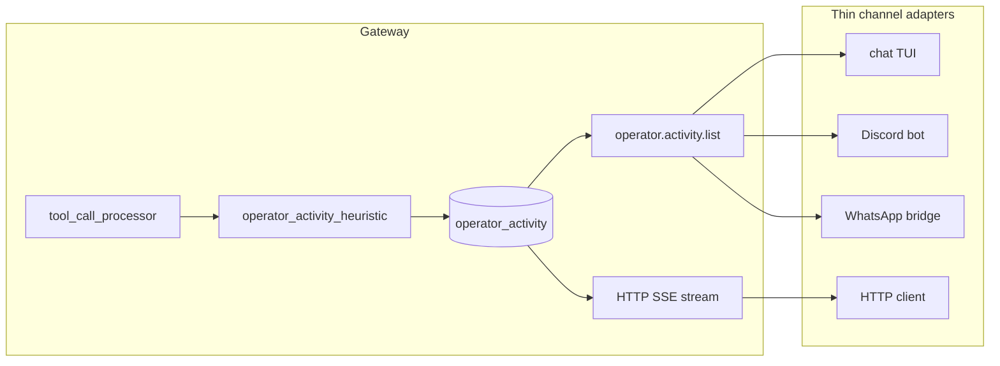

# Operator Activity Feed (Channel-Agnostic Session Visibility)

**Status:** Partial — Phases 0–3 shipped in PR #358 (classifier, SQLite feed, JSON-RPC, chat TUI, HTTP SSE). Phase 4 hardening (#357) pending.

**Problem surfaced by:** `session-46d65624` — planner wrote `news_fetcher.py`, `market_data.py`, and
`sentiment.py`; `digest.md` and `session_overview.md` showed it; the chat TUI did not.

**Core proposal:** the gateway emits a durable, channel-neutral **operator activity** stream
keyed by `root_session_id`. Every human-facing transport (terminal chat, Discord, WhatsApp, HTTP
bridges) consumes the same feed and applies local formatting. Visibility logic lives once in the
gateway, not in each UI.

**Refs:**

- `docs/archived/plan_workflow_update.md` — “CLI is a consumer, not an orchestrator”
- `docs/archived/plan-channel-agnostic-interaction-answering.md` — gateway-owned orchestration
- `docs/remote-agents-http-api.md` — `metadata.channel` convention, HTTP/SSE ingress
- `autonoetic-gateway/src/runtime/session_report.rs` — existing “important event” heuristic
- `autonoetic-types/src/task_completion.rs` — channel-neutral presentation precedent
- `docs/human-agent-collaboration.md` — collaborative planner / workbench flows

---

## 1. Problem statement

Operators need a **live picture of what agents are doing** while a session runs — not only when
a turn finishes and the model returns prose.

Today visibility is split across artifacts that chat consumers do not read:

| Surface | What it shows | Who reads it in chat |
|---------|---------------|----------------------|
| `assistant_reply` from `event.ingest` | Final model text for one RPC | Chat TUI, future bridges (via `session.status`) |
| `workflow_events` (`task.*`, `planframe.*`) | Delegation lifecycle, plan gates | Chat TUI polls in `check_signals` |
| `digest.md` (live digest) | Per-tool narrative | Editors / filesystem only |
| `session_overview.md` (session report) | “Important” causal timeline | Filesystem / observability tools |
| `causal_events` (SQLite) | Full audit trail | Policy pane subset only; not main transcript |

Gaps:

1. **Root-session tool work** (`content_write`, `agent_spawn`, `workflow_wait` results, etc.) is
   recorded for audit and reports but **not pushed to any operator channel**.
2. **`event.ingest` is turn-coarse** — many LLM/tool loops can run server-side before one reply;
   `jsonrpc_spawn_complete_empty` yields a silent chat even when tools succeeded.
3. **A TUI-only fix** (poll causal events inside `chat.rs`) would not carry to WhatsApp/Discord
   and duplicates logic that already exists in `session_report.rs`.

The operator activity feed closes the gap without coupling presentation to Ratatui or any
messaging SDK.

---

## 2. Design goals

1. **Single source of truth** — importance rules and summaries are defined once; session report,
   TUI, and bridges stay aligned.
2. **Channel-neutral payload** — structured records with severity and summary text; no emojis or
   markdown required in the core type (adapters may add them, like `TaskCompletionPresentation`).
3. **Root-scoped** — activities are indexed by `root_session_id` so child specialist work
   (researcher, coder) appears in the operator’s thread.
4. **Low noise** — poll-style tools (`workflow_state`, benign `workflow_wait`) are suppressed by
   default; failures and contract-impacting actions always surface.
5. **Safe summaries** — redacted, length-capped text suitable for Discord/WhatsApp; no raw env,
   credentials, or full file bodies.
6. **Cursor-based consumption** — bridges poll or stream incrementally; reconnect without replaying
   the full causal chain.
7. **Composable with existing surfaces** — does not replace `digest.md`, causal audit, or
   `workflow_events`; it **projects** a subset for humans.

### Non-goals (v1)

- Replacing `digest.md` or full session reports.
- Streaming LLM token deltas to operators.
- Push notifications to mobile OSes (webhook hooks may come in v2).
- Operator replies via the activity feed (use `interaction.resolve_and_answer` / `event.ingest`).

---

## 3. Architecture



**Principles (unchanged from workflow hardening plan):**

- Gateway owns emission and retention.
- Channels are dumb formatters + transport.
- Approval and interaction orchestration remain separate APIs; this feed is **informational**
  unless an activity record points at an actionable id (`approval_request_id`, `plan_id`, etc.).

---

## 4. Core types (`autonoetic-types`)

Add `autonoetic-types/src/operator_activity.rs` (exported from `lib.rs`).

### 4.1 `OperatorActivityRecord`

| Field | Type | Description |
|-------|------|-------------|
| `activity_id` | `String` | Stable id, e.g. `oa-{uuid}` |
| `root_session_id` | `String` | Operator thread scope |
| `session_id` | `String` | Emitting session (may be child) |
| `agent_id` | `String` | Emitting agent |
| `workflow_id` | `Option<String>` | When in workflow context |
| `task_id` | `Option<String>` | When in task context |
| `turn_id` | `Option<String>` | Best-effort turn alignment |
| `occurred_at` | `String` | RFC3339 UTC |
| `kind` | `OperatorActivityKind` | Normalized category |
| `severity` | `OperatorActivitySeverity` | `Info` \| `Progress` \| `Attention` \| `Error` |
| `summary` | `String` | Single-line operator text (redacted, capped) |
| `tool_name` | `Option<String>` | Source tool when applicable |
| `causal_event_id` | `Option<String>` | Link to audit row |
| `refs` | `OperatorActivityRefs` | Optional actionable handles |

### 4.2 `OperatorActivityKind` (enum)

Map from tool / event semantics:

| Kind | Examples |
|------|----------|
| `ToolCompleted` | `content_write`, `sandbox_exec`, `web_search` |
| `ToolFailed` | Any tool with `ok: false` (non-poll) |
| `Delegation` | `agent_spawn` / workflow `task.spawned` mirror |
| `WorkflowJoin` | `workflow_wait` join satisfied or child failures |
| `ApprovalRequired` | Tool result with `approval_required: true` |
| `PlanProposal` | Plan frame entered `awaiting_approval` |
| `HumanGate` | `user_ask`, escalation (optional v1 — may rely on existing interaction APIs) |
| `SessionLifecycle` | Session suspended, emergency stop, close reason |

v1 focuses on **tool completion** and **workflow/plan** events that session report already treats
as important.

### 4.3 `OperatorActivityRefs`

```json
{
  "approval_request_id": "apr-…",
  "plan_id": "plan-…",
  "interaction_id": "ui-…",
  "artifact_id": "art_…",
  "workbench_id": "wb-…"
}
```

Adapters use refs to deep-link (TUI: jump to approval card; Discord: button URL to admin UI).

### 4.4 `OperatorActivitySeverity`

Derived deterministically from kind + payload (no LLM):

- `Error` — tool failure, `workflow_wait` with `any_failed`, LoopGuard trip, session close failure
- `Attention` — approval required, plan awaiting approval, escalation
- `Progress` — successful `content_write`, spawn, artifact build, delegation started
- `Info` — optional; default suppress unless config enables verbose feed

---

## 5. Shared heuristic module (`autonoetic-gateway`)

Extract logic from `session_report.rs` into:

`autonoetic-gateway/src/runtime/operator_activity.rs`

Public functions:

```rust
pub fn classify_tool_activity(
    tool_name: &str,
    arguments_redacted: &str,
    result_json: &str,
    context: &OperatorActivityContext,
) -> Option<OperatorActivityDraft>;

pub fn classify_workflow_event(
    event: &WorkflowEvent,
) -> Option<OperatorActivityDraft>;
```

`OperatorActivityDraft` carries kind, severity, summary, refs — **no storage**.

**Importance rules (v1 parity with session report):**

- **Always emit:** non-poll tool failures; `approval_required`; `content_write` success;
  `agent_spawn`; `artifact_build` / `artifact_inspect` with ids; `sandbox_exec` completion;
  `web_search` / `web_fetch` (summary only); approval resolved lines.
- **Conditional emit (poll tools):** `workflow_wait` / `workflow_state` only when
  `poll_result_is_important()` matches (failed children, join satisfied, pending approvals) —
  move `is_poll_tool` / `poll_result_is_important` into the shared module.
- **Never emit:** routine `workflow_state` refresh with no failures; successful poll-only waits
  with no state change; memory search noise (`execution_search` with `%` patterns) — consider an
  explicit denylist for known spam tools in v1.1.

**Summaries:** reuse `summarize_tool_result` / `summarize_tool_error` (move or call from shared
module). Apply existing `redact_text_for_logs` before persistence.

`session_report.rs` calls the same classifier so “important” in `session_overview.md` and operator
feed never diverge.

---

## 6. Emission points

Write to `operator_activity` **after** the action is durable (same transaction boundary as causal
insert when possible).

| Hook | When |
|------|------|
| `tool_call_processor` | Tool result recorded (primary path for `content_write`, etc.) |
| `scheduler` workflow emitter | Mirror selected `workflow_events` already shown in chat (`task.failed`, `planframe.proposed`) if not redundant with tool hook |
| `execution.rs` | Session close with abnormal / empty-reply close reasons (`jsonrpc_spawn_complete_empty` → `Attention` “session ended with no assistant message; N tool steps ran”) |
| `human_gate` / plan frame ops | Plan approval state transitions (optional dedup with workflow event) |

**Dual-write policy:** causal audit remains authoritative; `operator_activity` is a **projection**.
If projection write fails, log warning — do not fail the tool.

**Dedup:** `(root_session_id, causal_event_id)` unique when `causal_event_id` is present; for
workflow mirrors use `(root_session_id, source_workflow_event_id)`.

---

## 7. Storage (`gateway.db`)

New migration `apply_operator_activity_vN()`:

```sql
CREATE TABLE IF NOT EXISTS operator_activity (
    activity_id       TEXT PRIMARY KEY,
    root_session_id   TEXT NOT NULL,
    session_id        TEXT NOT NULL,
    agent_id          TEXT NOT NULL,
    workflow_id       TEXT,
    task_id           TEXT,
    turn_id           TEXT,
    occurred_at       TEXT NOT NULL,
    kind              TEXT NOT NULL,
    severity          TEXT NOT NULL,
    summary           TEXT NOT NULL,
    tool_name         TEXT,
    causal_event_id   TEXT,
    workflow_event_id TEXT,
    refs_json         TEXT,
    UNIQUE (causal_event_id) WHERE causal_event_id IS NOT NULL,
    UNIQUE (workflow_event_id) WHERE workflow_event_id IS NOT NULL
);

CREATE INDEX idx_operator_activity_root_time
    ON operator_activity(root_session_id, occurred_at, activity_id);
```

**Retention:** follow `causal_events` retention policy (default 90 days) via the same pruning job.

**GatewayStore** (`gateway_store/operator_activity.rs`):

- `insert_operator_activity(&OperatorActivityRecord)`
- `list_operator_activity(root_session_id, after: Option<&str>, limit) -> Vec<…>`
- `latest_activity_cursor(root_session_id) -> Option<String>`

---

## 8. Gateway API

### 8.1 JSON-RPC: `operator.activity.list`

**Params:**

```json
{
  "root_session_id": "session-46d65624",
  "after_activity_id": "oa-optional-cursor",
  "limit": 50,
  "min_severity": "progress"
}
```

**Result:**

```json
{
  "activities": [ { /* OperatorActivityRecord */ } ],
  "next_cursor": "oa-…",
  "has_more": false
}
```

- Ordering: `(occurred_at ASC, activity_id ASC)`.
- `after_activity_id` is exclusive cursor (stable with compound key).
- Auth: same as other gateway methods (`AUTONOETIC_SHARED_SECRET`).

### 8.2 JSON-RPC: `operator.activity.subscribe` (optional v1.1)

Long-poll or WebSocket for daemons that already hold a connection. v1 can rely on list + 1s poll
in TUI (same cadence as `check_signals`).

### 8.3 HTTP: `GET /api/operator/activity/stream/{root_session_id}`

SSE mirror of list polling (same pattern as `GET /api/session/stream/{session_id}`):

- Query: `after`, `interval_ms`, `token` or Bearer auth.
- Each event: JSON `OperatorActivityRecord`.
- Termination: only on client disconnect (unlike session stream).

Document in `docs/remote-agents-http-api.md`.

---

## 9. Channel adapters

### 9.1 Terminal chat (`autonoetic/src/cli/chat.rs`)

- Remove any plan to poll raw `causal_events` for the main transcript.
- In `check_signals`, call `operator.activity.list` (in-process store when embedded; RPC when
  remote) with `app.last_operator_activity_cursor`.
- Append new rows as `MessageRole::Signal` (or reuse `push_workflow_event_message` styling).
- Map severity → icon in TUI only (keep types emoji-free).
- Update `session_overview.latest_signal` from latest activity summary.

### 9.2 Discord / WhatsApp / Slack (future)

Thin bridge responsibilities:

1. Bind inbound messages to `root_session_id` + `metadata.channel`.
2. `event.ingest` with `async_mode: true` when appropriate.
3. Poll `operator.activity.list` or SSE stream; format `summary` + optional buttons from `refs`.
4. Route approvals via existing gateway approval APIs (not chat-specific).
5. Answer `user_ask` via `interaction.resolve_and_answer`.

**Formatting examples (adapter-local):**

| Severity | Discord | WhatsApp |
|----------|---------|----------|
| `Progress` | embed field “Planner wrote `news_fetcher.py`” | single line text |
| `Error` | red embed + thread reply | text + optional link |
| `Attention` | button “Approve apr-…” | reply with command hint |

### 9.3 `metadata.channel` linkage (v2)

Optional table `operator_channel_bindings (channel_kind, channel_id, sender_id, root_session_id)`
so bridges recover session context without local state. v1: bridge stores mapping in its own DB.

---

## 10. Relationship to existing surfaces

| Surface | Relationship |
|---------|----------------|
| `workflow_events` | Keep for scheduler; mirror subset into operator feed where chat already expects cards |
| `digest.md` | Remains full-fidelity engineer log; feed is concise |
| `session_report` / `session_overview.md` | Share heuristic; report file generation unchanged |
| `session.status` / SSE | Still delivers **final** ingest outcome; feed covers **in-run** steps |
| `notifications` table | Stays agent-wake oriented; do not overload for human transcript |
| `EscalationMessage` | Separate promotion review path; may cross-reference in refs |

---

## 11. Phased rollout

### Phase 0 — Extract heuristic (no user-visible change)

- [ ] Move `is_poll_tool`, `poll_result_is_important`, summarize helpers to
      `operator_activity.rs`.
- [ ] `session_report.rs` calls shared module; existing tests green.

### Phase 1 — Persist + RPC

- [ ] SQLite migration + `GatewayStore` CRUD.
- [ ] Emit from `tool_call_processor` on tool completion.
- [ ] `operator.activity.list` in `router.rs`.
- [ ] Unit tests: `content_write` → one row; poll spam → none; `workflow_wait` failure → row.

### Phase 2 — Terminal chat consumer

- [ ] `check_signals` polls activity feed; shows planner file writes.
- [ ] Close-reason activity for `jsonrpc_spawn_complete_empty` when tools ran in that ingest.
- [ ] Integration test: ingest → poll feed → assert summary contains `wrote news_fetcher.py`.

### Phase 3 — HTTP SSE + docs

- [ ] `GET /api/operator/activity/stream/…`
- [ ] Update `docs/remote-agents-http-api.md`, `docs/human-agent-collaboration.md` (Observability).
- [ ] Example bridge pseudocode in `docs/agent-messaging.md` or new `docs/channel-adapters.md`.

### Phase 4 — Hardening

- [ ] Tool denylist / rate limit per root session (max N activities per minute).
- [ ] `operator.activity.subscribe` or webhook `operator.activity.push` for mobile.
- [ ] Channel binding table + `interaction.resolve_and_answer` correlation helpers.

---

## 12. Testing strategy

| Layer | Tests |
|-------|--------|
| Heuristic | Table-driven: tool name + JSON fixture → `Option<OperatorActivityDraft>` |
| Store | Insert/list cursor ordering, dedup unique constraints |
| RPC | `operator.activity.list` auth + pagination |
| Integration | Full session: planner `content_write` ×3 → chat poll shows 3 lines |
| Regression | Session report “important” count unchanged for fixture sessions |
| Security | Summaries never contain `AUTONOETIC_`, bearer tokens, or raw `content` bodies |

---

## 13. Security and constitution

- **R-3.x / disclosure:** Summaries use the same redaction pipeline as logs and session report.
- **No discretion leak:** Feed records what happened; it does not approve or deny actions.
- **Cross-session isolation:** `operator.activity.list` must reject `root_session_id` outside
  caller’s authorized scope (same session_id validation as `session.status`).
- **Rate limits:** Prevent activity flooding from runaway agents (align with LoopGuard /
  `approval_flood` philosophy).

---

## 14. Open questions

1. **Emit on tool start vs completion?** v1 recommends **completion only** to halve row volume;
   long-running `sandbox_exec` may need a “started” row in v1.1.
2. **Include child-only sessions in root feed?** Recommended **yes** (denormalize
   `root_session_id` at write time).
3. **Collapse bursts?** e.g. three `content_write` in one turn → one line “wrote 3 files (…)” —
   defer to Phase 4 unless WhatsApp length limits force earlier.
4. **Public HTTP exposure:** activity stream reveals operational detail — require Bearer token,
   same as other HTTP ingress.

---

## 15. Success criteria

Operators using **any** channel can answer without opening `digest.md`:

- “What did the planner just do?” → see `wrote news_fetcher.py` (and siblings) within one poll
  interval.
- “Did the researcher fail?” → see `Error` row with LoopGuard / `task.failed` summary.
- “Why did chat go quiet?” → see `Attention` row for `jsonrpc_spawn_complete_empty` with tool
  count, not an empty transcript.

Implementation is complete when Phase 2 tests pass and `docs/human-agent-collaboration.md` documents
the feed as the canonical live view for collaborative sessions.
