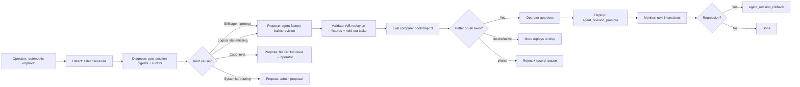

# Self-Improvement Loop — Design

> Status: **Draft (2026-05-20)** — feedback wanted before implementation.
> Tracking issue: [#244](https://github.com/mandubian/autonoetic/issues/244).
> Phase issues: P0 [#245](https://github.com/mandubian/autonoetic/issues/245),
> P1 [#246](https://github.com/mandubian/autonoetic/issues/246),
> P2 [#247](https://github.com/mandubian/autonoetic/issues/247),
> P3 [#248](https://github.com/mandubian/autonoetic/issues/248),
> P4 [#249](https://github.com/mandubian/autonoetic/issues/249),
> P5 [#250](https://github.com/mandubian/autonoetic/issues/250),
> P6 [#251](https://github.com/mandubian/autonoetic/issues/251),
> P7 [#252](https://github.com/mandubian/autonoetic/issues/252).
> Related: [`divergence-sentinel-design.md`](./divergence-sentinel-design.md) (in-session
> divergence detection; this doc is its post-session counterpart).

## 1. Problem Statement

Today's improvement loop is **operator-driven and manual**:

1. Operator runs a task; the session finishes (well or poorly).
2. Operator asks Claude to read the digest and identify what went wrong.
3. Operator + Claude diagnose: missing skill step, broken agent prompt, missing
   gateway primitive, oversized prompt, wrong routing, etc.
4. Operator edits skills or files a code change.
5. Operator re-runs the task and hopes it's better.

The mechanics for most of this exist in Autonoetic already — but they are
**disconnected**. There is no command that takes a finished session and walks
it through `analyze → propose → validate → approve → deploy → monitor`.

The operator wants this loop to be **concrete and partly automatic**, with two
target axes:

- **Logical correctness** — "register to service X" failed because of a missing
  OAuth callback step.
- **Efficiency** — a session burned 47k tokens and 23 turns when a tighter
  agent could have done it in 12k tokens and 8 turns.

And explicitly **not yet** fully autonomous — operator approval gates every
deploy until the system has earned trust.

## 2. What Already Exists (Bigger Than I Expected)

A thorough infrastructure survey shows **the closed loop is ~70% built**. The
table below maps closed-loop stages to the production code that already
implements them:

| Stage | Existing component | File / location | Status |
|---|---|---|---|
| **Detect — bad session signals** | `LoopGuard` sub-trip, budget breach, error_burst, divergence sentinel (planned #238) | `runtime/guard.rs`, `runtime/session_budget.rs` | ✅ Production |
| **Detect — cross-session patterns** | `memory-curator.default` agent (scores per-agent perf; flags systemic gaps) | `agents/evolution/memory-curator.default/SKILL.md` | ✅ Production |
| **Detect — orchestration chassis** | `evolution-orchestrator.default` (cron-driven: analyses sessions, triggers curator + steward, surfaces admin proposals) | `agents/evolution/evolution-orchestrator.default/SKILL.md` | ✅ Production |
| **Diagnose — narrative** | Auto `post_session_digest` (LLM narrative + structured memory extraction) | `runtime/post_session_digest.rs` | ✅ Production |
| **Diagnose — agent-level** | `evolution-steward.default` (classifies root cause: instructions-level / code-level / systemic) | `agents/evolution/evolution-steward.default/SKILL.md` | ✅ Production |
| **Propose — agent / skill change** | `agent-factory.default` (coder + auditor + evaluator pipeline) | `agents/evolution/agent-factory.default/` | ✅ Production |
| **Propose — revision storage** | `agent_revision_create`, immutable + content-addressed + Ed25519 signed | `runtime/tools/agent_revision.rs` | ✅ Production |
| **Validate — eval suite** | `eval_suite_publish/run/compare/report` (with self-evaluation ownership invariant) | `runtime/tools/evaluation.rs` | ✅ Schemas; compare logic TBD |
| **Validate — sealed replay** | `autonoetic eval sealed --artifact-ref <ar> --fixture-set <fs>` + recording mode | `runtime/sealed_network.rs`, `runtime/sealed_network_proxy.rs` | ✅ Production |
| **Approve — promotion gate** | `promotion.record` with severity gating; auditor + evaluator pass required for `full` mode | `runtime/tools/promotion.rs` | ✅ Production |
| **Deploy — alias swap** | `agent_revision_promote` (atomic alias update; multiple revisions coexist) | `runtime/tools/agent_revision.rs` | ✅ Production |
| **Rollback** | `agent_revision_rollback` | `runtime/tools/agent_revision.rs` | ✅ Production |
| **Monitor — cost & traces** | `session_cost_usd`, `execution_traces`, `causal_events` | various | ✅ Production |
| **Install** | `specialized_builder.default` | `agents/evolution/specialized_builder.default/` | ✅ Production |

The chassis is already there. The user can already do **most** of this by
chatting with the evolution-orchestrator. What is missing is **the connective
tissue that makes it concrete and operator-fronted**.

## 3. What's Actually Missing (The Real Gap)

Five concrete gaps, in priority order:

### G1 — A/B replay orchestration (the keystone)

There is no tool today that takes a recorded task and runs it against **two
agent revisions in parallel**, returning a comparison report. Today you can:

- Spawn one session with `revision_id` pinned (✅)
- Replay a sealed evaluator against fixtures (✅)
- Run two `agent_spawn` calls manually (✅)

But there is **no built-in primitive that does**: `(task, revision_A,
revision_B) → comparison_report` with controlled inputs, controlled fixtures,
and shared evaluation criteria. Without this, every "is variant B actually
better?" question falls back to "deploy and hope," which is exactly the
behavior the operator wants to escape.

### G2 — Multi-axis outcome grading

`execution_traces` records cost and exit codes. `memory-curator` scores
agents post-hoc. But there is **no canonical answer** to "did this session
succeed at its task?" beyond what the curator infers from extracted memory
or what the operator marked manually.

For self-improvement, we need a structured `SessionOutcome`:

```rust
struct SessionOutcome {
    task_goal: Option<String>,          // declared up front, optional
    completion: Completion,              // Achieved | PartiallyAchieved | Failed | Aborted
    cost_usd: f64,                       // already tracked
    tokens: TokenBreakdown,              // already tracked
    turns: u32,                          // already trivially derivable
    wall_clock_secs: u64,                // already tracked
    quality_score: Option<QualityScore>, // optional — from an external judge agent
    operator_rating: Option<OperatorRating>,  // optional — explicit thumbs
    grader: GraderProvenance,            // who graded this, with what evidence
}
```

The grader must **not be the agent that ran the session** (self-bias drift,
already a constitutional invariant on eval suites — `evaluated_targets`
cannot include the publishing agent).

### G3 — Code-issue proposer (operator-implements path)

The operator wants the loop to be able to **propose** code changes, not just
agent/skill changes. The proposed path: a specialist agent reads a failed
session, identifies that the cause is in gateway code (e.g., "tool result
schema lost the `Location` header on 3xx redirects"), and **files a
well-scoped GitHub issue** with evidence (session ID, causal events,
suggested fix area). The operator implements the fix on their own time.

This is **bounded**: the proposer only opens issues, never edits code, never
auto-merges. It is a focused agent with `github.issue.create` and
`execution.search` capabilities and nothing else.

### G4 — Eval compare statistical logic

`eval_compare` is registered as a tool but the comparison logic is currently
a stub. We need real statistical reasoning: is the observed delta
significant? How many replays do we need? Are we within budget?

For Phase 1, **bootstrap confidence intervals** over N replays (N typically
3–10) are sufficient — no need for parametric tests. The output is a
recommendation (`prefer_a` / `prefer_b` / `inconclusive`) with the CI as
evidence.

### G5 — Operator-fronted CLI

There is no `autonoetic improve` command. The user wants something like:

```bash
autonoetic improve --session <session_id>
# or
autonoetic improve --last 20-sessions --agent planner.default
```

…that drives the loop end-to-end and reports back. Internally it just
delegates to `evolution-orchestrator`, but with operator-mode behavior
(interactive prompts, proposed changes shown inline, approval gates).

## 4. Statistical Primer: Replays and Bootstrap

The eval comparison uses **bootstrap resampling** over **replays**. Here is
what those terms mean.

### Replay

A **replay** is one complete evaluation run of an agent revision against an
eval suite. Each case in the suite produces one row of per-axis measurements:

| Axis | Source | Meaning |
|------|--------|---------|
| `completion` | `SessionOutcome.judged_success()` | 1.0 if passed, 0.0 if failed |
| `cost_usd` | Session outcome | Dollar cost of the session |
| `tokens` | Session outcome | Total tokens consumed |
| `turns` | Session outcome | Number of LLM turns |
| `wall_clock_secs` | Session outcome | Wall-clock duration |

Five replays of the same revision produce five data points per axis. The
question `eval_compare` answers is: *are the candidate's points clearly
better than the baseline's?*

### Bootstrap Replicate

A **bootstrap replicate** is a synthetic dataset created by sampling the N
original replays **with replacement**. Some replays appear multiple times in
the replicate, others not at all. This simulates "what if I ran the
experiment again with the same underlying process."

Algorithm:

1. Start with N measured replays (each replay = one row of axis values).
2. Pick N random row indices (with replacement) from the original set.
3. Collect the rows at those indices → that is one replicate.
4. Compute per-axis means on the replicate.
5. Run the Pareto decision on those means.
6. Repeat steps 2–5 thousands of times.

The distribution of replicate outcomes approximates the sampling distribution
of the true mean — no parametric assumptions needed (important at small N).

### Row-Level Resampling

The replicate must preserve **per-replay correlations**: if a replay was
expensive *and* slow, those facts stay linked in every replicate. Step 2
samples *row indices* rather than resampling each axis independently.
Independent resampling would let an expensive-but-fast replay's cost pair
with a cheap-but-slow replay's wall-clock in the same replicate, inflating
variance and misleading the Pareto decision.

### Confidence

After computing the central verdict from the original (un-resampled) means,
the Pareto decision runs on each bootstrap replicate. The **confidence
score** is the fraction of replicates that agree with the central verdict.
A confidence of 0.95 means: "if the experiment were re-run, the same answer
comes out 95% of the time."

`Inconclusive` is always returned with confidence 0.0 — the tool's job is to
not guess when evidence is ambiguous.

## 5. The Closed Loop, Concretely



### The "logical fix" example (operator's first case)

> Session 41a3 tried to register to service X and failed because the OAuth
> callback step was missing from the planner's skill.

1. **Detect**: session ended with `completion=Failed`; curator flagged
   `planner.default` for `failure_mode=workflow_incomplete`.
2. **Diagnose**: post-session digest narrative + curator decision journal
   point at missing OAuth callback step.
3. **Propose**: `evolution-steward` decides this is instructions-level. It
   spawns `agent-factory` with context: "add OAuth callback handling step to
   register workflow." Agent-factory produces revision `planner.default@v17`.
4. **Validate**: A/B replay the failed session and 3 other registration tasks
   on v16 (ground) vs v17 (beta). Replay uses recorded fixtures for the
   external OAuth provider.
5. **Eval compare**: v17 succeeds on 4/4, v16 succeeds on 1/4. Cost delta
   negligible. Recommendation: `prefer_b`.
6. **Operator approves**: sees diff, approves via interactive prompt or via
   `admin.proposal` queue.
7. **Deploy**: `agent_revision_promote v17`. Old `v16` retained for rollback.
8. **Monitor**: next 5 registration sessions are watched; if regression,
   automatic rollback proposal surfaces.

### The "efficiency fix" example (operator's second case)

> The planner used 47k tokens and 23 turns for a task a tighter version
> should solve in 12k / 8 turns.

1. **Detect**: not a failure, but `evolution-orchestrator` flags the session
   as "outlier cost" — token usage > 90th percentile for this agent over the
   last 30 days.
2. **Diagnose**: curator analyzes which turns burned tokens. Identifies
   verbose system prompt and redundant re-summarization steps.
3. **Propose**: agent-factory produces `planner.default@v18-beta` with a
   condensed prompt and a `summarize_only_at_milestones` flag.
4. **Validate**: A/B replay 10 archived planner sessions on v17 (current)
   vs v18-beta. **Cost-only metrics are not enough** — also measure
   completion rate. A v18 that succeeds 60% of the time at half the cost is
   strictly worse than v17 at 95%.
5. **Eval compare**: v18-beta uses 0.55× tokens at 0.94× success.
   Bootstrap CI on completion is too wide. Recommendation: `inconclusive`,
   needs more replays.
6. **Operator decision**: run more replays, or accept the cost-vs-success
   tradeoff, or drop.
7. **Deploy / rollback**: same path as above.

## 6. Reward Hacking Defenses

This is the section the operator was right to flag. Without these, "cheaper
sessions" becomes the objective and quality erodes silently.

### D1 — Multi-axis grading is mandatory

A variant cannot be promoted on a single metric. The minimum bar is
**completion AND cost AND quality**. If the variant wins on cost but the
quality judge cannot confirm it matches on completion, it is **not better** —
it is differently bad. Encoded in `eval_compare` as a multi-objective
decision: variant B is preferred only if it Pareto-dominates A or is within
configured tolerance on all axes.

### D2 — The judge cannot be the proposer

Already a constitutional invariant on eval suites: the publishing agent
cannot appear in `evaluated_targets`. Extend this to the improvement loop:
the agent that proposed the revision cannot grade it. Quality scoring is
delegated to an independent specialist (e.g. an evaluator with no skin in
the proposal).

### D3 — Held-out tasks

The variant must succeed on tasks it was not optimized against. If we
proposed v18 from 5 specific session failures, validate also on a sample of
sessions outside those 5. Configurable: `validation.holdout_ratio` (default
0.3).

### D4 — Cost-cut Pareto floor

A variant whose cost reduction comes from completion reduction is rejected
mechanically. Equivalently: if `completion_rate(B) < completion_rate(A) -
tolerance`, the variant is rejected regardless of cost savings.

### D5 — Operator final approval, always (Phase 1)

Until the loop has run enough cycles for the operator to trust its
judgments, **every promote requires operator approval**. This is enforced
by routing all `agent_revision_promote` calls through the existing
admin-proposal queue with explicit operator approval. Path to relax this in
§7 (Progressive Automation).

### D6 — Rollback bound to monitoring

After deploy, the next N sessions are monitored. If completion rate or cost
regresses by > 15% relative to ground, an automatic `rollback proposal` is
queued for operator approval. This is **not auto-rollback** — operator
decides. But the proposal is automatic.

## 7. Rollout Phases

| Phase | Deliverable | Why this order |
|---|---|---|
| **P0** | `SessionOutcome` structured grading (G2) — schema + grader agent + storage | Everything downstream needs this; cheapest of the gaps |
| **P1** | `eval_compare` statistical logic (G4) — bootstrap CI, multi-axis decisions | Needed by validation; only the comparison routine is new code |
| **P2** | A/B replay orchestrator (G1) — `improvement_orchestrator` agent + tool that does `(task, rev_A, rev_B) → comparison` | The keystone gap |
| **P3** | `autonoetic improve` CLI (G5) — operator-fronted entry point | Makes the loop concrete |
| **P4** | Skill-level evolution end-to-end (use P0–P3 for prompts only) | Lowest-risk first deploy of the loop |
| **P5** | Agent-level evolution (capabilities, routing, sub-agents) | Higher blast radius; needs P4 to bake in |
| **P6** | Code-issue proposer agent (G3) | Adds the code-level axis; bounded scope |
| **P7** | Progressive automation: skip operator approval on small-blast-radius improvements with multi-cycle clean record | See §7 |

Each phase is independently valuable. P0 alone unlocks better dashboards.
P1 alone unlocks honest A/B reports. P2 alone unlocks operator-driven
deliberate testing.

## 8. Progressive Automation (The Path to Less Manual)

The operator wants to start operator-triggered and **allow more automation
later, progressively**. The progression has three gradations, each unlocked
by accumulated track record:

| Level | Trigger | Approval | When to unlock |
|---|---|---|---|
| **L1: Operator-triggered, operator-approved** | `autonoetic improve` | Every deploy | Default, always available |
| **L2: Auto-triggered, operator-approved** | `evolution-orchestrator` cron run | Every deploy still requires operator | After 10 successful L1 cycles with no regressions for an agent |
| **L3: Auto-triggered, auto-approved (bounded)** | Cron run | Auto-approval ONLY for: skill-only changes, multi-axis pass, held-out validated, blast radius score < threshold | After 20 successful L2 cycles per agent + explicit operator opt-in per agent |

L3 is **opt-in per agent** and never automatic for agents with code-execution
or sandbox-escape-adjacent capabilities. Constitutional rules apply.

## 9. Relationship to the Divergence Sentinel (#238)

The two designs are **complementary halves**:

- **Sentinel** = in-session, real-time, detects divergence mid-flight, notifies
  planner or operator while the session is still running.
- **Self-improvement** = post-session, batch, detects systemic patterns
  across many sessions and proposes durable changes.

Concretely, the sentinel's `divergence.detected` causal events are **inputs
to the curator**, which uses them as evidence when scoring agents. A
high-divergence agent over many sessions is a candidate for improvement.

## 10. Open Questions

1. **Replay fidelity for non-fixtured external calls.** Sealed fixtures cover
   recorded calls. Tasks involving novel real-world side effects (sending a
   message, signing up to a service) cannot be replayed safely. Should
   replay refuse such tasks, or use a mock provider, or operator-gate?
2. **How many replays for a confidence interval the operator trusts?**
   3 is cheap and weak; 10 is expensive and strong. Default proposal: 5,
   configurable.
3. **Held-out task pool: how curated?** Auto-sample from archived sessions
   tagged with the same agent? Operator-curated golden set?
4. **Quality-judge agent: separate per agent type, or one universal judge?**
   Universal is simpler but may miss domain-specific criteria.
5. **Cost ceiling per `autonoetic improve` invocation.** Replays add up. We
   should declare a per-invocation budget (default proposal: $1) and
   short-circuit cleanly.
6. **What about the planner itself proposing improvements to itself?** The
   ownership invariant on eval suites forbids self-evaluation. Should it also
   forbid self-proposal? Probably yes for L3 auto-approval, possibly OK for
   L1/L2 with operator review.

## 11. References

- `docs/design/divergence-sentinel-design.md` — sister design (in-session)
- `docs/cognitive-capsule.md` — capsule format used
  for replay determinism (Phase 4 is the last piece for full replay)
- `docs/archived/sealed-network-evaluation-plan.md` — fixture replay
  infrastructure
- `docs/archived/sealed-evaluator-replay-design.md` — sealed evaluator CLI
- `agents/evolution/` — existing pipeline (curator, steward, factory,
  builder, orchestrator, adapter)
- `autonoetic-gateway/src/runtime/tools/agent_revision.rs` — revision API
- `autonoetic-gateway/src/runtime/tools/evaluation.rs` — eval suite API
- `autonoetic-gateway/src/runtime/tools/promotion.rs` — promotion gating
- `docs/separation-of-powers.md` — constitutional context for what may /
  may not be auto-modified
