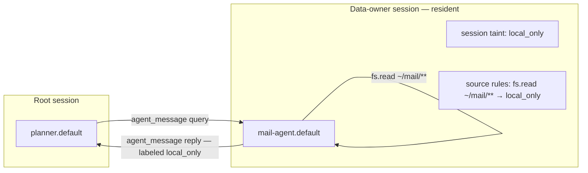

# Data-owner compartment pattern (egress Phase 4)

**RFC:** [`data-envelopes-egress-localization.md`](rfc/data-envelopes-egress-localization.md) §5.5  
**Tracking:** [#909](https://github.com/mandubian/autonoetic/issues/909) slice 7

## Problem

A long-lived personal data source (mail, health records, finance) should not
taint every sibling session in a root workflow. Ephemeral child sessions work
for one-shot bulk jobs, but standing sources need a **resident owner** that
centralizes access, labeling, and audit.

## Pattern



1. **Resident agent** — one bundle owns the sensitive source (`agent.resident_idle_ttl_secs` / session residency #902). The session parks instead of dying on idle so siblings can message it.
2. **Session policy** — root session declares `local_only` taint and source rules on the owner's reads (e.g. `fs.read:~/mail/** → local_only`). Everything the owner accumulates stays labeled by construction.
3. **Sibling access via `agent_message`** — other agents query the owner; replies carry egress labels and intersect into the caller's session taint (Phase 2/3). Raw paths stay confined to the owner bundle when capability scoping is tightened (recommended hard boundary: only the owner holds `ReadAccess` over `~/mail/**`).
4. **Network / federation gates (Phase 4)** — even if a sibling could reach the network, session taint excludes `Sink::Network` until operator declassification (`egress.declassified`). Grants from ordinary network approvals are host-scoped (`session:<root>:host:<host>`) and revocable via `gateway grants revoke --host <host>`; session-wide widening requires an explicit `EgressDeclassify` approval (filed via `gateway egress-declassify`). Pin the owner with `provider_constraint: local_only` on the session policy (`session egress-policy set --provider-constraint local_only`): taint-following routing alone decides per *batch*, so a clean inbound query could otherwise route the owner remote into an all-indications context — safe, but useless. The constraint restricts provider *selection* itself, clean batches included.

## Soft vs hard boundary

| Posture | Mechanism | Effect |
|---------|-----------|--------|
| **Soft** (labels only) | Source rules label any `~/mail` read | Nothing reaches remote sinks; siblings can still read paths directly |
| **Hard** (recommended) | Capability confinement + messaging | Only the owner reads raw paths; siblings must use `agent_message` |

Labels control *flow*; capability confinement controls *access*. Use both for genuinely sensitive standing sources.

## Operator setup (sketch)

```yaml
# config.yaml — global source rules (example)
egress:
  rules:
    - source: fs.read
      path: "~/mail/**"
      label: local_only
```

```yaml
# SKILL.md metadata for mail-agent.default
metadata:
  autonoetic:
    egress:
      output_label: local_only   # bundle floor — owner outputs never widen
    capabilities:
      - type: ReadAccess
        paths: ["~/mail/**"]
```

Spawn the owner as **resident** under a root session whose egress policy adds
the same rules. Siblings get `agent_message` to the owner — not `ReadAccess`
over `~/mail/**`.

## Phase 4 surfaces on the owner

When session taint excludes a sink, these surfaces refuse before bytes leave:

| Surface | Example refusal |
|---------|-----------------|
| `sandbox` | `share_net` under taint without declassification grant |
| `web` | `web_fetch` / `web_search` / `web_call` to remote hosts |
| `hooks` | `http.callback` delivery |
| `mcp` | Remote SSE `tools/call` with tainted args |
| `ofp` | Outbound `AgentMessage` when taint excludes `FederatedAgent` |
| `compression` | Remote preset band summarization on tainted context |

Every refusal emits `egress.boundary_refused` with `surface` + label metadata.
Operator widening emits `egress.declassified`. Inspect with:

```bash
autonoetic gateway egress audit <root-session-id>
```

## Related docs

- [`ARCHITECTURE.md`](ARCHITECTURE.md) — egress localization overview
- [`separation-of-powers.md`](separation-of-powers.md) — gateway-only label plane
- [`plan-egress-phase4-909.md`](plan-egress-phase4-909.md) — implementation slices
