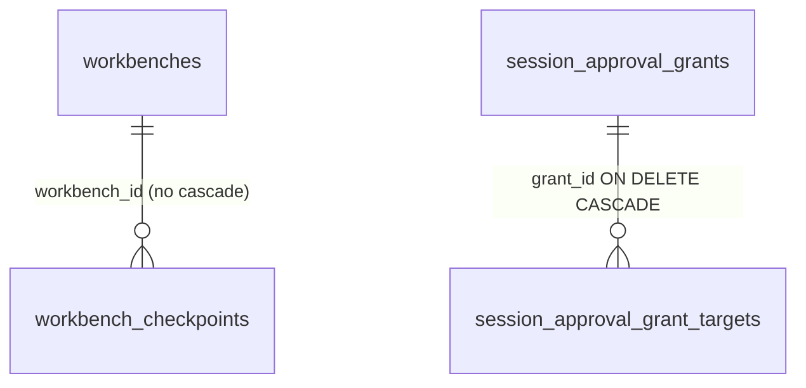

# Gateway Store — SQLite Schema Reference

> **Live reference** for the gateway's SQLite schema: every table, its owner
> module, its relations, and whether it is actively used. Source of truth is
> `autonoetic-gateway/src/scheduler/gateway_store/migrate.rs`
> (`SCHEMA_VERSION_LATEST = 65`). When the schema and this doc disagree, the
> migration file wins — fix this doc.

## How to read this doc

- **Owner module** is the file under `scheduler/gateway_store/` containing the
  primary writer. One file per domain is the convention.
- **Status** is one of: `written` (has INSERT/UPDATE in non-test code),
  `trigger-maintained` (FTS shadow table), or `internal` (infrastructure).
- **Relations**: only two tables declare SQL-level `FOREIGN KEY` constraints
  (see [Relation map](#relation-map)). Everything else is relational *by
  convention* — see the [FK enforcement caveat](#fk-enforcement-caveat) below.

---

## Migration model

`migrate()` (`migrate.rs:9`):

1. Bootstraps a `schema_migrations(version PK, name, applied_at)` tracker.
2. Reads `COALESCE(MAX(version), 0)` as `current_version`.
3. **Refuses to run** if the DB is newer than the binary
   (`current_version > SCHEMA_VERSION_LATEST`) — protects against a downgrade
   reading a schema it cannot understand (`migrate.rs:24-29`).
4. Short-circuits if already at latest (`migrate.rs:31-33`).
5. v1 (`initial_schema`) is applied as one batched transaction when
   `current_version < 1` (`migrate.rs:35-486`).
6. Every `apply_*_vN(conn)` function is called **unconditionally in ascending
   order** (`migrate.rs:488-552`). Each function re-reads `MAX(version)` and
   returns early if `current >= N`, then performs its DDL and inserts one row
   into `schema_migrations` with `(N, name, now)`.

Two consequences:

- Functions are **idempotent and order-independent** — any prefix can be
  skipped safely, and a fresh DB only runs the v1 batch + the early-return
  path for every later migration.
- Several ALTER-style migrations (`v2`, `v9`, `v12`, `v14`, `v15`, `v18`,
  `v20`, `v21`, `v30`, `v40`, `v56`) defensively check `pragma_table_info` /
  `pragma_index_list` before altering. They exist only to upgrade pre-existing
  v1 DBs created before a column was folded into the v1 baseline — they are
  no-ops on fresh DBs. Do not remove them.

### Adding a new migration

1. Increment `SCHEMA_VERSION_LATEST` in `migrate.rs`.
2. Add `fn apply_<descriptive_name>_vN(conn: &mut Connection) -> Result<()>`.
3. The function must read `MAX(version)` and return early if `current >= N`.
4. Register it in the dispatch chain in `migrate()` (ascending order).
5. Perform DDL; insert `(N, name, now)` into `schema_migrations`.
6. Add a domain module under `scheduler/gateway_store/<your_domain>.rs` for the
   writer — do not add new tables directly to `mod.rs` (see
   [Health notes](#health-notes) on `stage_transitions`).

---

## FK enforcement caveat

**`PRAGMA foreign_keys` is never set ON in the gateway code.** SQLite defaults
to FK enforcement **off**, so even the two declared `FOREIGN KEY` constraints
act as documentation only at runtime:

- `workbench_checkpoints.workbench_id → workbenches(workbench_id)` — no
  `ON DELETE` clause, so deleting a workbench does not cascade even with the
  pragma on.
- `session_approval_grant_targets.grant_id → session_approval_grants(id) ON DELETE CASCADE` —
  the cascade is **not actually in effect at runtime** unless a caller turns
  the pragma on per-connection.

All other "relations" described below are application-level invariants
enforced by the Rust writers, not by SQLite. If you add a table that depends
on cascade behavior, set `PRAGMA foreign_keys = ON` on the connection first
and audit the existing writers — they were written assuming the pragma is off.

---

## Table reference

Grouped by domain. Within each group, tables are listed in creation order.
"Created v*N*" is the migration that introduced the table; later column
additions are listed under "ALTERs".

### Schema infrastructure

#### `schema_migrations` — created pre-v1, owner: `migrate.rs` — `internal`
Tracks which migrations have run. One row per applied migration.

| column | type | notes |
|---|---|---|
| `version` | INTEGER PRIMARY KEY | migration version |
| `name` | TEXT NOT NULL | human-readable migration name |
| `applied_at` | TEXT NOT NULL | timestamp |

### Approvals, gates, escalations

The gate pipeline (`GateService`) writes here. See constitution §2.

#### `approvals` — created v1, owner: `approvals.rs` — `written`
The core gate table. One row per `GateKind::Approval` request.

| column | type | notes |
|---|---|---|
| `request_id` | TEXT PRIMARY KEY | |
| `agent_id`, `session_id` | TEXT NOT NULL | |
| `root_session_id` | TEXT | nullable for legacy rows |
| `workflow_id`, `task_id` | TEXT | |
| `action_type`, `action_payload` | TEXT NOT NULL | |
| `reason`, `evidence_ref` | TEXT | |
| `status` | TEXT NOT NULL DEFAULT `'pending'` | |
| `created_at` | TEXT NOT NULL | |
| `decided_at`, `decided_by` | TEXT | |
| `approval_level` | TEXT NOT NULL DEFAULT `'operator'` | |

ALTERs: `+ decision_reason` (v6), `+ similar_to_request_id, + similarity_score` (v19, **dropped v55**), `+ min_dwell_ms, + confirm_phrase` (v23), `+ code_excerpts, + risk_summary` (v32), `+ decided_by_kind` (v47, with backfill), `+ expires_at` (v60, + index).

Indexes: `idx_approvals_status`, `idx_approvals_session`, `idx_approvals_root_session`, `idx_approvals_workflow`, `idx_approvals_expires_at`.

#### `session_approval_grants` — created v4, **rebuilt v16**, owner: `approvals.rs` — `written`
Approved-host grants that auto-approve subsequent calls within scope (P-2.4).

| column | type | notes |
|---|---|---|
| `id` | INTEGER PRIMARY KEY AUTOINCREMENT | |
| `root_session_id`, `agent_id`, `host` | TEXT NOT NULL | |
| `granted_by`, `granted_at` | TEXT NOT NULL | |
| `source_approval_id` | TEXT | logical FK → `approvals.request_id` |
| `revoked_at`, `revoked_reason` | TEXT | added v15 |
| `session_id` | TEXT NOT NULL DEFAULT `''` | added in v16 rebuild |
| `scope` | TEXT NOT NULL DEFAULT `'root_session'` | |
| `expires_at` | TEXT | added v18 |
| | | UNIQUE(`root_session_id`, `session_id`, `agent_id`, `scope`, `host`) |

Indexes: `idx_session_grants_root_agent`, `idx_session_grants_root`, `idx_session_grants_session_agent`.

#### `session_approval_grant_targets` — created v17, owner: `approvals.rs` — `written`
Per-grant target patterns (`ExactHost`, `HostSuffix`, `HostAndPort`, `UrlPrefix`).

| column | type | notes |
|---|---|---|
| `id` | INTEGER PRIMARY KEY AUTOINCREMENT | |
| `grant_id` | INTEGER NOT NULL | **FK** → `session_approval_grants(id) ON DELETE CASCADE` |
| `kind`, `value` | TEXT NOT NULL | |

Index: `idx_grant_targets_grant_id`.

#### `approval_waiters` — created v61, owner: `approvals.rs` — `written`
Sessions blocked waiting on a specific approval.

| column | type | notes |
|---|---|---|
| `id` | INTEGER PRIMARY KEY AUTOINCREMENT | |
| `request_id`, `session_id` | TEXT NOT NULL | UNIQUE(`request_id`, `session_id`) |
| `workflow_id`, `task_id` | TEXT | |
| `created_at` | TEXT NOT NULL | |

Index: `idx_approval_waiters_request`.

#### `gate_messages` — created v31, owner: `gate_messages.rs` — `written`
Append-only enrichment threads on gates (P-2.19).

| column | type | notes |
|---|---|---|
| `id` | INTEGER PRIMARY KEY AUTOINCREMENT | |
| `gate_id`, `sender`, `content` | TEXT NOT NULL | |
| `created_at` | TEXT NOT NULL | |

Index: `idx_gate_messages_gate_id`.

#### `escalations` — created v33, owner: `escalations.rs` — `written`
Agent-decider → human-operator escalation gates (P-2.21).

| column | type | notes |
|---|---|---|
| `escalation_id` | TEXT PRIMARY KEY | |
| `artifact_id`, `agent_id`, `revision_id` | TEXT NOT NULL | |
| `artifact_digest` | TEXT | |
| `role_verdicts`, `planner_synthesis` | TEXT NOT NULL | |
| `created_at` | TEXT NOT NULL | |
| `resolved_at`, `decided_by`, `decision_reason` | TEXT | |
| `root_session_id` | TEXT NOT NULL | |
| `status` | TEXT NOT NULL DEFAULT `'pending'` | |

ALTERs: `+ code_excerpts, + escalation_type` (v36), `+ approval_request_id` (v62), `+ expires_at` (v63).

Indexes: `idx_escalations_root_session`, `idx_escalations_status`.

#### `user_interactions` — created v1, owner: `user_interactions.rs` — `written`
`user_ask` gates (`GateKind::UserInput`).

| column | type | notes |
|---|---|---|
| `interaction_id` | TEXT PRIMARY KEY | |
| `session_id`, `root_session_id`, `agent_id` | TEXT NOT NULL | |
| `workflow_id`, `task_id`, `turn_id` | TEXT | |
| `kind`, `question` | TEXT NOT NULL | |
| `context`, `options_json` | TEXT | |
| `allow_freeform` | INTEGER NOT NULL DEFAULT 1 | |
| `status` | TEXT NOT NULL DEFAULT `'pending'` | |
| `answer_option_id`, `answer_text`, `answered_by` | TEXT | |
| `created_at`, `answered_at`, `expires_at` | TEXT | |
| `checkpoint_turn_id` | TEXT | |
| `resumed_at` | TEXT | added v30 |

Indexes: `idx_user_interactions_session`, `idx_user_interactions_root_session`, `idx_user_interactions_workflow`, `idx_user_interactions_status`, `idx_user_interactions_agent`.

### Workflow orchestration

See `docs/workflow-orchestration.md` and the mechanical-orchestration RFC.

#### `workflow_index` — created v1, owner: `workflow.rs` — `written` (lightly)
One row per root session that has spawned a workflow.

| column | type | notes |
|---|---|---|
| `root_session_id` | TEXT PRIMARY KEY | |
| `workflow_id` | TEXT NOT NULL | |
| `created_at` | TEXT NOT NULL | |

Backfilled from filesystem in `migrate.rs:1601` (`backfill_workflow_index`).

#### `workflow_events` — created v1, owner: `workflow.rs` — `written`
Append-only workflow event log.

| column | type | notes |
|---|---|---|
| `event_id` | TEXT PRIMARY KEY | |
| `workflow_id`, `event_type` | TEXT NOT NULL | |
| `task_id`, `agent_id`, `payload` | TEXT | |
| `created_at` | TEXT NOT NULL | |

Indexes: `idx_workflow_events_workflow`, `idx_workflow_events_created`.

#### `task_runs` — created v65, owner: `workflow_tasks.rs` — `written`
Durable child-task records (the mechanical-orchestration primitive).

| column | type | notes |
|---|---|---|
| `task_id`, `workflow_id`, `agent_id`, `session_id` | TEXT NOT NULL | PK(`workflow_id`, `task_id`) |
| `parent_session_id` | TEXT NOT NULL DEFAULT `''` | |
| `status` | TEXT NOT NULL | |
| `created_at`, `updated_at` | TEXT NOT NULL | |
| `source_agent_id`, `result_summary`, `join_group`, `message`, `metadata_json` | TEXT | |
| `retry_count` | INTEGER NOT NULL DEFAULT 0 | |
| `last_failure_class`, `retry_policy_json`, `side_effect_state`, `dedupe_key` | TEXT | |

Index: `idx_task_runs_workflow`.

#### `queued_task_runs` — created v65, owner: `workflow_tasks.rs` — `written`
Tasks awaiting scheduler pickup (P-6.18 first-spawn persistence).

| column | type | notes |
|---|---|---|
| `task_id`, `workflow_id`, `agent_id`, `message` | TEXT NOT NULL | PK(`workflow_id`, `task_id`) |
| `child_session_id`, `parent_session_id`, `source_agent_id` | TEXT NOT NULL | |
| `metadata_json`, `join_group`, `credential_bindings_json` | TEXT | |
| `blocks_planner` | INTEGER NOT NULL DEFAULT 1 | |
| `enqueued_at` | TEXT NOT NULL | |

Index: `idx_queued_task_runs_workflow`.

#### `task_claims` — created v65, owner: `workflow_tasks.rs` — `written`
Per-scheduler-instance claim + heartbeat lease.

| column | type | notes |
|---|---|---|
| `task_id`, `workflow_id` | TEXT NOT NULL | PK(`workflow_id`, `task_id`) |
| `scheduler_instance_id`, `claimed_at`, `heartbeat_at` | TEXT NOT NULL | |

Indexes: `idx_task_claims_workflow`, `idx_task_claims_heartbeat`.

#### `workflow_singleton_index` — created v58, owner: `singleton_index.rs` — `written`
Single-flight dedupe index for durable operations (P-6.24).

| column | type | notes |
|---|---|---|
| `workflow_id`, `agent_id` | TEXT NOT NULL | PK(`workflow_id`, `agent_id`, `revision_id`) |
| `revision_id` | TEXT NOT NULL DEFAULT `''` | |
| `task_id` | TEXT NOT NULL | |
| `status` | TEXT NOT NULL DEFAULT `'pending'` | |
| `created_at`, `updated_at` | TEXT NOT NULL | |

Indexes: `idx_workflow_singleton_index_task`, `idx_workflow_singleton_index_workflow`.

#### `hook_deliveries` — created v7, owner: `hook_deliveries.rs` — `written`
Idempotent webhook/hook delivery tracking.

| column | type | notes |
|---|---|---|
| `id` | INTEGER PRIMARY KEY AUTOINCREMENT | |
| `event_id`, `hook_event`, `hook_action` | TEXT NOT NULL | UNIQUE(`event_id`, `hook_event`, `hook_action`) |
| `status` | TEXT NOT NULL DEFAULT `'pending'` | |
| `attempt_count` | INTEGER NOT NULL DEFAULT 0 | |
| `last_error` | TEXT | |
| `created_at`, `updated_at` | TEXT NOT NULL | |

Index: `idx_hook_deliveries_event` (unique).

### Causal chain & observability

The audit substrate. Constitution §8.

#### `causal_events` — created v1, owner: `observability.rs` — `written`
Append-only JSONL hash-chain mirrored to SQLite (P-8.1, P-8.4).

| column | type | notes |
|---|---|---|
| `event_id` | TEXT PRIMARY KEY | |
| `agent_id`, `session_id` | TEXT NOT NULL | |
| `turn_id`, `event_seq` | TEXT / INTEGER NOT NULL | |
| `timestamp`, `category`, `action`, `status` | TEXT NOT NULL | |
| `enforced_rules` | TEXT NOT NULL DEFAULT `'["R+++3"]'` | rule IDs cited on this event |
| `target`, `payload`, `payload_ref`, `evidence_ref`, `reason` | TEXT | |

Indexes: `idx_causal_agent_session`, `idx_causal_category_action`, `idx_causal_status`, `idx_causal_target`, `idx_causal_timestamp`.

#### `execution_traces` — created v1, owner: `observability.rs` — `written`
Per-tool-execution detail (stdout/stderr/exit/duration), untruncated (P-8.5).

| column | type | notes |
|---|---|---|
| `trace_id` | TEXT PRIMARY KEY | |
| `event_id`, `agent_id`, `session_id`, `turn_id`, `timestamp` | TEXT NOT NULL | |
| `tool_name` | TEXT NOT NULL | |
| `command`, `stdout`, `stderr`, `error_type`, `error_summary` | TEXT | |
| `exit_code`, `duration_ms` | INTEGER | |
| `success` | INTEGER NOT NULL | |
| `approval_required` | INTEGER DEFAULT 0 | |
| `approval_request_id`, `arguments`, `result` | TEXT | |

Indexes: `idx_exec_agent_session`, `idx_exec_tool`, `idx_exec_success`, `idx_exec_error_type`, `idx_exec_command`.

#### `session_transcripts` — created v1, owner: `observability.rs` — `written`
One row per session, updated as it runs.

| column | type | notes |
|---|---|---|
| `transcript_id` | TEXT PRIMARY KEY | |
| `session_id` | TEXT NOT NULL UNIQUE | |
| `root_session_id`, `agent_id` | TEXT NOT NULL | |
| `revision_id`, `user_id` | TEXT | |
| `started_at` | TEXT NOT NULL | |
| `ended_at`, `excerpt` | TEXT | |
| `status` | TEXT NOT NULL DEFAULT `'active'` | |
| `turn_count` | INTEGER NOT NULL DEFAULT 0 | |
| `transcript_handle` | TEXT | |
| `origin_node_id` | TEXT | |
| `lifecycle_state` | TEXT | added v64 (with backfill from `status`) |

Indexes: `idx_session_transcripts_agent`, `idx_session_transcripts_root`, `idx_session_transcripts_started`, `idx_session_transcripts_status`.

#### `session_transcripts_fts` — created v1 (virtual FTS5) — `trigger-maintained`
External-content FTS5 over `session_transcripts(excerpt)`. Maintained by
triggers `session_transcripts_ai`/`_ad`/`_au`. No direct writer.

#### `live_digest_events` — created v1, owner: `session_timeline.rs` — `written`
Per-turn timeline events feeding the live digest.

| column | type | notes |
|---|---|---|
| `event_id` | TEXT PRIMARY KEY | |
| `root_session_id`, `source_session_id`, `source_node_id` | TEXT NOT NULL | |
| `turn_id`, `source_agent_id` | TEXT | |
| `event_type`, `payload`, `created_at` | TEXT NOT NULL | |
| `principal_kind`, `principal_id`, `role`, `altitude`, `refs_json` | TEXT | added v46 (+ altitude index + backfill) |

Indexes: `idx_live_digest_root_created`, `idx_live_digest_event_type`, `idx_live_digest_source_session`, `idx_live_digest_root_altitude`.

#### `published_session_reports` — created v7, owner: `observability.rs` — `written`
Catalogued session reports queryable via `observability.*` (P-8.8).

| column | type | notes |
|---|---|---|
| `root_session_id` | TEXT PRIMARY KEY | |
| `report_handle` | TEXT NOT NULL | |
| `overview_handle`, `html_handle`, `narrative_handle` | TEXT | |
| `title` | TEXT NOT NULL | |
| `status`, `started_at`, `ended_at` | TEXT | |
| `agent_count`, `error_count`, `approval_count` | INTEGER NOT NULL DEFAULT 0 | |
| `search_text` | TEXT NOT NULL | |
| `generated_at` | TEXT NOT NULL | |
| `report_version` | INTEGER NOT NULL DEFAULT 1 | |

#### `published_session_reports_fts` — created v7 (virtual FTS5) — `written` (manual)
Contentless FTS5 over `(root_session_id, title, search_text, status)`.
**Unlike other FTS tables, this one is maintained by manual INSERT**
(`observability.rs:1115`), not triggers — easy to miss in audits.

#### `operator_activity` — created v45, owner: `operator_activity.rs` — `written`
Tiered operator timeline (the `operator.activity.list` surface).

| column | type | notes |
|---|---|---|
| `activity_id` | TEXT PRIMARY KEY | |
| `root_session_id`, `session_id`, `agent_id` | TEXT NOT NULL | |
| `workflow_id`, `task_id`, `turn_id` | TEXT | |
| `occurred_at`, `kind`, `severity`, `summary` | TEXT NOT NULL | |
| `tool_name` | TEXT | |
| `causal_event_id` | TEXT | unique partial index where not null |
| `workflow_event_id` | TEXT | unique partial index where not null |
| `refs_json` | TEXT | |

Indexes: `idx_operator_activity_causal` (unique partial), `idx_operator_activity_workflow_event` (unique partial), `idx_operator_activity_root_time`.

#### `sandbox_escape_attempts` — created v25, owner: `observability.rs` — `written`
Per-session kernel-denied syscall / mount / ptrace counts (P-7.22).

| column | type | notes |
|---|---|---|
| `id` | INTEGER PRIMARY KEY AUTOINCREMENT | |
| `session_id`, `root_session_id`, `agent_id`, `indicator` | TEXT NOT NULL | |
| `detail` | TEXT | |
| `exit_code` | INTEGER | |
| `detected_at` | TEXT NOT NULL | |

Indexes: `idx_escape_attempts_session`, `idx_escape_attempts_root_session`.

### Agent registry, revisions, promotion

Constitution §9.

#### `agent_revisions` — created v1, owner: `agent_registry.rs` — `written`
Immutable, content-addressed revisions (P-9.3).

| column | type | notes |
|---|---|---|
| `revision_id` | TEXT PRIMARY KEY | |
| `agent_id`, `content_digest`, `runtime_lock_hash`, `manifest_hash` | TEXT NOT NULL | |
| `base_revision_id`, `artifact_id` | TEXT | |
| `created_at` | TEXT NOT NULL | |
| `created_by_type`, `created_by_id`, `source_kind` | TEXT NOT NULL | |
| `source_ref` | TEXT | |
| `origin_node_id`, `trust_domain`, `status` | TEXT NOT NULL | |
| `metadata_json`, `short_id` | TEXT | |
| `signature`, `signer_id` | TEXT | added v24 |
| `detected_network_hosts` | TEXT | added v56 (pragma-guarded) |
| `requested_by_type`, `requested_by_id` | TEXT | added v68 — designer/requester lineage (#803): the delegating principal (e.g. `agent-factory.default`) derived from spawn lineage, distinct from `created_by_*` (the installer) |

Indexes: unique `idx_agent_revisions_agent_content ON (agent_id, content_digest)`, `idx_agent_revisions_agent`, `idx_agent_revisions_status`. Reclaims archived rows in `reclamation.rs:41` (skipping revisions still referenced by `session_agent_bindings`).

#### `agent_aliases` — created v1, owner: `agent_registry.rs` — `written`
The single source of truth for the "active" revision per agent (P-9.4).

| column | type | notes |
|---|---|---|
| `alias_id` | TEXT PRIMARY KEY | |
| `agent_id`, `revision_id` | TEXT NOT NULL | unique per `agent_id` |
| `updated_at`, `updated_by_type`, `updated_by_id`, `reason` | TEXT NOT NULL | |
| `suspended_at`, `suspended_reason`, `suspended_by` | TEXT | added v53 |

Indexes: unique `idx_agent_aliases_agent ON (agent_id)`, `idx_agent_aliases_revision`.

#### `session_agent_bindings` — created v1, owner: `agent_registry.rs` — `written`
Records which revision a session is running.

| column | type | notes |
|---|---|---|
| `session_id` | TEXT PRIMARY KEY | |
| `root_session_id`, `agent_id`, `revision_id`, `runtime_lock_hash`, `home_node_id` | TEXT NOT NULL | |
| `alias_id` | TEXT | |
| `created_at` | TEXT NOT NULL | |
| `requested_target` | TEXT NOT NULL | |

Indexes: `idx_session_agent_bindings_root`, `idx_session_agent_bindings_revision`.

#### `short_id_index` — created v1, owner: `agent_registry.rs` — `written`
Short-id → revision lookup.

| column | type | notes |
|---|---|---|
| `short_id` | TEXT PRIMARY KEY | |
| `revision_id` | TEXT NOT NULL | |
| `created_at` | TEXT NOT NULL | |

Index: `idx_short_id_index_revision`.

#### `promotion_history` — created v1, owner: `agent_registry.rs` — `written`
Audited promotion log (P-8.10 capability-accretion detection).

| column | type | notes |
|---|---|---|
| `promotion_id` | TEXT PRIMARY KEY | |
| `kind`, `alias_id`, `agent_id`, `new_revision_id` | TEXT NOT NULL | |
| `previous_revision_id`, `source_eval_run_id`, `reason` | TEXT | |
| `created_at`, `created_by_type`, `created_by_id`, `origin_node_id` | TEXT NOT NULL | |
| `pre_authorization` | TEXT | added v52 |

Indexes: `idx_promotion_history_agent`, `idx_promotion_history_revision`, `idx_promotion_history_alias`.

#### `promotion_attempts` — created v59, owner: `agent_registry.rs` — `written`
Per-`(alias, content_digest)` promotion attempt log for attempt-exhaustion gate (P-2.29).

| column | type | notes |
|---|---|---|
| `attempt_id` | TEXT PRIMARY KEY | |
| `alias_id`, `revision_id`, `content_digest`, `outcome` | TEXT NOT NULL | |
| `gate`, `error_code`, `session_id`, `workflow_id` | TEXT | |
| `created_at` | TEXT NOT NULL | |

Indexes: `idx_promotion_attempts_alias_digest`, `idx_promotion_attempts_alias_revision`, `idx_promotion_attempts_created_at`.

#### `eval_suites` — created v1, owner: `evaluations.rs` — `written`

| column | type | notes |
|---|---|---|
| `suite_id`, `name`, `description`, `spec_json` | TEXT NOT NULL | |
| `created_at`, `created_by_type`, `created_by_id`, `origin_node_id` | TEXT NOT NULL | |
| `evaluated_targets_json` | TEXT NOT NULL DEFAULT `'[]'` | added v28 |
| `author_agent_id`, `based_on_suite_id` | TEXT | added v28 |

Indexes (v28): `idx_eval_suites_author`, `idx_eval_suites_lineage`.

#### `eval_runs` — created v1, owner: `evaluations.rs` — `written`

| column | type | notes |
|---|---|---|
| `eval_run_id`, `suite_id`, `subject_agent_id`, `subject_revision_id` | TEXT NOT NULL | |
| `baseline_revision_id`, `started_at`, `completed_at`, `report_handle` | TEXT | |
| `status`, `queued_at`, `summary_json`, `origin_node_id` | TEXT NOT NULL | |

Indexes: `idx_eval_runs_subject`, `idx_eval_runs_suite`.

#### `eval_case_results` — created v1, owner: `evaluations.rs` — `written`

| column | type | notes |
|---|---|---|
| `eval_run_id`, `case_id` | TEXT NOT NULL | PK(`eval_run_id`, `case_id`) |
| `status` | TEXT NOT NULL | |
| `score` | REAL | |
| `session_id`, `notes` | TEXT | |
| `output_json` | TEXT NOT NULL | |

Index: `idx_eval_case_results_run`.

### Memory

#### `memories` — created v1, owner: `memory.rs` — `written`

| column | type | notes |
|---|---|---|
| `memory_id`, `scope`, `owner_agent_id`, `writer_agent_id`, `source_ref`, `content`, `content_hash` | TEXT NOT NULL | |
| `source_type` | TEXT NOT NULL DEFAULT `'agent_write'` | |
| `created_at`, `updated_at` | TEXT NOT NULL | |
| `confidence` | REAL | |
| `tags`, `lineage` | TEXT | |
| `visibility` | TEXT NOT NULL DEFAULT `'private'` | |
| `expires_at`, `revision_id`, `binding_session_id`, `alias_ref`, `quarantine_reason` | TEXT | |

Note: pre-v3 DBs had an `allowed_agents` column that was **dropped** in v3 — the only column ever removed from this table.

Indexes: `idx_memories_scope`, `idx_memories_owner`, `idx_memories_visibility`, `idx_memories_tags`, `idx_memories_revision_id`. Deleted on expiry by `reclamation.rs:20`.

#### `memory_tags` — created v1, owner: `memory.rs` — `written`
Normalized tag index.

| column | type | notes |
|---|---|---|
| `memory_id`, `tag` | TEXT NOT NULL | PK(`memory_id`, `tag`) |
| `scope` | TEXT NOT NULL | |

Indexes: `idx_memory_tags_scope_tag`, `idx_memory_tags_tag`. Deleted on parent expiry by `reclamation.rs:15`.

#### `memories_fts` — created v41 (virtual FTS5) — `trigger-maintained`
External-content FTS5 over `memories(content)`. Triggers
`memories_fts_ai`/`_ad`/`_au` keep it in sync. Backfilled once at migration
time. Rows where `quarantine_reason IS NOT NULL` are excluded.

### Artifacts & session lineage

#### `artifact_refs` — created v1, owner: `artifacts.rs` — `written`
In-DB reference to the content-addressed blob store.

| column | type | notes |
|---|---|---|
| `ref_id`, `scope_type`, `scope_id`, `artifact_id`, `artifact_digest` | TEXT NOT NULL | |
| `created_by_agent_id`, `created_at` | TEXT NOT NULL | |
| `expires_at`, `revoked_at` | TEXT | |
| `artifact_canonical_digest` | TEXT NOT NULL DEFAULT `''` | added v20 |

Indexes: unique `idx_artifact_refs_scope_ref ON (scope_type, scope_id, ref_id)`, `idx_artifact_refs_artifact`, `idx_artifact_refs_digest`. Read by `reclamation.rs:104` for liveness checks.

#### `session_fork_lineage` — created v54, owner: `artifacts.rs` — `written`
Records fork parentage (P-6.16).

| column | type | notes |
|---|---|---|
| `forked_session_id` | TEXT PRIMARY KEY | |
| `source_session_id`, `created_at` | TEXT NOT NULL | |

Backfilled at migration from `causal_events WHERE action='session.forked'`.

#### `session_spawn_lineage` — created v57, owner: `session_spawn_lineage.rs` — `written`
Spawn-tree ancestry for trust-boundary collapse (P-10.7).

| column | type | notes |
|---|---|---|
| `child_session_id` | TEXT PRIMARY KEY | |
| `parent_session_id`, `root_session_id`, `target_agent_id`, `created_at` | TEXT NOT NULL | |
| `spawned_at_turn` | INTEGER NOT NULL | |

Index: `idx_session_spawn_lineage_root`.

#### `session_outcomes` — created v38, owner: `session_outcomes.rs` — `written`
Per-session outcome + grader/operator rating.

| column | type | notes |
|---|---|---|
| `outcome_id`, `session_id`, `root_session_id`, `source_agent_id` | TEXT NOT NULL | `session_id` is UNIQUE |
| `task_goal` | TEXT | |
| `completion` | TEXT NOT NULL DEFAULT `'unknown'` | |
| `turns` | INTEGER NOT NULL DEFAULT 0 | |
| `tokens_total` | INTEGER NOT NULL DEFAULT 0 | |
| `cost_usd` | REAL NOT NULL DEFAULT 0.0 | |
| `wall_clock_secs` | REAL NOT NULL DEFAULT 0.0 | |
| `grader_agent_id`, `graded_at`, `grader_evidence` | TEXT | |
| `operator_thumb`, `operator_note`, `operator_rated_at` | TEXT | |
| `created_at`, `updated_at` | TEXT NOT NULL | |

Indexes: `idx_session_outcomes_root`, `idx_session_outcomes_agent`, `idx_session_outcomes_completion`.

### Runtime control

#### `emergency_stops` — created v1, owner: `runtime_control.rs` — `written`
Emergency-stop records (P-7.4).

| column | type | notes |
|---|---|---|
| `stop_id`, `scope_type`, `scope_id`, `root_session_id` | TEXT NOT NULL | |
| `workflow_id` | TEXT | |
| `requested_by_type`, `requested_by_id`, `trigger_kind`, `mode`, `status` | TEXT NOT NULL | |
| `reason` | TEXT | |
| `requested_at` | TEXT NOT NULL | |
| `completed_at`, `details_json` | TEXT | |

Indexes: `idx_emergency_stops_root`, `idx_emergency_stops_workflow`, `idx_emergency_stops_status`, `idx_emergency_stops_requester`.

#### `active_executions` — created v1, owner: `runtime_control.rs` — `written`
Live execution handle registry (driver, pid, host, heartbeat).

| column | type | notes |
|---|---|---|
| `execution_id`, `root_session_id`, `session_id`, `agent_id`, `execution_kind`, `host_id`, `status`, `started_at`, `heartbeat_at` | TEXT NOT NULL | |
| `workflow_id`, `task_id`, `driver` | TEXT | |
| `pid` | INTEGER | |
| `stop_requested_at`, `stopped_at`, `stop_id` | TEXT | |

Indexes: `idx_active_executions_root`, `idx_active_executions_workflow`, `idx_active_executions_task`, `idx_active_executions_session`. Reconciled to `lost` by `migrate.rs:1668` on startup.

### Credentials

#### `credentials` — created v1, owner: `credentials.rs` — `written`
Vault credential references (P-4.4: IDs are mechanical, never secret material).

| column | type | notes |
|---|---|---|
| `credential_id`, `service`, `secret_name`, `created_at`, `updated_at` | TEXT NOT NULL | |
| `inject_as`, `expires_at`, `shared_with`, `allowed_hosts`, `created_by_agent` | TEXT | |
| `refresh_token_secret_name`, `refresh_url`, `refresh_method`, `refresh_headers`, `refresh_extract_access_token`, `refresh_extract_refresh_token`, `refresh_extract_expires_in` | TEXT | added v12 |
| `label` | TEXT DEFAULT NULL | added v40 |

Indexes: `idx_credentials_service`, `idx_credentials_agent`.

#### `credential_setup_state` — created v10, owner: `credentials.rs` — `written`
Per-credential OAuth setup state machine (1:1 with `credentials`).

| column | type | notes |
|---|---|---|
| `credential_id` | TEXT PRIMARY KEY | |
| `state_json`, `created_at`, `updated_at` | TEXT NOT NULL | |

### Scheduled jobs

#### `scheduled_jobs` — created v8, owner: `scheduled_jobs.rs` — `written`
Cron-scheduled agent wake-ups.

| column | type | notes |
|---|---|---|
| `job_id`, `owner_agent_id`, `root_session_id`, `target_agent_id`, `message`, `cron_expr`, `next_run_at`, `created_at`, `updated_at` | TEXT NOT NULL | |
| `target_revision_id` | TEXT NOT NULL DEFAULT `''` | added v9 (folded into v8 baseline) |
| `metadata_json`, `last_run_at`, `last_error` | TEXT | |
| `status` | TEXT NOT NULL DEFAULT `'active'` | |
| `timezone` | TEXT NOT NULL DEFAULT `'UTC'` | |
| `generation` | INTEGER NOT NULL DEFAULT 0 | |

Indexes: `idx_scheduled_jobs_status_next_run`, `idx_scheduled_jobs_root_session`, `idx_scheduled_jobs_owner`. Stale jobs cancelled by `reclamation.rs:86`.

### Inter-agent messaging

#### `agent_messages` — created v11, owner: `messages.rs` — `written`
Peer-to-peer message queue (P-11.3).

| column | type | notes |
|---|---|---|
| `message_id`, `sender_session_id`, `sender_agent_id`, `target_pattern`, `message`, `created_at` | TEXT NOT NULL | |

#### `agent_message_deliveries` — created v11, owner: `messages.rs` — `written`
Per-target delivery tracking (P-11.4 auto-inject at turn start).

| column | type | notes |
|---|---|---|
| `message_id`, `target_session_id` | TEXT NOT NULL | PK(`message_id`, `target_session_id`) |
| `delivered_at` | TEXT | |

Index: `idx_agent_msg_deliveries_target`.

#### `notifications` — created v1, owner: `notifications.rs` — `written`
Operator/notification delivery queue.

| column | type | notes |
|---|---|---|
| `notification_id`, `notification_type`, `target_session_id`, `payload`, `created_at` | TEXT NOT NULL | |
| `request_id`, `target_agent_id`, `workflow_id`, `task_id` | TEXT | |
| `status` | TEXT NOT NULL DEFAULT `'pending'` | |
| `action_completed_at`, `delivered_at`, `consumed_at`, `last_attempt_at`, `error_message` | TEXT | |
| `attempt_count` | INTEGER NOT NULL DEFAULT 0 | |

Indexes: `idx_notifications_status`, `idx_notifications_target`.

### Plans, workbenches, envelopes

#### `plan_frames` — created v42, owner: `plan_frames.rs` — `written`
Versioned plan frames for human/agent co-construction.

| column | type | notes |
|---|---|---|
| `plan_id`, `version`, `workflow_id`, `root_session_id`, `title`, `objective`, `created_by_agent_id`, `created_at` | TEXT/INTEGER NOT NULL | PK(`plan_id`, `version`) |
| `parent_version` | INTEGER | |
| `status` | TEXT NOT NULL DEFAULT `'awaiting_approval'` | |
| `steps_json` | TEXT NOT NULL DEFAULT `'[]'` | |
| `validation_policy_json` | TEXT NOT NULL DEFAULT `'{"entries":[]}'` | |
| `approved_by`, `approved_at`, `reason` | TEXT | |
| `capability_envelope_json` | TEXT NOT NULL DEFAULT `'[]'` | added v51 |
| `expires_at` | TEXT | added v63 |

Indexes: `idx_plan_frames_workflow`, `idx_plan_frames_root_session`, `idx_plan_frames_status`.

#### `workbenches` — created v43, owner: `workbenches.rs` — `written`

| column | type | notes |
|---|---|---|
| `workbench_id`, `workflow_id`, `root_session_id`, `base_artifact_id`, `base_artifact_canonical_digest`, `workspace_path`, `status`, `created_by_agent_id`, `created_at` | TEXT NOT NULL | |
| `plan_id`, `last_checkpoint_at`, `reconciled_at`, `discarded_at` | TEXT | |

Indexes: `idx_workbenches_workflow`, `idx_workbenches_root_session`, `idx_workbenches_status`.

#### `workbench_checkpoints` — created v43, owner: `workbenches.rs` — `written`

| column | type | notes |
|---|---|---|
| `checkpoint_id`, `workbench_id`, `created_at` | TEXT NOT NULL | |
| `label` | TEXT | |
| `file_count`, `total_bytes` | INTEGER NOT NULL DEFAULT 0 | **FK** `workbench_id → workbenches(workbench_id)` (no cascade) |

Index: `idx_wb_checkpoints_workbench`.

#### `session_envelopes` — created v50, owner: `session_envelopes.rs` — `written`
Session capability envelope locks (P-2.27).

| column | type | notes |
|---|---|---|
| `id` | INTEGER PRIMARY KEY AUTOINCREMENT | |
| `root_session_id`, `capability_json`, `source`, `created_at` | TEXT NOT NULL | |
| `observed_at`, `locked_at`, `locked_by`, `plan_id` | TEXT | |

Index: `idx_session_envelopes_root`.

#### `validation_waivers` — created v44, owner: `validation_waivers.rs` — `written`

| column | type | notes |
|---|---|---|
| `waiver_id`, `workflow_id`, `artifact_id`, `validation_id`, `waived_by`, `reason`, `created_at` | TEXT NOT NULL | |
| `validation_class` | TEXT NOT NULL DEFAULT `'correctness_check'` | |

Indexes: `idx_waivers_workflow`, `idx_waivers_artifact`.

### Security, sentinel, recordings

#### `security_findings` — created v26, owner: `security_findings.rs` — `written`
**Append-only at the DB layer.** Trigger `security_findings_no_body_update`
ABORTs any UPDATE that changes a column other than `triage_state` /
`triage_reason`; trigger `security_findings_no_delete` ABORTs any DELETE.

| column | type | notes |
|---|---|---|
| `finding_id`, `severity`, `finding_type`, `affected_json`, `evidence_json`, `reproducibility`, `proposed_remediation`, `sentinel_revision_id`, `created_at` | TEXT NOT NULL | |
| `confidence` | REAL NOT NULL | |
| `baseline_agreed` | INTEGER NOT NULL DEFAULT 0 | |
| `ensemble_agreed` | INTEGER | |
| `triage_state` | TEXT NOT NULL DEFAULT `'pending'` | the only column a body-update may change |
| `triage_reason` | TEXT | |

Indexes: `idx_security_findings_severity`, `idx_security_findings_type`, `idx_security_findings_triage`, `idx_security_findings_created`.

#### `security_sentinel_disagreements` — created v27, owner: `sentinel_disagreements.rs` — `written`
Drift between baseline and current sentinel sweeps.

| column | type | notes |
|---|---|---|
| `disagreement_id`, `sweep_at`, `anchor_json`, `baseline_sentinel_rev`, `current_sentinel_rev`, `created_at` | TEXT NOT NULL | |
| `direction` | TEXT NOT NULL CHECK(`direction IN ('baseline_only','current_only')`) | |
| `baseline_finding_id`, `current_finding_id` | TEXT | logical FK → `security_findings` |

Indexes: `idx_sentinel_disagreements_sweep`, `idx_sentinel_disagreements_direction`.

#### `proposed_attack_patterns` — created v29, owner: `attack_patterns.rs` — `written`
Agent-proposed attack patterns for sentinel hardening.

| column | type | notes |
|---|---|---|
| `pattern_id`, `proposed_by_agent_id`, `category`, `description`, `how_sentinel_should_catch`, `evidence_anchors_json`, `synthetic_test_case_json`, `created_at` | TEXT NOT NULL | |
| `status` | TEXT NOT NULL DEFAULT `'pending'` | |
| `accepted_check_type`, `operator_notes`, `reviewed_at` | TEXT | |

Indexes: `idx_attack_patterns_status`, `idx_attack_patterns_proposer`.

#### `post_promotion_reviews` — created v35, owner: `post_promotion_reviews.rs` — `written`
Tier-1 observational review counters per `(agent, revision)`.

| column | type | notes |
|---|---|---|
| `review_id`, `agent_id`, `revision_id`, `reviewed_at` | TEXT NOT NULL | |
| `tool_failures`, `auth_denials`, `suspensions`, `sentinel_findings` | INTEGER NOT NULL DEFAULT 0 | |
| `findings_json` | TEXT NOT NULL DEFAULT `'[]'` | |

Indexes: `idx_post_promotion_reviews_agent`, `idx_post_promotion_reviews_reviewed`.

#### `recording_sessions` — created v34, owner: `recordings.rs` — `written`
Sealed-network recording sessions for replay-based evaluation.

| column | type | notes |
|---|---|---|
| `session_id`, `agent_id`, `artifact_id`, `revision_id`, `root_session_id`, `started_at`, `created_by` | TEXT NOT NULL | |
| `stopped_at`, `fixture_set_id` | TEXT | |
| `duration_secs`, `max_requests`, `max_bytes`, `request_count`, `total_bytes` | INTEGER | |
| `status` | TEXT NOT NULL DEFAULT `'active'` | |

Indexes: `idx_recording_sessions_agent`, `idx_recording_sessions_status`.

#### `fixture_sets` — created v34, owner: `recordings.rs` — `written`
Replay fixture bundles produced from recording sessions.

| column | type | notes |
|---|---|---|
| `fixture_set_id`, `agent_id`, `revision_id`, `recording_session_id`, `created_at`, `digest` | TEXT NOT NULL | |
| `fixture_file_count`, `total_bytes`, `host_count` | INTEGER NOT NULL DEFAULT 0 | |
| `host_summary` | TEXT NOT NULL DEFAULT `'[]'` | |
| `redaction_summary` | TEXT NOT NULL DEFAULT `'[]'` | |
| `status` | TEXT NOT NULL DEFAULT `'ready'` | |

Index: `idx_fixture_sets_agent`.

### Self-improvement & governance

#### `admin_proposals` — created v13, owner: `admin_proposals.rs` — `written`
Operator-actionable admin proposals surfaced by the sentinel.

| column | type | notes |
|---|---|---|
| `proposal_id`, `title`, `category`, `evidence_json`, `remediation`, `blast_radius`, `created_by`, `created_at` | TEXT NOT NULL | |
| `priority` | TEXT NOT NULL DEFAULT `'medium'` | |
| `status` | TEXT NOT NULL DEFAULT `'open'` | |
| `triaged_by`, `triaged_at`, `decision_reason` | TEXT | |

Indexes: `idx_admin_proposals_status`, `idx_admin_proposals_category`, `idx_admin_proposals_created_at`.

#### `constitutional_proposals` — created v22, owner: `constitutional_proposals.rs` — `written`
Agent-proposed amendments (Ri-0.8). The `O-6` decision duty is recorded here.

| column | type | notes |
|---|---|---|
| `proposal_id`, `proposer_agent_id`, `kind`, `justification`, `created_at` | TEXT NOT NULL | |
| `proposer_session_id`, `target_id`, `proposed_text` | TEXT | |
| `evidence_json` | TEXT NOT NULL DEFAULT `'[]'` | |
| `status` | TEXT NOT NULL DEFAULT `'pending'` | |
| `operator_decision`, `decision_reason`, `decided_by`, `decided_at`, `published_in_release` | TEXT | |

Indexes: `idx_constitutional_proposals_status`, `idx_constitutional_proposals_proposer`, `idx_constitutional_proposals_release`, `idx_constitutional_proposals_created_at`.

#### `improvement_cycles` — created v39, owner: `improvement_cycles.rs` — `written`
Self-improvement loop bookkeeping.

| column | type | notes |
|---|---|---|
| `cycle_id`, `agent_id`, `level`, `outcome`, `created_at` | TEXT NOT NULL | |
| `regression_detected` | INTEGER NOT NULL DEFAULT 0 | |
| `operator_decision` | TEXT NOT NULL DEFAULT `''` | |
| `session_id`, `revision_before`, `revision_after` | TEXT | |
| `blast_radius_score` | REAL | |
| `closed_at` | TEXT | |

Indexes: `idx_improvement_cycles_agent`, `idx_improvement_cycles_created`.

#### `stage_transitions` — created v37, owner: `mod.rs` (no dedicated module) — `written`
**The only table whose writer lives in `mod.rs` directly.** Inconsistent with
the one-file-per-domain convention — flagged in [Health notes](#health-notes).

| column | type | notes |
|---|---|---|
| `id` | INTEGER PRIMARY KEY AUTOINCREMENT | |
| `agent_id`, `revision_id`, `stage` | TEXT NOT NULL | UNIQUE(`agent_id`, `revision_id`, `stage`) |
| `transition_type` | TEXT NOT NULL DEFAULT `'attempt'` | |
| `created_at` | TEXT NOT NULL DEFAULT `(datetime('now'))` | |

Indexes: `idx_stage_transitions_agent_revision`, `idx_stage_transitions_stage`.

### Users, channels, inference

#### `user_profiles` — created v5, owner: `user_profiles.rs` — `written`

| column | type | notes |
|---|---|---|
| `user_id` | TEXT PRIMARY KEY | |
| `display_name`, `profile_json` | TEXT | |
| `trust_domain` | TEXT NOT NULL DEFAULT `'local'` | |
| `origin_node_id` | TEXT | |
| `profile_version` | INTEGER NOT NULL DEFAULT 1 | |
| `created_at`, `updated_at` | TEXT NOT NULL | |

Index: `idx_user_profiles_trust`.

#### `user_agent_bindings` — created v5, owner: `user_profiles.rs` — `written`

| column | type | notes |
|---|---|---|
| `user_id`, `agent_id` | TEXT NOT NULL | PK(`user_id`, `agent_id`) |
| `scope` | TEXT NOT NULL DEFAULT `'restricted'` | |
| `granted_at` | TEXT NOT NULL | |
| `granted_by` | TEXT | |

Index: `idx_user_agent_bindings_agent`.

#### `operator_channel_bindings` — created v48, owner: `channel_bindings.rs` — `written`
External channel (Slack, etc.) → root-session binding.

| column | type | notes |
|---|---|---|
| `channel`, `external_id`, `root_session_id`, `created_at`, `updated_at` | TEXT NOT NULL | PK(`channel`, `external_id`) |

Index: `idx_channel_bindings_root`.

#### `session_inference_bindings` — created v49, owner: `session_inference.rs` — `written`
Per-root-session LLM preset override.

| column | type | notes |
|---|---|---|
| `root_session_id` | TEXT PRIMARY KEY | |
| `preset_override`, `reason`, `set_by`, `set_at` | TEXT NOT NULL | |

---

## Relation map

### Declared SQL-level foreign keys (only two)

> ⚠ Both are **inert at runtime** because `PRAGMA foreign_keys` is never set
> ON. The cascade on `session_approval_grant_targets` does not fire; manual
> cleanup is required in application code.

### Logical relations (by convention, not enforced)

The remaining ~30 logical relations are application-level invariants. The
diagram below shows the main clusters; arrows point from the referencing
column to the referenced table.

```mermaid
erDiagram
    approvals ||--o{ session_approval_grants : "source_approval_id"
    approvals ||--o{ approval_waiters : "request_id"
    approvals ||--o{ notifications : "request_id"
    approvals ||--o{ escalations : "approval_request_id"

    agent_revisions ||--|| agent_aliases : "revision_id"
    agent_revisions ||--o{ session_agent_bindings : "revision_id"
    agent_revisions ||--o{ promotion_history : "new_revision_id"
    agent_revisions ||--o{ promotion_attempts : "revision_id"
    agent_revisions ||--o{ short_id_index : "revision_id"
    agent_revisions ||--o{ memories : "revision_id"
    agent_aliases ||--o{ session_agent_bindings : "alias_id"
    agent_aliases ||--o{ promotion_history : "alias_id"

    eval_suites ||--o{ eval_runs : "suite_id"
    eval_runs ||--o{ eval_case_results : "eval_run_id"

    memories ||--o{ memory_tags : "memory_id"

    causal_events ||--o{ execution_traces : "event_id"
    causal_events ||--o{ operator_activity : "causal_event_id"
    workflow_events ||--o{ operator_activity : "workflow_event_id"

    security_findings ||--o{ security_sentinel_disagreements : "baseline_finding_id"
    security_findings ||--o{ security_sentinel_disagreements : "current_finding_id"

    recording_sessions ||--o{ fixture_sets : "recording_session_id"

    plan_frames ||--o{ workbenches : "plan_id"
    plan_frames ||--o{ session_envelopes : "plan_id"
```

### Content-addressed (out-of-DB) references

`artifact_refs.artifact_id` / `.artifact_digest` /
`.artifact_canonical_digest` reference the content-addressed blob store, which
lives on the filesystem — not in SQLite. The `reclamation` module is what
joins these two worlds: it queries `referenced_artifact_digests` and deletes
unreferenced blobs.

---

## Health notes

### No fully-orphaned tables

Every table has at least one INSERT/UPDATE writer in the non-test source tree
(aside from `schema_migrations`, which is by design only written by the
migrator). No dead schema was found.

### FTS shadow tables — three flavors

| FTS table | Maintenance | Notes |
|---|---|---|
| `session_transcripts_fts` | triggers (`_ai`/`_ad`/`_au`) | external-content over `excerpt` |
| `memories_fts` | triggers (`_ai`/`_ad`/`_au`) | external-content over `content`; excludes quarantined rows |
| `published_session_reports_fts` | **manual INSERT** at `observability.rs:1115` | contentless FTS5; easy to miss — audit when refactoring |

### Two columns ever removed

- `approvals.similar_to_request_id` / `similarity_score` — added v19,
  **dropped v55** (reverted the feature).
- `memories.allowed_agents` — existed pre-v3, **dropped v3**.

These are the only two schema regressions in the history.

### Defensive no-op migrations on fresh DBs

`v2`, `v9`, `v12`, `v14`, `v15`, `v18`, `v20`, `v21`, `v30`, `v40`, `v56`
all defensively check `pragma_table_info` / `pragma_index_list` before
altering. They exist to upgrade pre-existing v1 DBs created before a column
was folded into the v1 baseline, and are no-ops on fresh DBs. **Do not remove
them** — they are load-bearing for installs that have been running since
before those columns landed.

### Ownership inconsistencies

- **`stage_transitions`** (v37) is written and read inline in `mod.rs:396`
  rather than in a dedicated domain module. This is the only table that
  violates the one-file-per-domain convention. A `stage_transitions.rs`
  module would bring it in line.

### Lightly-used tables (live, worth flagging)

- **`workflow_index`** has a filesystem-backfill path (`migrate.rs:1601`) and
  a single normal writer (`workflow.rs:97`). It exists, but its role overlaps
  with what `workflow_events` + the causal chain already provide — worth
  reviewing whether it is still pulling its weight.
- **`agent_messages`** has no indexes beyond its PK. If message volume grows,
  an index on `(target_pattern, created_at)` may be needed; currently
  read-through is by delivery rows.

### Append-only tables (DB-enforced)

- **`security_findings`** is append-only at the DB layer: triggers
  `security_findings_no_body_update` and `security_findings_no_delete` reject
  any mutation except triage-state changes. This is the strongest integrity
  guarantee in the schema; treat it as a precedent if you need another
  tamper-evident table.
