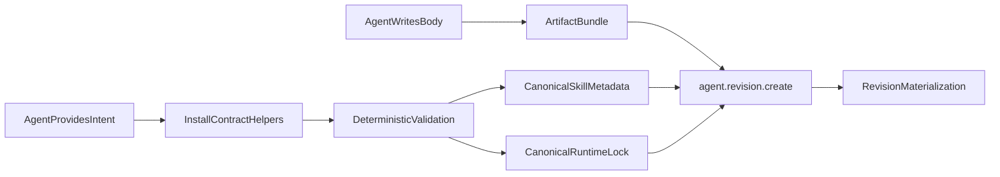

# Plan: Agent Install Hybrid Canonicalization

**Date:** 2026-04-06
**Status:** In progress; core hardening completed, intent path still pending
**Related:** `docs/AGENTS.md`, `docs/CLI.md`, `docs/agent-features.md`, `docs/plan-network-approval-builder-layers-fix.md`

---

## Progress Update

### Completed

- Phase 1 landed through `autonoetic-gateway/src/runtime/install_contract.rs` as the shared source of truth for validation helpers, canonical examples, schema text, and `runtime.lock` scaffolding.
- Phase 2 landed in `autonoetic-gateway/src/runtime/tools/agent_revision.rs`:
  - raw `SKILL.md` frontmatter is validated before typed parsing,
  - install diagnostics are aggregated,
  - `runtime.lock` agent-owned fields are validated separately from gateway-owned fields,
  - malformed dependency and artifact entries are reported with indexed parse errors,
  - missing gateway-owned lock sections are scaffolded before final canonicalization.
- Phase 3 landed for the install boundary and import path:
  - `agent.revision.create` now scaffolds gateway-owned `runtime.lock` sections,
  - `autonoetic/src/cli/agent.rs` now writes canonical `runtime.lock` content for imported skills,
  - shipped agent/example locks were refreshed toward the canonical shape.
- Phase 5 landed with the read-only `agent.revision.schema` tool and shared schema/example rendering from `install_contract.rs`.
- Phase 7.1 landed in `autonoetic-gateway/src/runtime/lifecycle.rs` by extracting `tool_result_counts_as_progress(...)` and stopping structured tool failures from resetting loop progress.
- Phase 7.2 landed in `autonoetic-gateway/src/scheduler/gateway_store/observability.rs` with a safer FTS fallback decision helper and corrected `LIKE` fallback behavior for dotted plain-text queries.

### Partially completed

- AgentSkills.io compatibility work is substantially in place for import and canonicalization:
  - external skills remain a source format,
  - imported skills now converge on canonical installed metadata plus canonical `runtime.lock`,
  - provenance-preserving behavior remains intact.
- Phase 4 is partially complete:
  - `agents/specialists/coder.default/SKILL.md` and `agents/lead/planner.default/SKILL.md` were aligned with the hybrid ownership model,
  - `docs/AGENTS.md` and canonical lock examples were updated,
  - broader doc/example polish can continue as follow-up if needed.

### Remaining

- Phase 6 is still pending: add a partial-manifest or intent-driven install path such as `agent.revision.create_from_intent`.
- Phase 7.3 remains optional follow-up work unless current content/install hints prove insufficient in practice.
- Some long-tail fixture and example migration can continue incrementally; the core install-loop fixes no longer depend on those migrations.

---

## Problem

The failed demo session showed that the current install boundary is too dependent on LLM-authored serialization:

1. `agent.revision.create` currently expects a fully correct `SKILL.md` and `runtime.lock` inside the artifact.
2. `SkillParser::parse()` in `autonoetic-gateway/src/runtime/parser.rs` first tries `AgentManifest` and then falls back to `StandardSkillFrontmatter`, so install-time errors surface as mixed Autonoetic-vs-AgentSkills parse failures instead of one authoritative install contract.
3. `RuntimeLock` in `autonoetic-types/src/runtime_lock.rs` requires `gateway`, `sdk`, and `sandbox`, but agents are currently asked to guess those values even though the gateway owns them.
4. `agents/specialists/coder.default/SKILL.md`, `docs/AGENTS.md`, and `autonoetic/src/cli/agent.rs` currently teach different answers for the same files.
5. Once install validation starts failing, the planner can loop because structured tool failures still reset progress, and `session.search` is brittle for dotted plain-text queries such as `runtime.lock`.

The goal is to keep the gateway non-agentic while moving correctness into deterministic gateway behavior.

---

## Design Decision

### Ownership Split

**Agent-owned and free-form**

- The markdown body of `SKILL.md`
- Role instructions, behavioral guidance, persona, workflow notes

**Agent-provided semantic intent**

- `agent_id`
- `description`
- `execution_mode`
- `script_entry`
- `llm_config`
- `capabilities`
- optional `io`
- optional `middleware`
- optional `response_contract`

**Gateway-owned schema and canonicalization**

- The allowed metadata shape and field types
- Defaulting and autofill rules
- Final canonical `SKILL.md` metadata serialization
- Final canonical `runtime.lock` serialization
- Gateway/runtime-owned fields such as `runtime.engine`, `runtime.gateway_version`, `runtime.sdk_version`, `runtime.runtime_lock`, and most of `runtime.lock`

**Runtime lock ownership**

- Agent may provide dependency intent and, if needed later, minimal runtime hints
- Gateway owns canonical `gateway`, `sdk`, `sandbox`, `artifacts`, and `layers` closure structure

### Scope Guardrails

- Do **not** let the agent define the schema.
- Do **not** remove AgentSkills import compatibility in `SkillParser::parse()` during the first pass.
- Do **not** tighten general boot-time `runtime.lock` parsing in `autonoetic-gateway/src/bootstrap.rs` in this plan.
  - Today bootstrap hashes the file but does not deserialize it.
  - Many existing integration tests still write minimal `runtime.lock` fixtures such as `dependencies: []`.
  - Solving install loops does not require broad boot-time strictness.

---

## Existing Code Constraints

### Current install path

`autonoetic-gateway/src/runtime/tools/agent_revision.rs`

- `AgentRevisionCreateTool` is the current install boundary.
- It:
  - loads artifact files,
  - requires `SKILL.md` at artifact root,
  - parses `SKILL.md` via `SkillParser::parse()`,
  - resolves the lock path from `manifest.runtime.runtime_lock`,
  - deserializes `runtime.lock` directly into `RuntimeLock`,
  - normalizes and hashes the lock,
  - materializes the revision directory.

### Current manifest parser

`autonoetic-gateway/src/runtime/parser.rs`

- `SkillParser::parse()` extracts YAML frontmatter with `gray_matter`.
- It first deserializes to `AgentManifest`.
- On failure it falls back to `StandardSkillFrontmatter` and maps that to `AgentManifest`.
- This fallback is useful for compatibility, but it produces poor install-time diagnostics when an agent is trying to create a normal Autonoetic bundle.

### Current canonical target types

- `autonoetic-types/src/agent.rs`
  - `RuntimeDeclaration`
  - `AgentIdentity`
  - `AgentManifest`
- `autonoetic-types/src/runtime_lock.rs`
  - `LockedGateway`
  - `LockedSdk`
  - `LockedSandbox`
  - `RuntimeLock`

These public Rust types should remain the canonical install target in phase 1.

### Current drift points

- `autonoetic/src/cli/agent.rs`
  - `default_runtime_lock_contents()`
  - `handle_agent_import_skill()`
  - scaffolded `SKILL.md`
- `agents/specialists/coder.default/SKILL.md`
- `agents/lead/planner.default/SKILL.md`
- `agents/evolution/specialized_builder.default/SKILL.md`
- `docs/AGENTS.md`
- `examples/quickstart/sample_agent/SKILL.md`

---

## Implementation Overview

---

## Phase 1: Introduce Shared Install-Contract Helpers

**Status:** Done

**Goal:** create one gateway-owned source of truth for canonical defaults, runtime-lock scaffolding, example rendering, and install diagnostics.

### New module

**New file:** `autonoetic-gateway/src/runtime/install_contract.rs`

### Responsibilities

- Hold gateway-owned canonical defaults:
  - runtime engine
  - gateway version
  - sdk version
  - default sandbox backend
  - canonical runtime lock filename
- Expose helpers such as:
  - `default_runtime_declaration()`
  - `default_runtime_lock(...)`
  - `scaffold_runtime_lock(...)`
  - `render_skill_metadata_example(...)`
  - `render_runtime_lock_example(...)`
  - `install_schema_description()`
- Keep serialization deterministic enough that:
  - `agent.revision.create`
  - future `agent.revision.schema`
  - CLI scaffolds in `autonoetic/src/cli/agent.rs`
  all draw from the same helper layer.

### Important design rule

This module is deterministic infrastructure, not a policy engine:

- no inference from code meaning,
- no guessing agent intent,
- only rendering, defaulting, scaffolding, and validation support.

---

## AgentSkills.io Compatibility

**Status:** Mostly done for import/canonicalization; broader polish remains optional

### Current behavior

The external-skill import path shown in `docs/quickstart-planner-specialist-chat.md` already acts as a translation boundary:

- `autonoetic/src/cli/agent.rs` → `handle_agent_import_skill()` loads the external `SKILL.md`
- `autonoetic-gateway/src/runtime/parser.rs` → `SkillParser::parse()` accepts both:
  - native Autonoetic frontmatter, and
  - AgentSkills-style frontmatter through `StandardSkillFrontmatter`
- `map_standard_frontmatter_to_manifest()` converts AgentSkills fields into `AgentManifest`
- `infer_capabilities()` maps `allowed-tools` into Autonoetic capabilities
- `AgentSkillsImportMetadata` in `autonoetic-types/src/agent.rs` preserves source metadata such as:
  - `license`
  - `compatibility`
  - `allowed_tools`
  - `needs_tool_bridging`
- `autonoetic-gateway/src/runtime/lifecycle.rs` injects the runtime tool-bridging appendix when the imported skill needs it

### Design rule

AgentSkills is a **source format**, not the installed canonical format.

Under the hybrid design:

- external AgentSkills bundles should continue to author their own source `SKILL.md`
- Autonoetic should translate them into canonical installed metadata and canonical `runtime.lock`
- imported skills must **not** be required to provide final Autonoetic runtime-closure fields

### Required plan impact

#### 1. Reuse the shared canonicalization helpers in import

**Primary file:** `autonoetic/src/cli/agent.rs`

Refactor `handle_agent_import_skill()` to use the same shared helper layer introduced in:

- `autonoetic-gateway/src/runtime/install_contract.rs`

That means import should stop hand-rolling canonical metadata strings and instead call shared rendering/defaulting helpers where possible.

#### 2. Generate canonical `runtime.lock` during import

Today `handle_agent_import_skill()` rewrites `SKILL.md` and copies resource directories, but the hybrid design requires import to also produce a canonical `runtime.lock`.

Implementation target:

- imported skills should receive a canonical Autonoetic `runtime.lock` created from gateway-owned defaults
- AgentSkills source bundles should not need to carry one

#### 3. Preserve source provenance while canonicalizing target format

Imported skills should retain:

- `agentskills_import`
- original `allowed-tools`
- trust-mode effects
- tool-bridging behavior

But the installed artifact or directory should still converge on the same canonical Autonoetic metadata and lock shape as any native agent.

#### 4. Keep trust mode logic separate from canonicalization

The trust modes in `handle_agent_import_skill()`:

- `generous`
- `strict`
- `audit`

should continue to affect capability policy, but should not fork the manifest/lock serialization format.

Canonicalization should be identical regardless of trust mode; only the semantic capability set changes.

#### 5. Treat capability mapping as lossy and explicit

`infer_capabilities()` is a pragmatic mapping from AgentSkills `allowed-tools` to Autonoetic capabilities.

This remains acceptable, but the plan should assume:

- mapping is lossy,
- trust mode remains important,
- import diagnostics and docs should clearly describe the resulting Autonoetic capabilities.

### Testing impact

Update or extend import tests in `autonoetic/src/cli/agent.rs` to cover:

- imported skill writes canonical `SKILL.md`
- imported skill writes canonical `runtime.lock`
- `agentskills_import` metadata is preserved
- trust mode changes capabilities without changing canonical file shape
- imported resource directories still copy correctly

---

## Phase 2: Harden the Existing `agent.revision.create` Path

**Status:** Done

**Primary file:** `autonoetic-gateway/src/runtime/tools/agent_revision.rs`

### Task 2.1: Split validation from final deserialization

Add private helpers so `agent.revision.create` no longer goes straight from raw bytes to first serde error:

- `extract_skill_frontmatter_and_body(...)`
- `validate_skill_frontmatter_shape(...)`
- `validate_runtime_lock_shape(...)`
- `format_install_validation_error(...)`

### Task 2.2: Keep `SkillParser` compatibility, but stop leaking it as install UX

**Files:**

- `autonoetic-gateway/src/runtime/parser.rs`
- `autonoetic-gateway/src/runtime/tools/agent_revision.rs`

**Plan:**

- Keep `SkillParser::parse()` behavior for compatibility.
- Add a raw frontmatter extraction helper in `parser.rs` or a private equivalent in `agent_revision.rs`.
- For install validation:
  - parse frontmatter into a raw value first,
  - collect all missing or wrong-type Autonoetic paths,
  - only after that call the typed deserializer.

**Why:**

- This avoids changing non-install parsing behavior too broadly.
- It gives better install errors without removing AgentSkills support.

### Task 2.3: Add aggregated `SKILL.md` diagnostics

The validation report should identify at least:

- missing artifact-root `SKILL.md`
- missing YAML frontmatter
- missing `runtime`
- missing `agent`
- missing `agent.id`
- missing or invalid `runtime.type`
- missing or invalid `runtime.runtime_lock`
- mismatched `agent.id` vs requested `agent_id`

The error response should include:

- all failing paths in one response,
- the expected canonical path names,
- a minimal canonical example,
- an optional hint to call a future `agent.revision.schema` tool.

### Task 2.4: Add aggregated `runtime.lock` diagnostics

Instead of deserializing immediately into `RuntimeLock`, parse a partial structure first.

**Implementation detail:**

- Add a private partial shape in `agent_revision.rs` or `install_contract.rs` that only models agent-owned fields:
  - optional `dependencies`
  - optional `artifacts`

Do not require gateway-owned sections in the partial shape; those are scaffolded deterministically by the gateway.

Then:

1. collect missing-path diagnostics,
2. scaffold gateway-owned sections,
3. deserialize the canonicalized value into `RuntimeLock`,
4. reuse existing `normalize_runtime_lock()` and `canonical_runtime_lock_bytes()`.

### Task 2.5: Canonicalize the stored revision content

Continue to write canonicalized `runtime.lock` bytes back into `file_map` before digesting the revision.

If a future manifest canonicalizer is added, the same rule should apply to `SKILL.md` metadata:

- the revision identity should be based on canonicalized stored bytes, not raw guessed YAML formatting.

---

## Phase 3: Scaffold Gateway-Owned Parts of `runtime.lock`

**Status:** Done for install and import paths; bootstrap strictness intentionally unchanged

**Primary files:**

- `autonoetic-gateway/src/runtime/install_contract.rs`
- `autonoetic-gateway/src/runtime/tools/agent_revision.rs`
- `autonoetic/src/cli/agent.rs`

### Task 3.1: Define the gateway-owned default closure

Use the shipped agent locks, such as `agents/lead/planner.default/runtime.lock`, as the minimal valid target shape:

- `gateway.artifact`
- `gateway.version`
- `gateway.sha256`
- `sdk.version`
- `sandbox.backend`
- `dependencies`
- `artifacts`
- `layers`

### Task 3.2: Unify placeholder policy

Today the repo uses both:

- `"replace-me"`
- `"unmanaged"`

Pick one deterministic placeholder policy for gateway-owned locks and use it in:

- CLI scaffolds
- examples
- built-in agent bundles
- schema examples

### Task 3.3: Do not broaden boot-time strictness yet

Leave `autonoetic-gateway/src/bootstrap.rs` behavior unchanged in this phase.

This plan only makes the revision-creation boundary canonical and strict.

That avoids immediately breaking tests and fixtures that still write minimal ad hoc locks in agent directories.

---

## Phase 4: Update Docs, Prompts, and Scaffolds to Match Reality

**Status:** Partially done

### Agent prompts and built-in bundles

**Files:**

- `agents/specialists/coder.default/SKILL.md`
- `agents/lead/planner.default/SKILL.md`
- `agents/evolution/specialized_builder.default/SKILL.md`

### Documentation and examples

**Files:**

- `docs/AGENTS.md`
- `docs/CLI.md`
- `docs/agent-features.md`
- `examples/quickstart/sample_agent/SKILL.md`
- `autonoetic/src/cli/agent.rs`

### Required changes

- Stop telling coder agents to write `runtime.lock` as only `layers: []`.
- Stop documenting TOML-style `runtime.lock` where the runtime actually expects YAML `RuntimeLock`.
- Point all examples and prompts at the same canonical helper output.
- Update planner and specialized builder guidance so they describe the new ownership split:
  - agent owns free-form instructions,
  - gateway owns canonical metadata structure and lock closure.

### Dirty-worktree note

`agents/lead/planner.default/SKILL.md` and `agents/specialists/coder.default/SKILL.md` are already dirty in the current worktree, so implementation must merge with local edits instead of overwriting them.

---

## Phase 5: Add a Read-Only Schema Surface

**Status:** Done

**Primary file:** `autonoetic-gateway/src/runtime/tools/agent_revision.rs`

### New tool

Add `agent.revision.schema` as a support tool, not as the safety boundary.

### Behavior

Return:

- ownership split summary,
- required `SKILL.md` metadata paths,
- required `runtime.lock` paths,
- canonical examples generated from `install_contract.rs`,
- short guidance on:
  - when to use `artifact_id`,
  - when a future intent path is preferable,
  - which fields are gateway-filled.

### Registration

Register the tool alongside:

- `agent.revision.create`
- `agent.revision.list`
- `agent.revision.inspect`
- `agent.revision.promote`
- `agent.revision.rollback`
- `agent.revision.diff`

---

## Phase 6: Add a Partial-Manifest Intent Path

**Status:** Pending

**Primary file:** `autonoetic-gateway/src/runtime/tools/agent_revision.rs`

### Goal

Remove punctuation-sensitive manifest authoring from the install path without forcing agents to fill a huge strict schema.

### New tool

Add a parallel tool rather than overloading the current one. Example names:

- `agent.revision.create_from_intent`
- `agent.revision.create_structured`

### Input contract

Require only semantic intent plus free-form instructions:

- `agent_id`
- `artifact_id`
- `instructions` or `instructions_handle`
- `description`
- `execution_mode`
- `script_entry` for script agents
- `llm_config`
- `capabilities`
- optional `io`
- optional `middleware`
- optional `response_contract`
- optional `summary`

### How it should work

1. Load the artifact.
2. Treat bundled `SKILL.md` and `runtime.lock` as optional or advisory on this path.
3. Use `install_contract.rs` to render canonical metadata and lock content.
4. Inject those canonical files into the in-memory `file_map`.
5. Call a shared internal revision-creation routine so both install paths reuse the same:
   - validation,
   - canonicalization,
   - digesting,
   - materialization,
   - promotion flow.

### Required refactor

Extract a shared internal function from `agent.revision.create`, for example:

- `create_revision_from_files(...)`
- `canonicalize_bundle_for_revision(...)`

The existing artifact-driven path and the new intent path should both call into that shared implementation.

### Tool result

Echo back:

- canonicalized `SKILL.md` metadata,
- canonicalized `runtime.lock`,
- which fields were autofilled,
- which fields were normalized.

This is important for debuggability and trust.

---

## Phase 7: Fix Loop/Search Dead-End Amplifiers

**Status:** Mostly done

These are secondary to the install contract, but they are part of stopping the dangerous loop.

### Task 7.1: Structured failures must not reset progress

**Files:**

- `autonoetic-gateway/src/runtime/lifecycle.rs`
- `autonoetic-gateway/src/runtime/tool_call_processor.rs`

**Current issue:**

- `had_any_success` becomes true when a tool call completes at the transport layer.
- `lifecycle.rs` then calls `register_progress()` even if the tool result payload is logically `{ "ok": false }`.

**Plan:**

- distinguish transport success from logical progress,
- do not reset the loop guard on structured install validation failures,
- add one regression test for repeated identical `agent.revision.create` failures.

### Task 7.2: `session.search` must handle plain-text dotted queries

**Files:**

- `autonoetic-gateway/src/runtime/tools/session.rs`
- `autonoetic-gateway/src/scheduler/gateway_store/observability.rs`

**Plan:**

- detect plain-text queries and quote or sanitize them before raw FTS5 `MATCH`,
- or fall back to a safer substring search on parse failure,
- improve the error text so agents know this is an FTS query issue, not missing data.

### Task 7.3: Better content/install boundary hints

**File:** `autonoetic-gateway/src/runtime/tools/content.rs`

Keep steering agents toward:

- `artifact_id`
- `workflow.wait` outputs
- session-visible names

instead of full SHA handles across install boundaries.

This remains a follow-up improvement. The dangerous loop was materially reduced by the Phase 7.1 and 7.2 fixes even without changing this tool yet.

---

## Test Plan

**Status:** Partially complete

### New unit coverage

**Files:**

- `autonoetic-gateway/src/runtime/tools/agent_revision.rs`
- `autonoetic-gateway/src/runtime/install_contract.rs`
- `autonoetic-gateway/src/runtime/parser.rs`

Implemented so far:

- `install_contract.rs` validation and schema-description tests,
- `lifecycle.rs` tests for `tool_result_counts_as_progress(...)`,
- `observability.rs` tests for FTS fallback decision helpers.

### New integration coverage

**New file:** `autonoetic-gateway/tests/agent_revision_canonicalization_integration.rs`

Cover at least:

1. malformed `SKILL.md` returns aggregated install diagnostics,
2. minimal `runtime.lock` is scaffolded into a valid canonical lock,
3. canonicalized lock bytes are written into the revision directory,
4. future intent path can install without bundled `SKILL.md` / `runtime.lock`,
5. repeated identical install failures trip the loop guard instead of resetting progress.

Current note:

- The core fixes landed without a dedicated new integration file for every case above.
- If more hardening is needed later, the highest-value next integration target is the future Phase 6 intent path.

### Existing tests to update

The following files currently write minimal `runtime.lock` fixtures such as `dependencies: []` and should be reviewed as the contract is cleaned up:

- `autonoetic-gateway/tests/schema_enforcement_integration.rs`
- `autonoetic-gateway/tests/post_session_digest_integration.rs`
- `autonoetic-gateway/tests/live_digest_integration.rs`
- `autonoetic-gateway/tests/turn_continuation_approval_integration.rs`
- `autonoetic-gateway/tests/emergency_stop_root_session_integration.rs`
- `autonoetic-gateway/tests/workflow_chat_ingest_routing_integration.rs`
- `autonoetic-gateway/tests/session_trace_integration.rs`
- `autonoetic-gateway/tests/script_agent_integration.rs`
- `autonoetic-gateway/tests/user_interaction_resume_integration.rs`
- `autonoetic-gateway/tests/full_lifecycle_integration.rs`

Not all of these must change in phase 1 if bootstrap remains permissive, but they should be migrated toward canonical fixtures over time.

### CLI scaffold coverage

**File:** `autonoetic/src/cli/agent.rs`

Add or update tests so scaffolded agents match the new canonical helper output for:

- `SKILL.md`
- `runtime.lock`

---

## Rollout Order

**Current state:** steps 1 through 5 are effectively complete, step 6 remains pending

1. Completed: add `install_contract.rs`.
2. Completed: harden `agent.revision.create` with aggregated validation and runtime-lock scaffolding.
3. Largely completed: update CLI scaffolds, docs, prompts, and examples to the canonical helper output.
4. Completed: add `agent.revision.schema`.
5. Completed: fix loop/search behavior.
6. Pending: add the new partial-manifest intent path and migrate builder/planner prompts to prefer it.

---

## Expected Outcome

**Updated expectation:** the repo now has the core install-boundary hardening in place; the remaining architectural improvement is to remove hand-authored manifest YAML from the hot path entirely

After phase 1 through phase 5:

- agents can still write free-form `SKILL.md` instructions,
- install correctness no longer depends on perfect YAML authoring,
- `runtime.lock` gateway-owned fields are no longer guessed by the model,
- validation errors are actionable in one shot,
- planner loops are much less likely to spiral,
- docs, prompts, CLI scaffolds, and gateway enforcement all describe the same contract.

After phase 6:

- agent installation no longer needs hand-authored manifest YAML on the hot path,
- the gateway remains dumb in the correct sense: deterministic, canonical, and strict.
