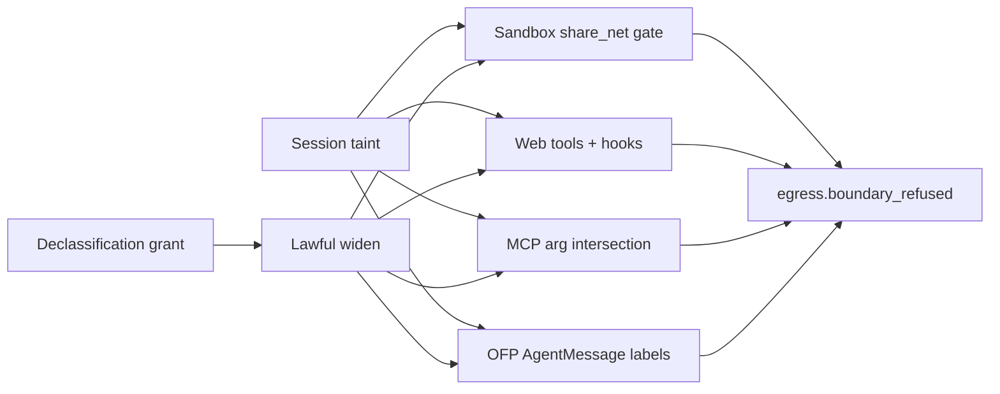

# Implementation plan — #909 [Phase 4] Federation, MCP, sandbox, declassification

**Tracking issue:** [mandubian/autonoetic#909](https://github.com/mandubian/autonoetic/issues/909)  
RFC: [`docs/rfc/data-envelopes-egress-localization.md`](rfc/data-envelopes-egress-localization.md) §5.5, §7, §8, §9.1.  
Parent [#903](https://github.com/mandubian/autonoetic/issues/903). Depends on merged Phase 3 (#908).

## Where Phase 3 left the label plane

- Stored content is labeled (`MemoryObject.egress_label`, `execution_traces.egress_label_json`, schema v76).
- Store-time taint intersection + request-time filter on recall/search/digest/wiki/session_peek/observability.
- Curator mechanical refuse for `local_only` `promote_to_skill` (no declassification grant path yet).
- `gateway memory relabel` + `egress.relabel` audit events.
- Cross-agent taint on `agent_message` / spawn-return (#907) + session residency (#902).
- **`egress.boundary_refused`** exists (compression); Phase 4 adds `surface` early via `emit_surface_boundary_refused` (shared prep / slice 1), not as a late follow-up.
- **No** OFP label metadata, MCP `egress_class`, gateway-native web/hook network gates, capsule label filtering (until their slices land).

### Locked RFC decisions (do not re-litigate)

- Widening labels is **only** via operator declassification (§8) — never LLM judgment.
- Declassification reuses the approval-grant shape; content-scoped, expiring, revocable; `egress.declassified` audit.
- Every refuse on OFP/MCP/sandbox/web/hooks emits `egress.boundary_refused` with `surface` + envelope ids + label.
- OFP `CapsuleOffer` wire path stays unwired until label metadata exists.
- Sandbox: no egress proxy — document residual gap; taint + `Unresolved` = hard refuse.
- **Inbound federated content is fail-closed:** missing/unparseable inbound `egress_label` is treated as `FederatedAgent`-tainted (never `unrestricted`). Outbound wire field remains optional for backward-compat with old peers.
- **Network sink is gateway-wide:** any surface that can send session-derived bytes to the network (sandbox `share_net`, native web tools, hook HTTP deliveries, remote MCP, OFP) must gate on session taint × `Sink::Network`.

---

## Slicing (each row = one PR)

| Slice | Scope | Blast radius | Depends |
|---|---|---|---|
| **0. Plan doc** | `docs/plan-egress-phase4-909.md` | docs | — |
| **1. Declassification vertical** | grant type + store + `ScheduledAction::EgressDeclassify` + `egress.declassified`; curator exception; land `emit_surface_boundary_refused` / `surface` payload | scheduler/approval + types + `egress_labeler` | 0 |
| **2. Sandbox composition** | session-taint `share_net` via **declassification** (not plain approval alone); `Unresolved`+taint hard refuse; sandbox `boundary_refused` | `runtime/tools/sandbox.rs` | **1** |
| **2b. Gateway network tools** | taint gate on `web_fetch` / `web_search` / `web_call` / `web_redirect` + hook HTTP deliveries | `runtime/tools/web*.rs`, `scheduler/hooks.rs` | **1** |
| **3. MCP egress** | registry `egress_class`; argument intersection; remote SSE refuse | `autonoetic-mcp/`, `tool_call_processor` | 1 |
| **4. OFP federation** | `AgentMessage` label metadata; outbound withhold; **inbound fail-closed ingest as session taint** | `autonoetic-ofp/`, `server/router.rs`, `server/ofp.rs` | 1 |
| **5. Capsule export filtering** | destination sink on export; label-filtered memory snapshot | `capsule/export.rs` | 1 |
| **6. Boundary audit polish** | compression caller `surface: "compression"`; `gateway egress audit` renders all surfaces | CLI + remaining callers | 2–5, 2b |
| **7. Compartment polish** | data-owner example + docs cross-link; Phase 4 visual-map / ARCHITECTURE / SoP egress follow-up | docs + types | 1, 4 |
| **8. Acceptance e2e** | federated refuse, remote MCP refuse, tainted `share_net`, web/hook refuse, capsule filter, declassify audit | `tests/egress/` | 1–7 |

**Recommended order:** 0 → 1 → 2 → 2b → 3 → 4 → 5 → 6 → 8 (slice 7 can parallel 5–6).

Rationale: declassification is the lawful widening path. Sandbox and gateway-native network tools are the highest local exfil backstops and both depend on grants + `egress.declassified`. MCP and OFP are independent wire changes. Capsules need destination sink. Slice 6 is audit/CLI polish — the `surface` field lands with slice 1. Acceptance last.



---

## Shared design (all slices)

**Session taint resolution** (reuse Phase 2/3 pattern):

```rust
fn resolve_session_egress_taint(
    run_context: Option<&NativeToolRunContext>,
    store: Option<&GatewayStore>,
    session_id: Option<&str>,
) -> anyhow::Result<Option<EgressLabel>>;
```

- Prefer `run_context.egress_taint`; fall back to `store.get_session_egress_taint(session_id)`; error if store read fails.

**Boundary rule (fail-closed):** at sandbox / web / hooks / MCP / OFP call sites, **unknown ⇒ refuse**. Callers must not treat `Err` or an ambiguous `Ok(None)` (session live but no store / can't establish label) as "no taint." Prefer a boundary helper that returns `Result<EgressLabel>` and refuses unless a definitive label is established (`Ok(None)` from a successful store miss = unrestricted only when the store was queried).

**`surface` on `boundary_refused` (lands with slice 1, not slice 6):**

- `emit_surface_boundary_refused(..., surface: &str, ...)` with `"sandbox"` | `"mcp"` | `"ofp"` | `"web"` | `"hooks"` | `"compression"`.
- Compression caller updated to pass `surface: "compression"` when convenient; slice 6 finishes any stragglers + audit CLI.

**Declassification grant** (slice 1 — locked shape):

- Action: **`ScheduledAction::EgressDeclassify`** (not a separate gate kind).
- Table `egress_declassification_grants` (v77): target kind (`envelope_id` | `source_pattern` | `memory_id`), target value, allowed `Sink`, scope (`RootSession` | `Session`), expiry, revoked_at.
- Lookup **`egress_declassification_allows` checks revocation + expiry at use time** (no grant cache that can outlive revoke).
- `source_pattern` must not be a silent blanket widen: either bound patterns (no bare `*`) or require the operator to see match count before approve (same spirit as memory relabel `--dry-run` / #948).
- `emit_declassified` → `egress.declassified` causal event.

---

## Slice 1 — Declassification vertical

**Schema / types**

- `EgressDeclassificationGrant` / `EgressDeclassificationTarget` in `autonoetic-types`.
- Migration **v77**: `egress_declassification_grants` + indexes on `(root_session_id, target_kind, target_value)`.
- `ScheduledAction::EgressDeclassify { target, allowed_sink, reason, payload }`.

**Approval**

- Operator approves via existing gate/approval machinery; grant materialized on approve; emit `egress.declassified`.
- Revocation via `gateway grants revoke` pattern or dedicated subcommand; emergency stop / `delete_session_grants` clears declass rows.
- Flood cap: reuse `max_pending_approvals_per_root` for declassify *requests*.

**Consumers**

- `curator_journal.rs`: allow `promote_to_skill` when evidence has active declassification to `RemoteModel`.
- Future: inline routing declassify choice (lifecycle) — wire when grant API exists.

**Also in this slice:** `emit_surface_boundary_refused` + `surface` payload (shared prep for 2–5 / 2b).

**PR title:** `feat(egress): declassification grants + egress.declassified (#909 slice 1)`

---

## Slice 2 — Sandbox composition

**Depends on slice 1.** Enabling `share_net` for a session whose taint excludes `Sink::Network` is a **label widening** — it must go through declassification, not a plain host-grant approval alone.

**Escalation** (`sandbox_exec` / network-gate path in `runtime/tools/sandbox.rs`):

- Resolve session taint with the boundary fail-closed rule.
- If taint excludes `Sink::Network`:
  - Do **not** auto-approve via `RemoteAccessApprovalMode::Preapproved`.
  - Do **not** treat exec-cache hits as sufficient to enable `share_net`.
  - Operator path: approve via machinery that **materializes a declassification grant for `Sink::Network`** and emits `egress.declassified`. Grants are **host-scoped** (`source_pattern: "session:<root>:host:<host>"`, one per approved host from `detected_hosts`) — an ordinary network approval widens only the hosts the operator saw, never the whole session. Session-wide `source_pattern: "session:<root>"` remains possible via the explicit `EgressDeclassify` action only. A bare `SandboxExec` host approval without that grant must not set `share_net = true`. An approval with no concrete `detected_hosts` materializes nothing (fail-closed).
  - `safe_inspection_bypass` must keep `share_net = false` under taint (already required).
- `NetworkCoverage::Unresolved` + taint excludes `Network` → hard refuse (no approval offer); emit `egress.boundary_refused` with `surface: "sandbox"`.

**Tests:** tainted session + preapproved agent still gates; approval without declass grant does not enable `share_net`; Unresolved + taint refuses; `egress.declassified` on lawful widen; `boundary_refused` in causal chain.

**PR title:** `feat(egress): session-taint share_net via declassification (#909 slice 2)`

---

## Slice 2b — Gateway network tools (native web + hooks)

**In scope (not optional):** Network is a sink. Closing only sandbox `share_net` leaves exfil through gateway-owned HTTP.

- Gate `web_fetch` / `web_search` / `web_call` / `web_redirect` (`runtime/tools/web*.rs`): if session taint excludes `Sink::Network`, refuse (or require active declassification to `Network`) before any outbound request; emit `egress.boundary_refused` with `surface: "web"`.
- Gate hook HTTP deliveries (`scheduler/hooks.rs`): same rule when the delivery body/URL is session-derived; `surface: "hooks"`.
- Widening uses the same slice-1 declassification grants + `egress.declassified`.

**PR title:** `feat(egress): taint gate on web tools + hook deliveries (#909 slice 2b)`

---

## Slice 3 — MCP egress

- `McpServer.egress_class: local | remote` in registry JSON + `autonoetic-mcp` types.
- Before `tools/call` on remote (SSE) server: intersect argument envelope labels; refuse if args exclude `Sink::Network` (or required sink); emit `egress.boundary_refused` with `surface: "mcp"`.
- Boundary fail-closed taint resolution.

**PR title:** `feat(egress): MCP egress_class + argument intersection (#909 slice 3)`

---

## Slice 4 — OFP federation

- Extend `WireRequest::AgentMessage` with `egress_label` + optional `withheld_indication`.
  - **Outbound:** field is optional for wire backward-compat with old peers (omit ⇒ peer may not understand labels; we still withhold locally when our label excludes `FederatedAgent`).
  - **Inbound (fail-closed):** missing or unparseable `egress_label` ⇒ treat content as **`FederatedAgent`-tainted** (or stricter remote-restricted / `no_remote_model`), **never** `unrestricted`. This closes the "launder through an unlabeled peer" path.
- **Inbound ingest:** set the received label as the spawned session's **initial taint**, mirroring Phase 2/3 `agent_message` ingest — not a mere validate-and-drop check.
- Outbound (`server/router` OFP path): refuse or substitute indications before framed write when label excludes `FederatedAgent`; `surface: "ofp"`.
- Do **not** wire `CapsuleOffer` transfer.

**PR title:** `feat(egress): OFP AgentMessage labels + inbound fail-closed taint (#909 slice 4)`

---

## Slice 5 — Capsule export filtering

- `ExportRequest.destination_sink` (or infer from `trust_domain`).
- Memory snapshot staging: include memory only when `label.allows(destination_sink)`; count withheld.
- Provenance records withheld count.

**PR title:** `feat(egress): capsule export label filtering by destination (#909 slice 5)`

---

## Slice 6 — Boundary audit polish

`surface` already exists from slice 1. This slice finishes:

- Compression caller passes `surface: "compression"` if not already.
- `gateway egress audit` renders sandbox / web / hooks / mcp / ofp / compression refusals.

**PR title:** `feat(egress): boundary_refused audit CLI + remaining surfaces (#909 slice 6)`

---

## Slice 7 — Compartment polish + docs follow-up

- Document data-owner pattern: resident agent + `local_only` + `agent_message` replies.
- ~~Optional: `provider_constraint` on `EgressSessionPolicy`.~~ **Landed** (follow-up): `provider_constraint: local_only` constrains provider *selection* for the whole session tree, exposed via `session egress-policy set --provider-constraint local_only`; compartment acceptance in `tests/egress/compartment.rs`.
- Update Phase 4 egress visual maps + `ARCHITECTURE.md` / `separation-of-powers.md` egress sections for new surfaces (`egress.declassified`, web/hooks/ofp/mcp/sandbox `boundary_refused`).

**PR title:** `docs(egress): data-owner compartment + Phase 4 surface maps (#909 slice 7)`

---

## Slice 8 — Acceptance

- `tests/egress/phase4_boundaries.rs` (or modules in the egress domain binary): sandbox refuse, web/hook refuse, MCP refuse (mock), OFP inbound fail-closed + outbound refuse (mock), declassify grant lifecycle, capsule filter smoke.

**PR title:** `test(egress): phase 4 boundary acceptance (#909 slice 8)`

---

## Immediate next step

Phase 4 slices 0–8 are complete. Constitution / enforcement-register changes
remain **Phase 5 #910**.

**Follow-up (post-slice-8):** declassification grants materialized from ordinary
network approvals are host-scoped (`session:<root>:host:<host>`), honor
`default_grant_ttl_secs`, carry `expires_at` in the `egress.declassified`
payload, and are revocable via `gateway grants revoke --host <host>` (which now
also revokes matching declassification grants and records the count in the
`revoke_grants` causal event). The approval request shown to the operator
discloses the widening.
