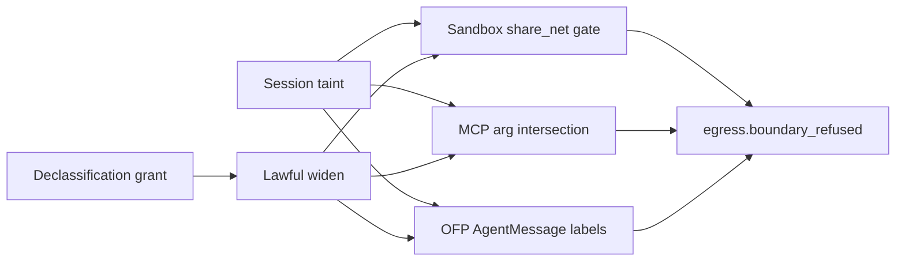

# Implementation plan — #909 [Phase 4] Federation, MCP, sandbox, declassification

**Tracking issue:** [mandubian/autonoetic#909](https://github.com/mandubian/autonoetic/issues/909)  
RFC: [`docs/rfc/data-envelopes-egress-localization.md`](rfc/data-envelopes-egress-localization.md) §5.5, §7, §8, §9.1.  
Parent [#903](https://github.com/mandubian/autonoetic/issues/903). Depends on merged Phase 3 (#908).

## Where Phase 3 left the label plane

- Stored content is labeled (`MemoryObject.egress_label`, `execution_traces.egress_label_json`, schema v76).
- Store-time taint intersection + request-time filter on recall/search/digest/wiki/session_peek/observability.
- Curator mechanical refuse for `local_only` `promote_to_skill` (no declassification grant path yet).
- `gateway memory relabel` + `egress.relabel` audit events.
- Cross-agent taint on `agent_message` / spawn-return (#907) + session residency (#902).
- **`egress.boundary_refused`** exists but is compression-only (`context_governor/capsule.rs`); no `surface` field.
- **No** OFP label metadata, MCP `egress_class`, sandbox taint escalation, capsule label filtering, or declassification grants.

### Locked RFC decisions (do not re-litigate)

- Widening labels is **only** via operator declassification (§8) — never LLM judgment.
- Declassification reuses the approval-grant shape; content-scoped, expiring, revocable; `egress.declassified` audit.
- Every refuse on OFP/MCP/sandbox emits `egress.boundary_refused` with `surface` + envelope ids + label.
- OFP `CapsuleOffer` wire path stays unwired until label metadata exists.
- Sandbox: no egress proxy — document residual gap; taint + `Unresolved` = hard refuse.

---

## Slicing (each row = one PR)

| Slice | Scope | Blast radius | Depends |
|---|---|---|---|
| **0. Plan doc** | `docs/plan-egress-phase4-909.md` | docs | — |
| **1. Declassification vertical** | grant type + store + approval flow + `egress.declassified`; curator exception | scheduler/approval + types | 0 |
| **2. Sandbox composition** | session-taint `share_net` escalation; `Unresolved`+taint hard refuse; sandbox `boundary_refused` | `runtime/tools/sandbox.rs` | 0 |
| **3. MCP egress** | registry `egress_class`; argument intersection; remote SSE refuse | `autonoetic-mcp/`, `tool_call_processor` | 1 |
| **4. OFP federation** | `AgentMessage` label metadata; outbound withhold; inbound `FederatedAgent` refuse | `autonoetic-ofp/`, `server/router.rs`, `server/ofp.rs` | 1 |
| **5. Capsule export filtering** | destination sink on export; label-filtered memory snapshot | `capsule/export.rs` | 1 |
| **6. `boundary_refused` unification** | `surface` field; wire all surface callers; audit CLI | `egress_labeler.rs`, CLI | 2–5 |
| **7. Compartment polish** | data-owner example + docs cross-link (`provider_constraint` optional) | docs + types | 1, 4 |
| **8. Acceptance e2e** | federated refuse, remote MCP refuse, tainted `share_net`, capsule filter, declassify audit | `tests/egress/` | 1–7 |

**Recommended order:** 0 → 1 → 2 → 3 → 4 → 5 → 6 → 8 (slice 7 can parallel 5–6).

Rationale: declassification is the lawful widening path needed by curator, inline routing, and boundary refuses. Sandbox is the highest local exfil backstop. MCP and OFP are independent wire changes. Capsules need destination sink. Unify events once call sites exist. Acceptance last.



---

## Shared design (all slices)

**Session taint resolution** (reuse Phase 2/3 pattern):

```rust
fn resolve_session_taint(
    run_context: Option<&NativeToolRunContext>,
    store: Option<&GatewayStore>,
    session_id: Option<&str>,
) -> anyhow::Result<Option<EgressLabel>>;
```

- Prefer `run_context.egress_taint`; fall back to `store.get_session_egress_taint(session_id)`; error if store read fails on a live session with expected taint row.

**`emit_boundary_refused` extension** (`runtime/egress_labeler.rs`):

- Add `surface: &str` (`"sandbox"` | `"mcp"` | `"ofp"` | `"compression"`) to payload per RFC §9.1.
- Keep compression caller passing `surface: "compression"` for backward-compatible audit queries.

**Declassification grant** (slice 1):

- New table `egress_declassification_grants` (v77): target kind (`envelope_id` | `source_pattern` | `memory_id`), target value, allowed `Sink`, scope (`RootSession` | `Session`), expiry, revoked_at.
- Approval action variant `ScheduledAction::EgressDeclassify { ... }` or dedicated gate kind.
- Lookup helper: `store.egress_declassification_allows(target, sink, session_id)`.
- `emit_declassified` → `egress.declassified` causal event.

---

## Slice 1 — Declassification vertical

**Schema / types**

- `EgressDeclassificationGrant` in `autonoetic-types`.
- Migration **v77**: `egress_declassification_grants` + indexes on `(root_session_id, target_kind, target_value)`.

**Approval**

- Operator approves via existing gate/approval machinery; grant materialized on approve.
- Revocation via `gateway grants revoke` pattern or dedicated subcommand.
- Flood cap: reuse `max_pending_approvals_per_root` shape for declassify *requests*.

**Consumers**

- `curator_journal.rs`: allow `promote_to_skill` when evidence has active declassification to `RemoteModel`.
- Future: inline routing declassify choice (lifecycle.rs) — wire when grant API exists.

**PR title:** `feat(egress): declassification grants + egress.declassified (#909 slice 1)`

---

## Slice 2 — Sandbox composition

**Escalation** (`runtime/tools/sandbox.rs` ~L1323–L2127):

- Resolve session taint; if it excludes `Sink::Network`:
  - Do **not** auto-approve via `RemoteAccessApprovalMode::Preapproved`.
  - Treat any exec that would set `share_net = true` as requiring operator approval even when manifest `NetworkAccess` passes.
- `NetworkCoverage::Unresolved` + taint excludes `Network` → hard refuse (no approval offer); emit `egress.boundary_refused` with `surface: "sandbox"`.

**Tests:** tainted session + preapproved agent still gates; `Unresolved` + taint refuses; `boundary_refused` in causal chain.

**PR title:** `feat(egress): session-taint share_net escalation + Unresolved refuse (#909 slice 2)`

---

## Slice 3 — MCP egress

- `McpServer.egress_class: local | remote` in registry JSON + `autonoetic-mcp/src/types.rs`.
- Before `tools/call` on remote (SSE) server: intersect argument envelope labels; refuse if args exclude `Sink::Network`.
- `egress.boundary_refused` with `surface: "mcp"`.

**PR title:** `feat(egress): MCP egress_class + argument intersection (#909 slice 3)`

---

## Slice 4 — OFP federation

- Extend `WireRequest::AgentMessage` with `egress_label` + optional `withheld_indication` fields (wire compat: optional, default unrestricted).
- Outbound (`server/router.rs`): refuse or substitute indications before `write_framed_message` when label excludes `FederatedAgent`.
- Inbound (`server/ofp.rs`): validate incoming label before spawning agent handler.
- Do **not** wire `CapsuleOffer` transfer.

**PR title:** `feat(egress): OFP AgentMessage label metadata + FederatedAgent refuse (#909 slice 4)`

---

## Slice 5 — Capsule export filtering

- `ExportRequest.destination_sink` (or infer from `trust_domain`).
- `stage_memory_snapshot`: include memory only when `label.allows(destination_sink)`; count withheld.
- Provenance records withheld count.

**PR title:** `feat(egress): capsule export label filtering by destination (#909 slice 5)`

---

## Slice 6 — `boundary_refused` unification

- Extend `emit_boundary_refused` signature + payload `surface`.
- Update compression caller to pass `surface: "compression"`.
- `gateway egress audit` renders sandbox/mcp/ofp refusals.

**PR title:** `feat(egress): boundary_refused surface field + audit (#909 slice 6)`

---

## Slice 7 — Compartment polish

- Document data-owner pattern: resident agent + `local_only` + `agent_message` replies.
- Optional: `provider_constraint` on `EgressSessionPolicy`.

**PR title:** `docs(egress): data-owner compartment pattern (#909 slice 7)`

---

## Slice 8 — Acceptance

- `tests/egress/phase4_boundaries.rs`: sandbox refuse, MCP refuse (mock), OFP refuse (mock), declassify grant lifecycle, capsule filter smoke.

**PR title:** `test(egress): phase 4 boundary acceptance (#909 slice 8)`

---

## Immediate next step

1. Branch `pascal/egress-phase4-909` from `origin/main`.
2. Land **Slice 0** plan doc + comment on #909.
3. Implement **Slice 1** (declassification) then **Slice 2** (sandbox) in follow-up commits/PRs.

No constitution / enforcement-register changes in Phase 4 (clause remains Phase 5 #910).
