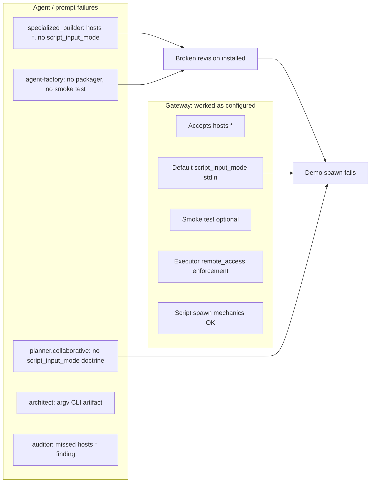

# Postmortem: Weather Agent Build & Demo Failure

**Session:** `session-b6d27af2`  
**Workflow:** `wf-92f8592f`  
**Installed revision:** `weather-agent@rev_emy29e32` (`rev_sha256:753c24b86244a87619a5e6de4b941f5e26367b70761c16e653a6fb751513d6c4`)  
**Date:** 2026-06-21  
**Scope:** Attribution only — which agent failed due to prompts vs gateway/workflow behavior. No agent or gateway changes implied.

---

## Executive summary

The build pipeline (research → architect → tests → federation → install) reported success at 12:53. The end-to-end demo failed at 13:09–13:14 when the planner tried to run the installed agent.

The breakage is **mostly agents not following their own prompts**, plus a few **gateway policy gaps** that let a defective revision through. The gateway script spawn path, executor remote-access enforcement, and mocked unit tests all behaved as configured.

---

## Session arc

| Phase | Time | What happened |
|---|---|---|
| Build | 12:17–12:53 | Research → architect → tests (42/42 mocked) → federation pass → install |
| Declared done | 12:53 | Planner reported “weather agent is now live and ready to use” |
| Demo attempts | 13:09–13:14 | Two `weather-agent` spawns failed instantly; `executor.default` workaround also failed |
| Session cut | ~13:14 | `executor.default` still running, mid-workaround |

---

## Failure timeline (who did what)

| When | Agent | What happened | Verdict |
|---|---|---|---|
| 12:52 | `specialized_builder.default` | Installed with `hosts: ["*"]`, no `script_input_mode`, no `remote_access`, empty `runtime.lock` deps | **Agent prompt violation** |
| 12:52 | `agent-factory.default` | Skipped packager + smoke test; delegated default `full` install | **Agent prompt violation** |
| 12:24 | `architect.default` | Built `sys.argv` CLI; no SDK / stdin contract | **Artifact mismatch** (no install guidance in prompt) |
| 12:29 | `unit_test_runner.default` | 42/42 pass with mocked network | **Worked as designed**; misleading for live use |
| 12:31 | `auditor.default` | Passed; did **not** flag `hosts: ["*"]` | **LLM ignored own prompt** |
| 12:53 | `planner.collaborative` | “Ready to use” with no live spawn | **Agent prompt gap + judgment** |
| 13:09–13:11 | `weather-agent` (gateway script path) | `input_mode=Stdin` + empty `argv` → usage error | **Gateway behaved per manifest** |
| 13:12 | `executor.default` | `undeclared_remote_pattern` on `requests` script | **Gateway behaved per manifest** |
| 13:13+ | `executor.default` | `artifact_build` entrypoint mismatch | **Agent tool misuse** |

---

## Issue 1: “Missed the specific host”

### Who should have declared `geocoding-api.open-meteo.com` + `api.open-meteo.com`

| Agent | Prompt says | What it did |
|---|---|---|
| `planner.collaborative` | `capability_envelope` should use **concrete hosts, never `"*"`** | Plan had no envelope; research hosts never flowed into install |
| `specialized_builder.default` | **“NetworkAccess hosts MUST be specific”**; wildcard only for open-web agents | Installed `hosts: ["*"]` anyway |
| `auditor.default` | `NetworkAccess hosts: ["*"]` for narrow-purpose agent → **error finding** | Passed with only cosmetic info findings |
| `researcher.default` | — | Correctly found and tested both hosts |

`weather.py` hardcodes:

```python
GEOCODING_URL = "https://geocoding-api.open-meteo.com/v1/search"
FORECAST_URL = "https://api.open-meteo.com/v1/forecast"
```

The install call used:

```json
"capabilities": [
  {"type": "NetworkAccess", "hosts": ["*"]},
  {"type": "CodeExecution"}
]
```

### Gateway role

This is **not a workflow bug**. In `validate_network_access_hosts`, any declared `hosts: ["*"]` short-circuits host checking (`autonoetic-gateway/src/runtime/tools/agent_revision.rs`). Builder doctrine says “reject/narrow”; gateway says “`*` covers everything.” `specialized_builder` took the path the gateway permits.

Static evaluator and auditor **noticed** the hosts in prose (URL constants in findings) but nobody fed that back into the install manifest. Install used `gating: audit_only`, so the builder was not forced to reconcile capability hosts against detected code.

---

## Issue 2: Why `weather-agent` couldn’t run (instant failure)

### Root cause: `script_input_mode` mismatch

Gateway log at spawn:

```
input_mode=Stdin
```

Installed manifest has no `script_input_mode` → defaults to **stdin**.

`architect.default` built a **CLI argv** script (`sys.argv[1:]`). On spawn, the task text (“Get the current weather for London”) went to stdin; `argv` stayed empty → usage message, exit 1.

Both attempts failed in under 100ms with:

```
Usage: python weather.py <city_name>
Example: python weather.py London
```

`agent_inspect` at 13:09:54 surfaced `"script_input_mode":"stdin"`, but the planner did not act on the mismatch before retrying.

### Who is responsible

| Layer | Responsibility |
|---|---|
| `architect.default` | Built argv-only entrypoint; artifact SKILL says “command-line argument” |
| `specialized_builder.default` | Script install checklist omits `script_input_mode`; never set `args` |
| `agent-factory.default` | Says script agents should use `AUTONOETIC_INPUT*` / SDK; didn’t reconcile with argv artifact |
| `planner.collaborative` | **No `script_input_mode` guidance** in its SKILL (unlike `planner.default`) |
| Gateway | Default `stdin` is documented; spawn did exactly what manifest said |

This is primarily an **agent pipeline coordination failure**, not a broken spawn workflow.

---

## Issue 3: Why the executor workaround also failed

After two spawn failures, `planner.collaborative` delegated to `executor.default` to run:

```bash
python /tmp/weather_agent/weather.py London
```

### `sandbox_exec` blocked — correct per executor manifest

Executor SKILL:

- **No `NetworkAccess` capability**
- `remote_access` only covers `curl` / `wget`, not Python `import requests`

Running the weather script static-analyzes file contents → `undeclared_remote_pattern`. Gateway enforced executor’s declared surface. **Not a workflow bug.**

### `artifact_build` failed — executor mistake

Passed content ref `cnt_4101b8e4` but entrypoint `weather.py` (actual path: `weather_agent/weather.py`). Tool error, not gateway.

The executor then tried a stdlib rewrite (`weather_runner.py`) and hit the same `artifact_build` filename mismatch before the session was cut.

---

## Issue 4: Other install gaps (would bite on next run)

| Gap | Who | Prompt says | What happened |
|---|---|---|---|
| No `packager.default` | `agent-factory` | Step 3 when `requirements.txt` exists | **Never spawned** (no packager in session) |
| Empty `runtime.lock` deps | install pipeline | Packager bakes deps into layers | `requests` not materialized |
| No smoke test | `agent-factory` | Step 6: `user_ask` then spawn candidate | **Skipped**; builder used default `install_mode: full` (create+promote in one turn) |
| Gateway smoke gate | config | `agent_install_smoke_test: ask` (not `required`) | Promote without smoke test is **allowed** |

`specialized_builder` prompt explicitly allows default `full` = create + promote in one turn — so agent-factory’s skipped smoke test is an **agent orchestration** issue; gateway didn’t block it.

Even after fixing `script_input_mode`, `requirements.txt` lists `requests>=2.28.0` while `runtime.lock` has `"dependencies": []` — a successful argv pass would likely hit `ModuleNotFoundError: requests` next.

---

## Prompt contradictions (system design)

Three docs disagree on how script agents receive input:

| Source | Says |
|---|---|
| `agent-factory.default` | Use `AUTONOETIC_INPUT*` / SDK; argv is fallback |
| `planner.default` | `stdin` vs `args` via `script_input_mode` |
| `architect.default` | Built classic `python weather.py <city>` CLI |

`planner.collaborative` (the session root) has `capability_envelope` guidance for concrete hosts but **no** `script_input_mode` / script-spawn doctrine at all.

Nobody in the chain closed the loop for this artifact.

---

## What worked correctly

- **`researcher.default`** — identified Open-Meteo, tested live endpoints including both hostnames.
- **Gateway script executor** — ran with `input_mode=Stdin` as manifest specified.
- **`executor.default` policy** — correctly blocked undeclared Python network patterns.
- **`unit_test_runner.default`** — 42/42 in network-off sandbox with mocks; constitution P-3.10 by design. Pass does not imply live readiness.
- **Federation reviewers** — static analysis and audit passed on code quality; did not block install on manifest/capability gaps.

---

## Attribution diagram



---

## Summary verdict

| Category | Primary blame |
|---|---|
| **Install defects** | `specialized_builder.default` — specific-host doctrine ignored; `script_input_mode` and `remote_access` omitted |
| **Orchestration** | `agent-factory.default` — skipped packager and smoke test per its own pipeline |
| **Demo-time** | `planner.collaborative` — declared success without live validation; ignored `agent_inspect` signal; routed to `executor.default` which cannot run that script |
| **Gateway/workflow** | Mostly **not broken** — script spawn, approval checks, install validation ran as configured. Gaps: wildcard hosts bypass validation; smoke test not mandatory; no argv/stdin mismatch detection |
| **False confidence** | Mocked unit tests + federation pass treated as “works live” |

---

## References

- Session digest: `~/.autonoetic/runtime/sessions/session-b6d27af2/digest.md`
- Installed revision: `~/.autonoetic/runtime/revisions/agents/weather-agent/`
- Gateway log: `~/.autonoetic/runtime/logs/run.2026-06-21.log` (13:09–13:14)
- Relevant agent prompts:
  - `agents/evolution/specialized_builder.default/SKILL.md` (capabilities, script install)
  - `agents/evolution/agent-factory.default/SKILL.md` (pipeline, smoke test, script mode)
  - `agents/lead/planner.collaborative/SKILL.md` (capability_envelope)
  - `agents/lead/planner.default/SKILL.md` (script-mode spawn specifics)
  - `agents/specialists/auditor.default/SKILL.md` (hosts `["*"]` scope overreach)
  - `agents/specialists/executor.default/SKILL.md` (no NetworkAccess, remote_access surface)
